# TilauScope

**A guided roasting assistant for home & amateur coffee roasters — built on [Artisan Roaster Scope](https://github.com/artisan-roaster-scope/artisan).**

 

## What is TilauScope?

Artisan is a professional-grade roast logging and control tool used by roasters worldwide. **TilauScope is an opinionated guided layer built on top of it**, aimed at home and amateur roasters who want more than a scope: step-by-step guidance, automatic milestone detection, and a roast plan that learns from every batch — while never touching or slowing down Artisan's real-time core.

Think of it as *"Artisan, plus a coach standing next to you telling you what to do and why."*

## Why TilauScope

- 🧑‍🏫 **Guided roast assistant** — a live plan that tells you what to do next (heat, airflow, timing) and explains why, instead of leaving you to interpret a raw curve.
- 📈 **Learns from your own roasts** — first crack temperature, phase durations, and crash/flick risk are calibrated from your roasting history for that exact bean and batch size, not generic theory.
- 🎚️ **Three experience levels** — **Guided**, **Standard**, **Expert**. Beginners get an assistant that opens, starts, and closes itself; experts get the full Artisan interface, undisturbed.
- 🫘 **BeanCave** — a bean database and roast log in one place: stock, density, roast history, and side-by-side batch comparison (overlay / consistency / aligned).
- ☕ **Brew Advisor** — brewing recipes (espresso, V60, French Press, AeroPress, Moka…) adjusted for roast level, dose, and bean freshness, plus a resting/degassing calendar.
- 🔌 **Real hardware integration** — connected scales, BLE airflow/color sensors, adaptive PID control, and label printing, wired directly into the roasting workflow.

## Screenshots

### Guided roast assistant

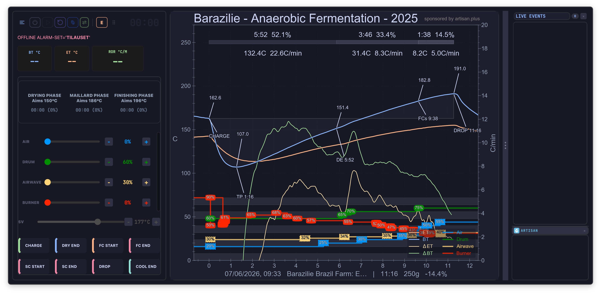
*The guided assistant panel during a roast — live phase tracking, 4-lever control (Air / Drum / Airwave / Burner), and milestone buttons*

| | |
|---|---|
| 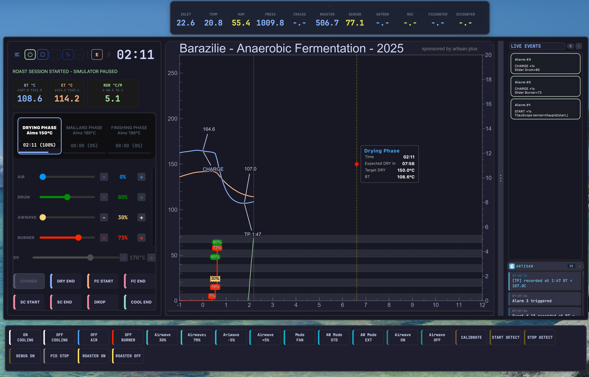 *Live projection of Dry End time and target, tracked against the plan* | 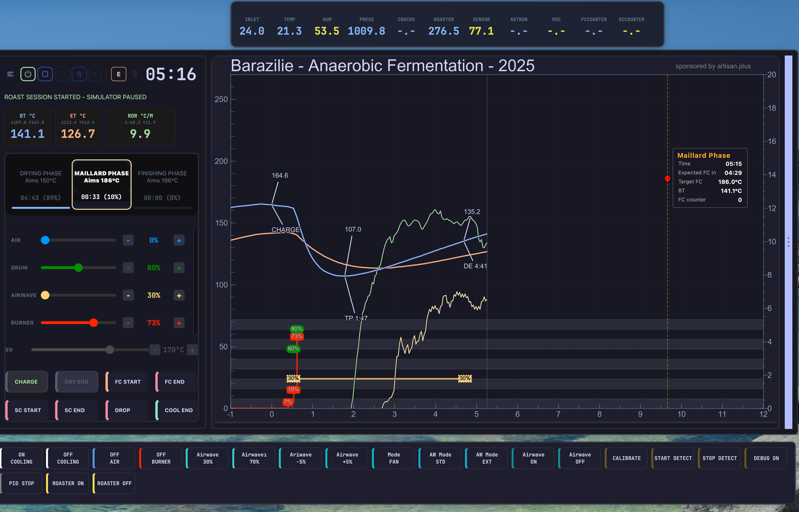 *Maillard phase countdown to expected First Crack* |

### BeanCave & Roast Viewer

| | |
|---|---|
| 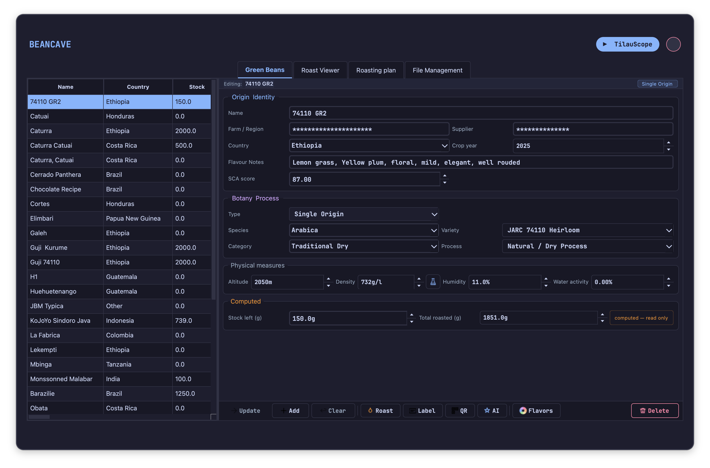 *BeanCave — green bean inventory & specs* | 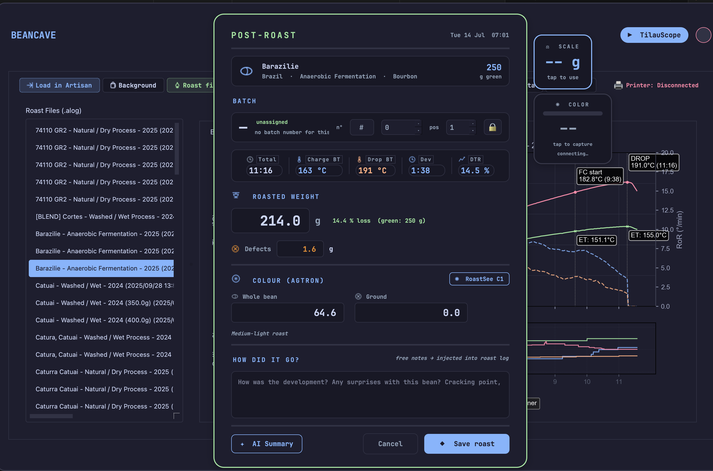 *Post-roast summary — weight loss, DTR, Agtron colour, AI-assisted notes* |
| 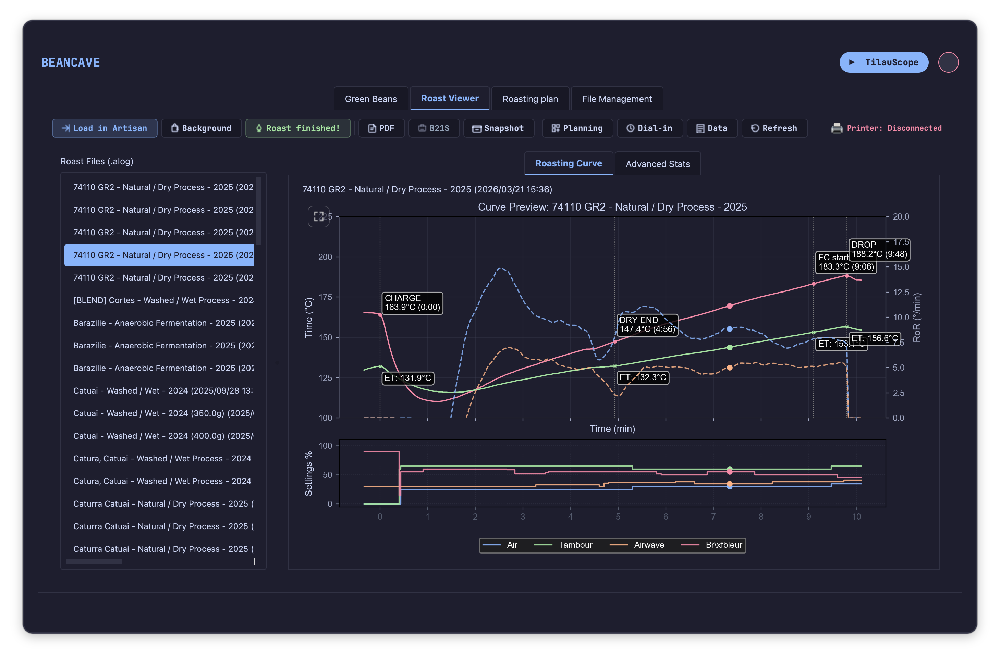 *Roast Viewer — revisit any past roast curve from BeanCave* | 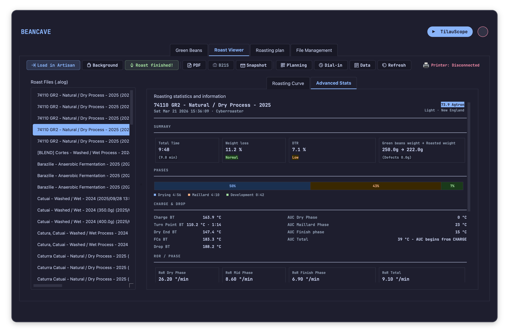 *Advanced stats — phase balance, RoR per phase, AUC* |
| 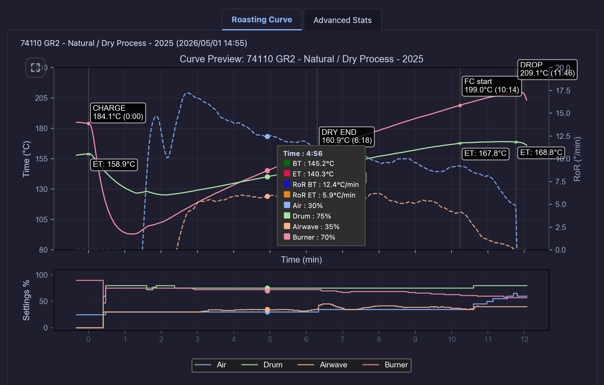 *Live cursor readout — every channel at a glance, anywhere on the curve* | 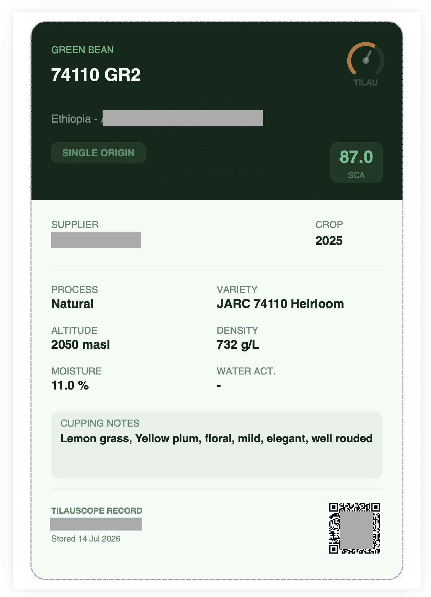 *Auto-generated bean label, ready to print* |

### Alarms & automation

| | |
|---|---|
| 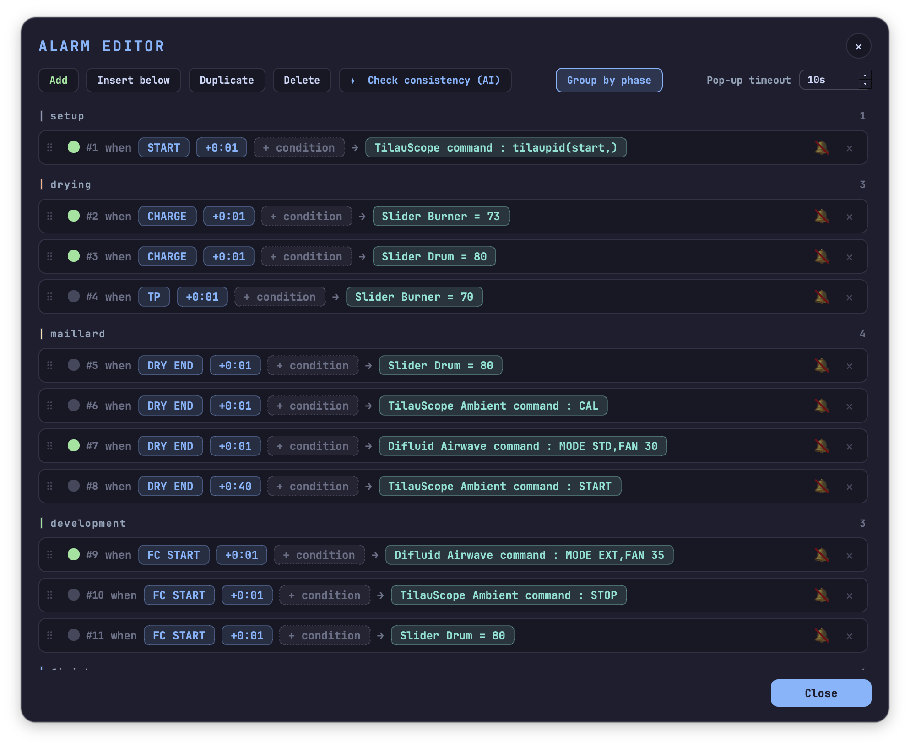 *Sentence-based Alarm Editor, grouped by roast phase* | 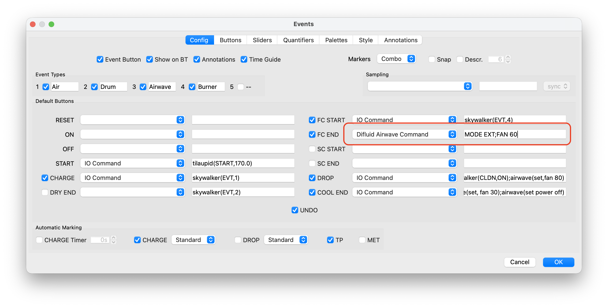 *Event buttons wiring hardware commands to roast milestones* |
| 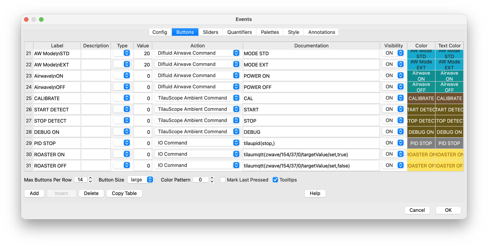 *Custom event buttons for AirWave and ambient probe commands* | |

### Hardware & configuration

| | |
|---|---|
| 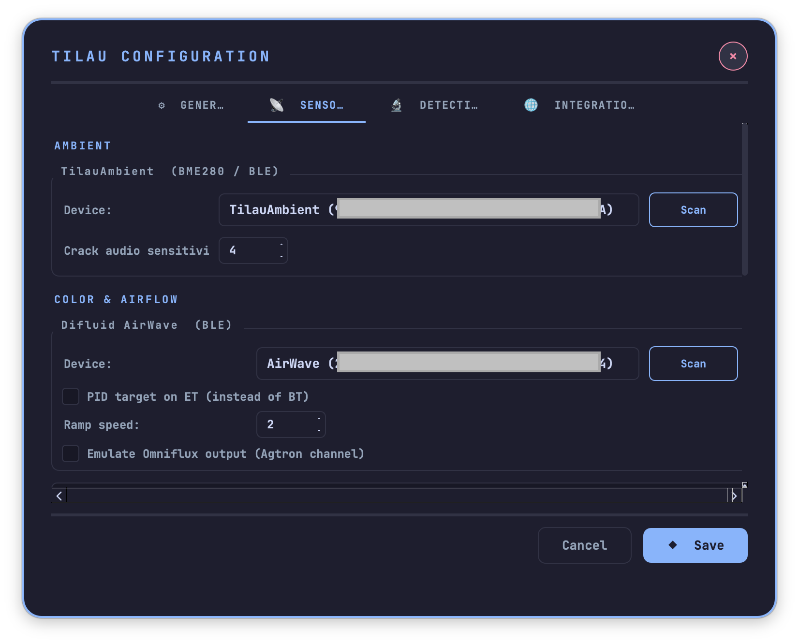 *Connected BLE hardware setup (ambient probe, DiFluid AirWave)* | 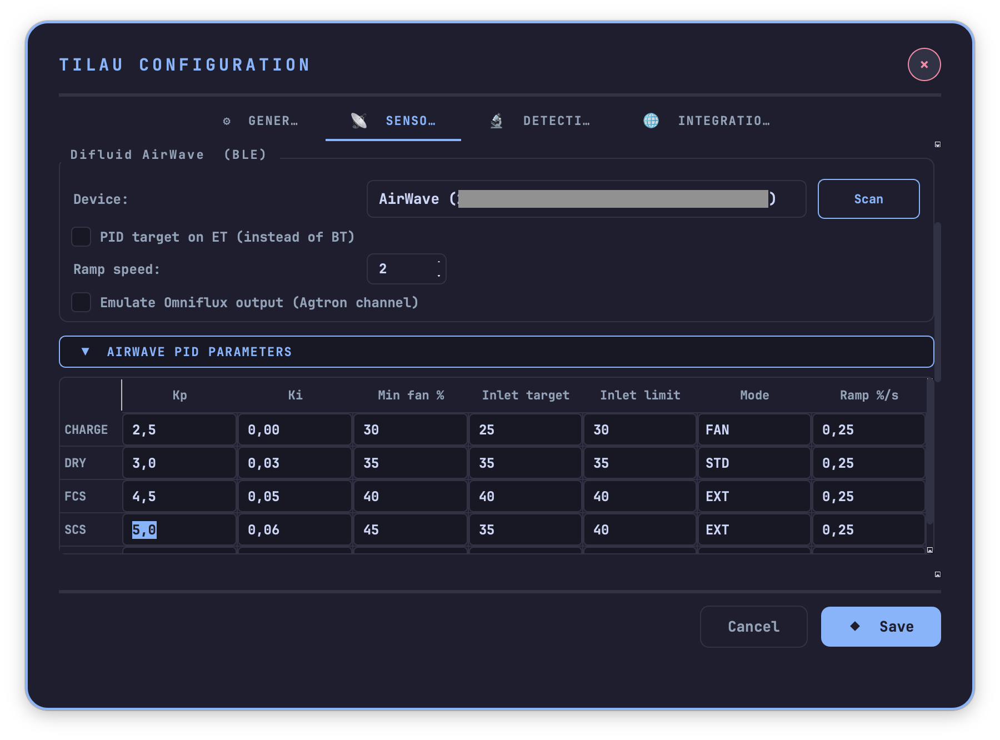 *Adaptive PID parameters per roast phase, tunable per machine* |
| 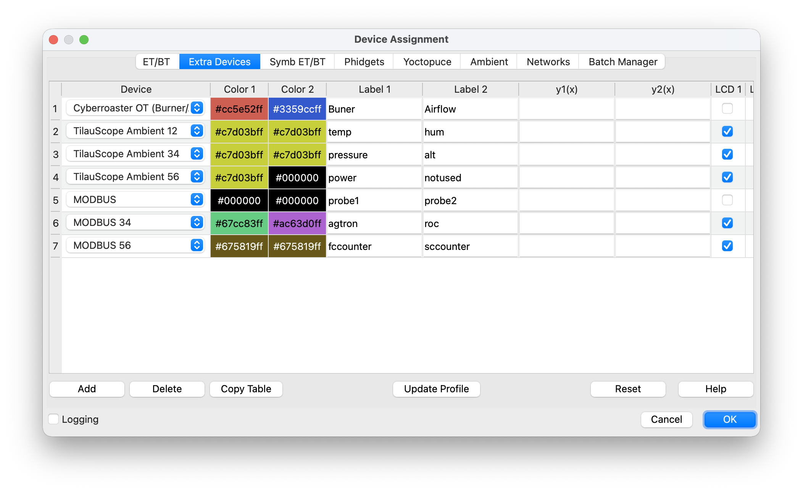 *Extra device channels — multi-sensor roasts (burner, ambient, MODBUS)* | |

## Hardware supported

Skywalker "Cyberroaster" FIR drum roasters, DiFluid AirWave (airflow/BLE) and Omniflux (color/acoustic) sensors, Acaia scales, Niimbot label printers, and a custom ambient probe (temperature/humidity/acoustic) — all integrated via BLE, Modbus, or MQTT.

## Built on Artisan Roaster Scope

TilauScope is a fork of [Artisan Roaster Scope](https://github.com/artisan-roaster-scope/artisan), the open-source roast logging and control software. All of Artisan's core functionality — device support, profile recording, alarms, PID control — is inherited unchanged; TilauScope adds the guided layer on top, additively.

Full credit and thanks to the Artisan team and community. If TilauScope is useful to you, consider [supporting Artisan's development](https://www.paypal.me/MarkoLuther) too.

## License

GNU General Public License v3.0 — see [LICENSE](LICENSE).
