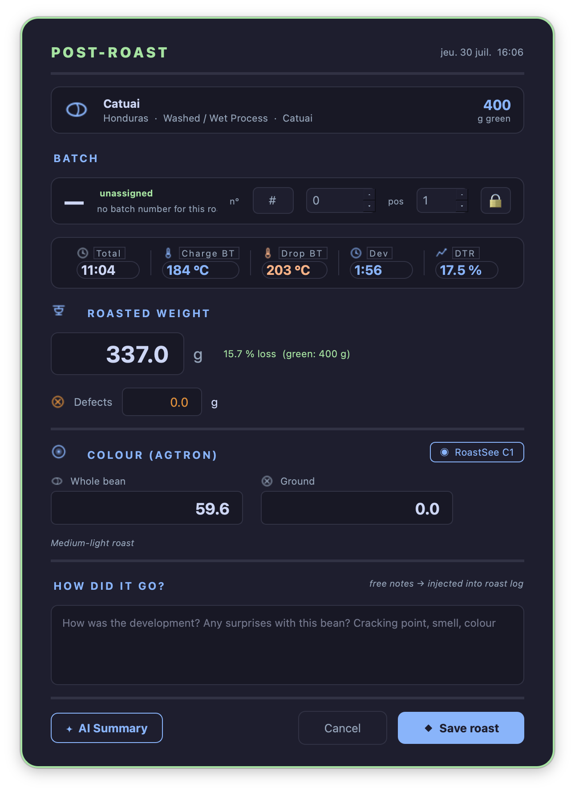
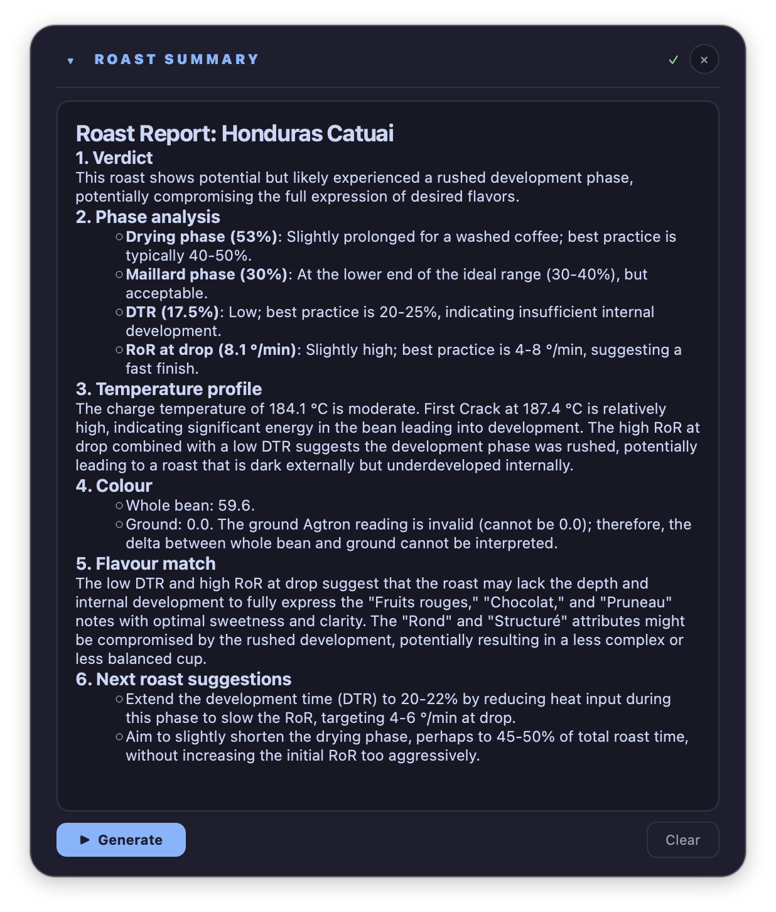

# After the roast

!!! abstract "Artisan does / TilauScope adds"
    **Artisan does** — records the curve and saves it. Reading it back means loading it and
    reading raw numbers.

    **TilauScope adds** — a record that can be reopened and completed later, a reading that
    grades the roast against your own history, a way to compare several roasts side by side,
    and correction to the timeline after the fact.

This chapter picks up where [The guided roast](the-guided-roast.md#after-the-drop) leaves
off: **ROAST SUMMARY**, colour closing the loop into the next plan, and
**🚫 Exclude from learning** all happen right at DROP and are documented there. What follows
here is everything reached later, from **BeanCave → Roast Viewer**.

---

## Finishing a roast later

A roast is not always completed on the spot — a batch relaunched with **Restart batch**
(see [The guided roast](the-guided-roast.md#cooling-and-the-next-batch)) saves without its
result form, and an older or imported file can simply be missing fields.

**Roast finished!**, in the Roast Viewer's action bar, opens the exact same result form as
the one shown at DROP — weight, colour, notes — for the selected roast, whenever it is
convenient to fill it in. Confirming it writes the result into the roast file.

---

## The Roast Viewer

**BeanCave → Roast Viewer** lists every roast file on the left; selecting one — or several —
fills the right side.

**Load in Artisan** opens the roast in Artisan's own view for full analysis. **Background**
loads it as a comparison curve behind whatever is roasting or being reviewed next.

!!! note
    **Planning** and **Dial-in**, in the same action bar, are about brewing the roast rather
    than reading it back — see [Filter coffee and espresso (Brew)](brew.md).

### Reading the curve

The **Roasting Curve** sub-tab shows the recorded BT/ET curve with every marked milestone
labelled directly on it.

Selecting **two or more roasts** turns on two extra views:

- **Consistency** overlays the selected roasts on one reference, with a shaded band showing
  how much they spread — a tight band means the same coffee roasted the same way twice; a
  wide one flags what actually varied.
- **Aligned** stretches each roast so its milestones line up with the reference roast's, so
  the *shape* of a phase can be compared independent of how long it happened to run.

### Correcting the timeline afterward

Right-clicking anywhere on the curve offers the nearest milestone to move to that point —
useful for a milestone marked a little late in the moment, or one filled in on a roast that
never had it. Choosing one stages the change; a **💾 Save markers** button appears over the
curve to confirm it.

### Reading back every sample

**Data** opens a full, read-only table of everything recorded — every sample, every phase
metric — with a navigator down the side that jumps straight to any milestone. Time is shown
from when recording actually started, so the preheat before CHARGE can be read too. Nothing
here can be changed; it exists for a real, unhurried read of the roast, when the curve alone
does not answer the question.

---

## Coach's Advice

The **Advanced Stats** sub-tab reads the finished roast, not the plan for it. Weight loss and
[DTR](glossary.md#dtr--development-time-ratio) are checked against sane ranges for the roast
level and the coffee's process; each phase duration is checked against your own history of
this coffee where you have one, and against general guidance where you do not; drop
temperature and DTR are cross-checked to catch an under- or over-developed roast even when
either figure alone looks fine; and the rate of rise around
[first crack](glossary.md#fc--first-crack) is read for a stall, a crash or a flick.

!!! note
    This is a different reading from the **Judging the batch** insights shown before roasting
    (see [Preparing a roast](preparing-a-roast.md#judging-the-batch-before-it-starts)). That
    one works from the coffee and the plan; this one works from what was actually measured.

---

## Weight, colour and notes

The result form — whether filled at DROP or reopened later — records roasted weight and any
defect weight, whole-bean and ground colour, and free notes. Colour can be typed, judged by
eye against named roast levels, or read live from a colour meter where one is paired.

**Recording a colour is what closes the loop.** A roast with a colour on file becomes part of
what the next plan for that coffee learns from — see
[The roast plan](the-roast-plan.md#what-the-plan-learns-and-when) for how. A roast left
without one simply does not teach the plan anything about drop temperature.

With an AI provider configured, **✦ AI Summary** writes a short account of the roast from its
recorded figures — a starting point for notes, not a replacement for judging the cup.

**🏷 Label PDF** prints the roast's label straight from the form, using the weight and colour
just entered, so the bag can be labelled while the batch is still cooling. Saving the form
without having printed one asks the question once. See
[Labels and QR](labels-and-qr.md#what-each-label-carries).

---

## Tasting

Cupping notes are entered through Artisan's own cupping tools, reached from **Load in
Artisan**. TilauScope does not add a separate tasting form — it reads what is already there
and shows it wherever the roast is presented: the Roast Viewer, the scanned roast card, and
the printed label.

---

## Sharing a roast

**Card** exports the selected roast as a landscape image sized for social sharing: the
coffee's identity, the roast's key figures, and its curve on one card — the roast's
counterpart to the bean record's own card (see [BeanCave](beancave.md#sharing-and-printing)).
**Snapshot** is simpler: a plain image of the curve exactly as it is displayed.

Scanning a roast's printed label or QR opens a different, read-only **roast card**: title,
date, a small curve with its milestones, weight and loss, colour and
[DTR](glossary.md#dtr--development-time-ratio), key times, tasting notes if present, and a
link back to the source coffee. See [Labels and QR](labels-and-qr.md) for printing and
scanning; this is what scanning a roast actually shows.

---

## Repairing incomplete roast files

**Repair ALogs**, in **BeanCave → File Management**, lists every roast file with a
completeness mark — missing its coffee link, or missing a field the plan or the record relies
on (weights, density, moisture, colour, ambient conditions). Selecting one opens it for
editing directly.

**Complete from bean** fills only the fields still empty, from the linked coffee's own
record — nothing already filled is touched. **Record** validates and writes the file, and
moves on to the next incomplete one, so a backlog of half-finished roasts can be cleared in
one pass rather than one file open at a time.

!!! note
    A file is only rewritten to disk when **Record** is pressed. Browsing the list, or
    closing without pressing it, changes nothing.

**🚫 Exclude from learning** can also be toggled here, per file, alongside the completeness
fields — the same switch as the one shown right after DROP.

---

## Next

- What happens at DROP itself: see [The guided roast](the-guided-roast.md#after-the-drop).
- How a recorded colour changes the next plan: see [The roast plan](the-roast-plan.md).
- Printing or scanning a roast: see [Labels and QR](labels-and-qr.md).
- A roast saved remotely, from a phone, still needs its weight and colour completed here: see
  [Piloting from a phone](phone-piloting.md).
- Brewing this coffee: see [Filter coffee and espresso (Brew)](brew.md).
- Any unfamiliar term: see the [Glossary](glossary.md).
