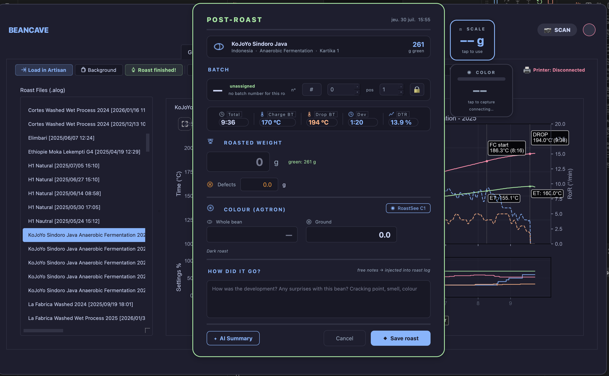
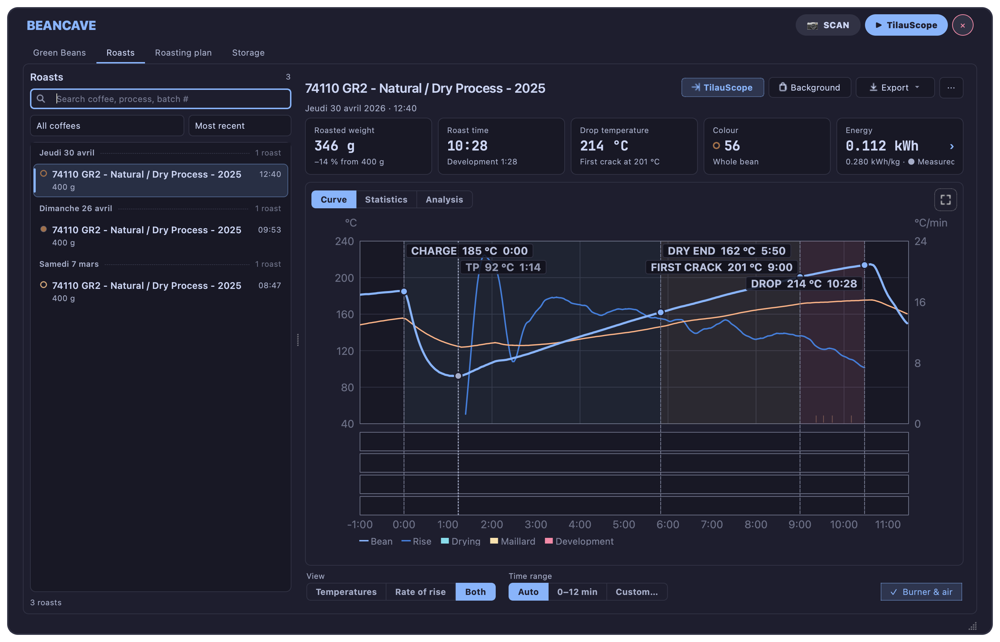
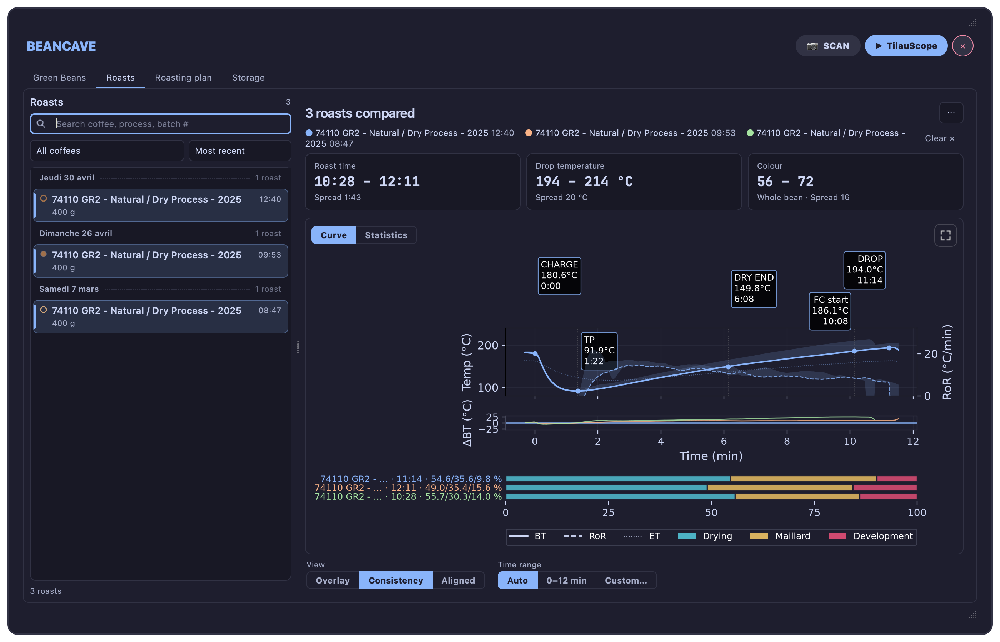
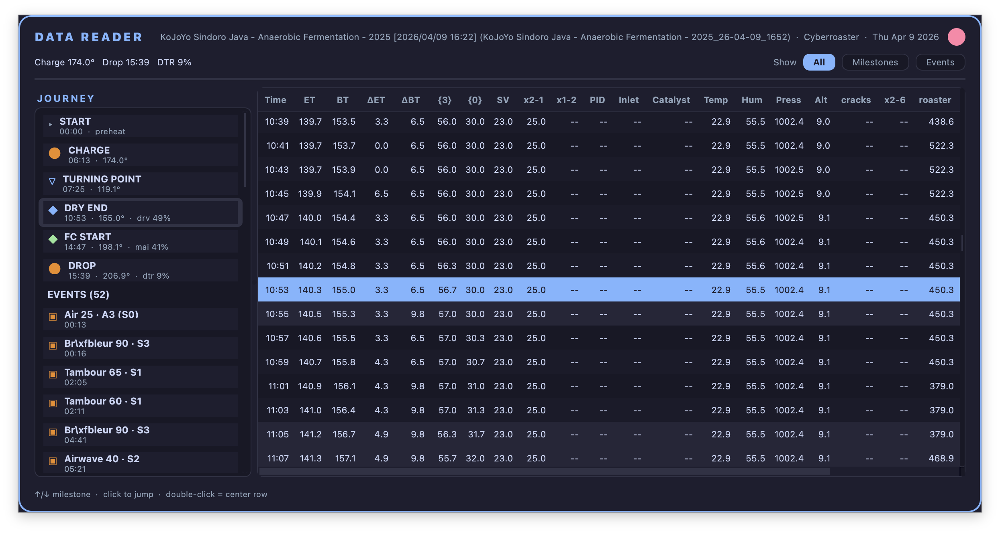
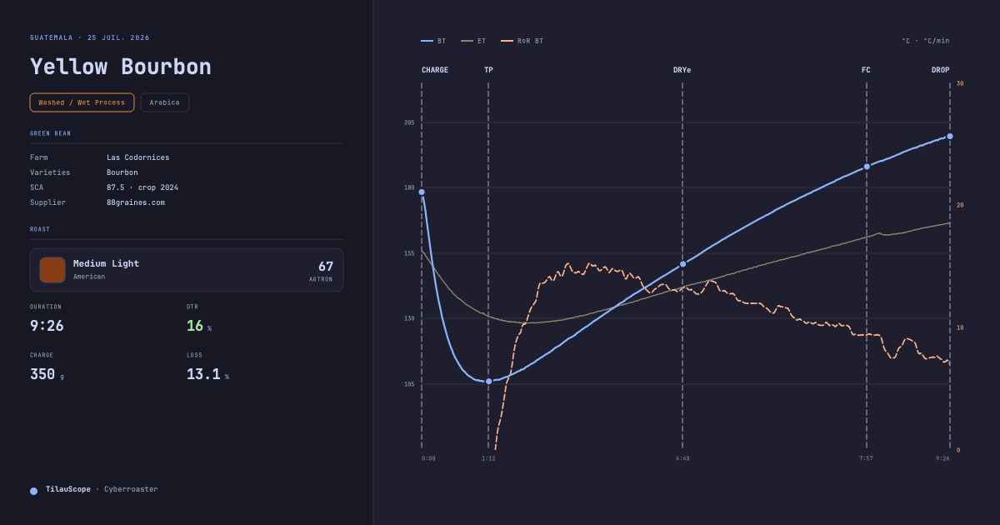
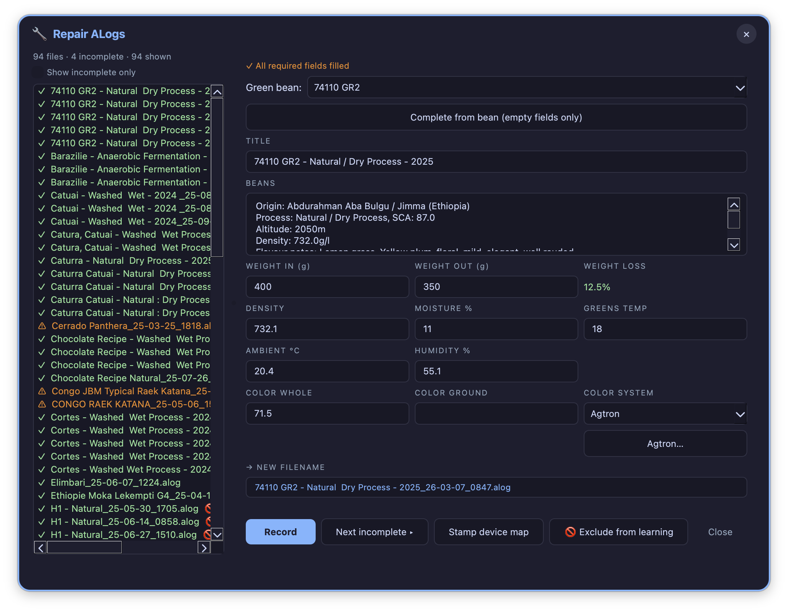

# After the roast

!!! abstract "Artisan does / TilauScope adds"
    **Artisan does** — records the curve and saves it. Reading it back means loading it and
    reading raw numbers.

    **TilauScope adds** — a record that can be reopened and completed later, a reading that
    grades the roast against your own history, a way to compare several roasts side by side,
    and correction to the timeline after the fact.

This chapter picks up where [The guided roast](the-guided-roast.md#after-the-drop) leaves
off: **ROAST SUMMARY**, colour closing the loop into the next plan, and
**🚫 Exclude from learning** all happen right at DROP and are documented there. What follows
here is everything reached later, from **BeanCave → Roast Viewer**.

---

## The roast review

The moment a recording is stopped, the left of the roasting window has nothing left to steer. The
[machine controls](the-window.md#machine-controls), the readouts above them and the status line
all describe a live session, so the whole column is given over to the **roast review**: what the
roast did, and how it compares to the plan.

The same thing happens when a past roast is opened from **File → Open**, whether to look at it or
to replay it in the simulator. There is nothing to switch on or off — starting a recording, or a
simulation, hands the column back to the live session, and RESET clears it.

At the [Guided](getting-started.md#guided-or-expert) level the docked assistant steps aside for
the review, since the roast it was guiding is over. Calling the assistant back — with the
assistant button, or by setting up the next roast from BeanCave — hands it the column again.

The review reads from the top down:

**The verdict.** One sentence saying whether the roast ran to plan, the single deviation that
mattered most, and one thing to do differently next time. It is the only part meant to be read
during a two-second glance; everything below it is the evidence behind it.

**The phase ribbon.** Drying, Maillard and development, each with its duration and its share of
the roast.

**The milestones.** Charge, turning point, dry end, first crack and drop — each with its time, its
bean temperature, and how far it landed from the plan. Timing is compared on the clock for the
early milestones and on temperature for the drop, because that is how each one is actually steered.

**Four figures.** [Development](glossary.md#dtr--development-time-ratio),
[development rise](glossary.md#development-rise), the peak
[rate of rise](glossary.md#ror--rate-of-rise) and
[weight loss](glossary.md#weight-loss). Each is shown with the plan's target or the usual range
for that roast colour, so no figure has to be judged on its own. Weight loss is the exception
to "for that roast colour": its target also follows the water this particular lot carried and
the development the roast actually got, so the panel names the development it judged against.

Below them sit the weights, the colour and the room conditions the roast was recorded in, and
**Full roast card**, which opens the same reading with the curve on it.

!!! note "When there is no plan to compare against"
    A roast started outside the guided assistant, and any roast file recorded before this feature
    existed, carries no plan. The review says so — **NO PLAN RECORDED** — and shows the figures
    against the usual ranges for the roast colour instead of inventing a comparison. The rate of
    rise column takes the place of the deviation column.

!!! note "Colour is reported, never prescribed"
    When the plan has a colour target, the measured colour is shown next to it. The advice never
    tells you to drop hotter or cooler to correct a colour: no reliable relationship between drop
    temperature and colour has been established, and inventing one would be worse than silence.

If the roasted weight has not been entered yet, the review offers to take it — the only missing
value that can still be measured at that moment. Filling it in updates the review straight away.

<!-- CAPTURE 8.0 — the roasting window just after STOP: the left column given over to the roast
     review of a roast that ran to plan — readouts and status line gone, verdict block at the top,
     phase ribbon, milestone table with the VS PLAN column, and the four figures. -->

---

## Finishing a roast later

A roast is not always completed on the spot — a batch relaunched with **Restart batch**
(see [The guided roast](the-guided-roast.md#cooling-and-the-next-batch)) saves without its
result form, and an older or imported file can simply be missing fields.

**Roast finished!**, in the Roast Viewer's action bar, opens the exact same result form as
the one shown at DROP — weight, colour, notes — for the selected roast, whenever it is
convenient to fill it in. Confirming it writes the result into the roast file.

---

## The Roast Viewer

**BeanCave → Roast Viewer** lists every roast file on the left; selecting one — or several —
fills the right side. The list is ordered by coffee, so it opens on the roast you are most
likely to want rather than on the top row: whichever roast is currently loaded in TilauScope,
or failing that the one you had selected last time, or failing that your most recent roast.

**Load in Artisan** opens the roast in Artisan's own view for full analysis. **Background**
loads it as a comparison curve behind whatever is roasting or being reviewed next.

!!! note
    **Planning** and **Dial-in**, in the same action bar, are about brewing the roast rather
    than reading it back — see [Filter coffee and espresso (Brew)](brew.md).

### Reading the curve

The **Roasting Curve** sub-tab shows the recorded BT/ET curve with every marked milestone
labelled directly on it.

Selecting **two or more roasts** turns on two extra views:

- **Consistency** overlays the selected roasts on one reference, with a shaded band showing
  how much they spread — a tight band means the same coffee roasted the same way twice; a
  wide one flags what actually varied.
- **Aligned** stretches each roast so its milestones line up with the reference roast's, so
  the *shape* of a phase can be compared independent of how long it happened to run.

<!-- CAPTURE 8.3 — Consistency view on 3+ roasts of the same coffee; the phase ribbon under the curve now reads one decimal (e.g. Drying 49.5%) -->

### Correcting the timeline afterward

Right-clicking anywhere on the curve offers the nearest milestone to move to that point —
useful for a milestone marked a little late in the moment, or one filled in on a roast that
never had it. Choosing one stages the change; a **💾 Save markers** button appears over the
curve to confirm it.

### Reading back every sample

**Data** opens a full, read-only table of everything recorded — every sample, every phase
metric — with a navigator down the side that jumps straight to any milestone. Time is shown
from when recording actually started, so the preheat before CHARGE can be read too. Nothing
here can be changed; it exists for a real, unhurried read of the roast, when the curve alone
does not answer the question.

---

## Coach's Advice

The **Advanced Stats** sub-tab reads the finished roast, not the plan for it. The roast level
it judges against is read from what the roast did — how long the bean developed and how hot it
left, the pair that sets the colour — corrected for your machine's own probe, never from the
colour measured afterwards. The advice opens by naming that level and the pair it was read
from; where the arrival lands closer to a neighbouring level than the roaster can resolve, both
are named, because a home machine's drop temperature is not a laboratory measurement.

The colour is the result of the roast, so a roast whose colour disagrees is a roast that cooked
badly, not a roast that belongs to another level. It is shown for what it is, with a category
name only when it was measured on ground beans, since that is the scale those names belong to.

The four figures above the advice are **average rises**: the degrees gained across a phase
divided by its length, from the turning point to the drop. They are not the rate of rise drawn
on the curve, which moves throughout each phase — a drying phase averaging 12°/min contains
readings well above and well below that.

Weight loss and
[DTR](glossary.md#dtr--development-time-ratio) are checked against sane ranges for that roast
level and the coffee's process — each with the tolerance its own measurement deserves, so a
ratio a tenth of a point over a limit, or a weight loss within a gram of the floor, is not
reported as a fault; each phase duration is checked against your own history of
this coffee where you have one, and against general guidance where you do not; drop
temperature and DTR are cross-checked to catch an under- or over-developed roast even when
either figure alone looks fine; and the rate of rise around
[first crack](glossary.md#fc--first-crack) is read for a stall, a crash or a flick. Only an
accident large enough to be visible on the curve is named, and only the most pronounced one,
with the time it happened — so you can go and look at that spot yourself.

!!! note
    This is a different reading from the **Judging the batch** insights shown before roasting
    (see [Preparing a roast](preparing-a-roast.md#judging-the-batch-before-it-starts)). That
    one works from the coffee and the plan; this one works from what was actually measured.

---

## Weight, colour and notes

The result form — whether filled at DROP or reopened later — records roasted weight and any
defect weight, whole-bean and ground colour, and free notes. Colour can be typed, judged by
eye against named roast levels, or read live from a colour meter where one is paired.

Across the top the form recalls which roast this is — the coffee, its batch number, and the
five figures the roast produced: total time, charge and drop temperature, development time
and DTR. Below that, the fields to fill sit on the left and the notes box on the right. On a
screen too short for the whole form, this middle part scrolls while the title and **⬥ Save
roast** stay in place.

**Recording a colour is what closes the loop.** A roast with a colour on file becomes part of
what the next plan for that coffee learns from — see
[The roast plan](the-roast-plan.md#what-the-plan-learns-and-when) for how. A roast left
without one simply does not teach the plan anything about drop temperature.

With an AI provider configured, **✦ AI Summary** writes a short account of the roast from its
recorded figures — a starting point for notes, not a replacement for judging the cup.
**What is sent** in the same panel shows the exact text the request would carry, cleaned as it
will be sent, along with a line naming what was taken out of it; reading it sends nothing.

**🏷 Label PDF** prints the roast's label straight from the form, using the weight and colour
just entered, so the bag can be labelled while the batch is still cooling. Saving the form
without having printed one asks the question once. See
[Labels and QR](labels-and-qr.md#what-each-label-carries).

<!-- CAPTURE 8.8 — the result form, two columns: weight and colour filled in on the left, notes written on the right -->

<!-- CAPTURE 8.9 — the result form reopened from Roast finished! on an older roast, batch and metrics shown across the top -->

<!-- CAPTURE 8.10 — the AI Summary panel docked beside the result form -->

---

## Tasting

Cupping notes are entered through Artisan's own cupping tools, reached from **Load in
Artisan**. TilauScope does not add a separate tasting form — it reads what is already there
and shows it wherever the roast is presented: the Roast Viewer, the scanned roast card, and
the printed label.

---

## Sharing a roast

**Card** exports the selected roast as a landscape image sized for social sharing: the
coffee's identity, the roast's key figures, and its curve on one card — the roast's
counterpart to the bean record's own card (see [BeanCave](beancave.md#sharing-and-printing)).
**Snapshot** is simpler: a plain image of the curve exactly as it is displayed.

Scanning a roast's printed label or QR opens a different, read-only **roast card**: title,
date, a small curve with its milestones, weight and loss, colour and
[DTR](glossary.md#dtr--development-time-ratio), key times, tasting notes if present, and a
link back to the source coffee. See [Labels and QR](labels-and-qr.md) for printing and
scanning; this is what scanning a roast actually shows.

---

## Repairing incomplete roast files

**Repair ALogs**, opened from **TilauScope → Roast Profile Maintenance…**, lists every roast
file with a completeness mark — missing its coffee link, or missing a field the plan or the
record relies on (weights, density, moisture, colour, ambient conditions). Selecting one opens
it for editing directly.

The window opens on its full list straight away. Should the reading take longer — a very
large folder, or one on a slow network drive — the list fills in as it goes and a progress
bar appears with a **Cancel** button: the files already listed stay usable, and **Scan
again** picks the reading back up.

**Update Roast Counts**, above the list, rescans the roast folder and recomputes how many
roasts and how much weight each green coffee has behind it — the figures shown in
[BeanCave's catalogue](beancave.md#the-catalogue).

**Complete from bean** fills only the fields still empty, from the linked coffee's own
record — nothing already filled is touched. **Record** validates and writes the file, and
keeps the same roast selected so you can check what was saved. **Next incomplete ▸** moves on
to the following file needing attention, so a backlog of half-finished roasts can be cleared
in one pass rather than one file open at a time.

!!! note
    A file is only rewritten to disk when **Record** is pressed. Browsing the list, or
    closing without pressing it, changes nothing.

**Plan learning** is set here too, per file, at the top of the editing panel — three states
rather than a switch:

| State | What it means | Does the plan learn from it? |
|---|---|---|
| **✓ Admitted** | You opened this roast, checked it, and it is sound. | Yes |
| **– Not reviewed** | No decision recorded. Every file starts here. | Yes |
| **🚫 Excluded** | You judged this roast unfit to teach anything. | No |

Only **Excluded** keeps a roast out of the history. **Admitted** does not make the plan trust
it more — it records that *you* looked, so a long list shows at a glance what has been vetted
and what has merely never been opened. An imperfect roast still teaches something, which is why
*Not reviewed* is learned from.

The state is written to the file the moment you press it, without **Record**, and the list marks
it: ✅ for admitted, 🚫 for excluded, nothing for not reviewed. Browsing the list never changes a
state — only pressing a button does.

<!-- CAPTURE 8.15 — the Repair ALogs editor pane, PLAN LEARNING segmented control visible with
"– Not reviewed" selected, and a file list showing one ✅ row and one 🚫 row. -->

The 🚫 switch shown right after DROP sets the same **Excluded** state.

---

## Next

- What happens at DROP itself: see [The guided roast](the-guided-roast.md#after-the-drop).
- How a recorded colour changes the next plan: see [The roast plan](the-roast-plan.md).
- Printing or scanning a roast: see [Labels and QR](labels-and-qr.md).
- A roast saved remotely, from a phone, still needs its weight and colour completed here: see
  [Piloting from a phone](phone-piloting.md).
- Brewing this coffee: see [Filter coffee and espresso (Brew)](brew.md).
- Any unfamiliar term: see the [Glossary](glossary.md).
