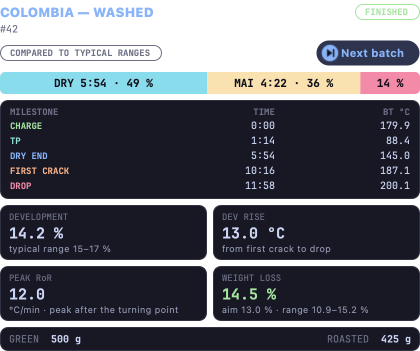
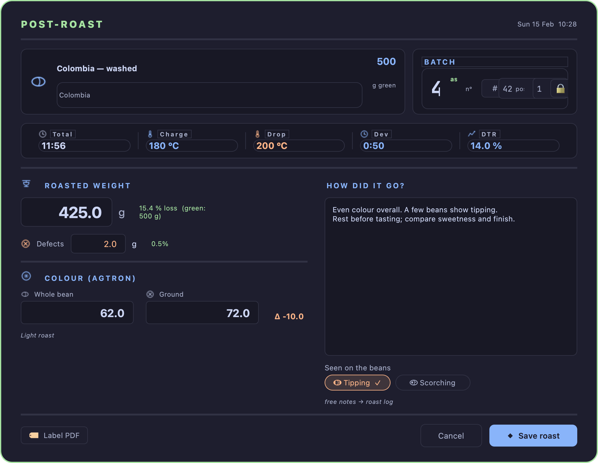
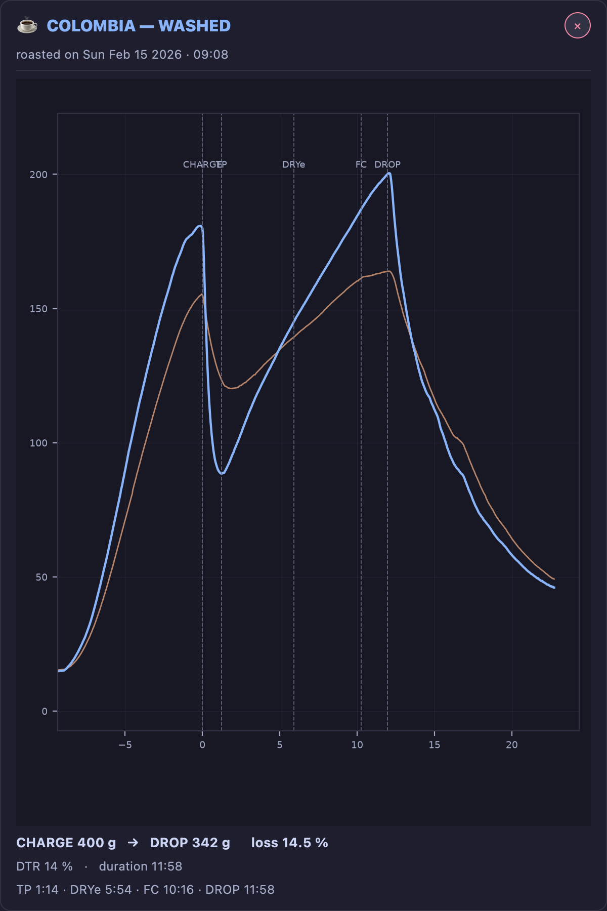

# After the roast

!!! abstract "Artisan does / TilauScope adds"
    **Artisan does** — records the curve and saves it. Reading it back means loading it and
    reading raw numbers.

    **TilauScope adds** — a record that can be reopened and completed later, a reading that
    grades the roast against your own history, a way to compare several roasts side by side,
    and correction to the timeline after the fact.

This chapter picks up where [The guided roast](the-guided-roast.md#after-the-drop) leaves
off: **ROAST SUMMARY**, colour closing the loop into the next plan, and
**🚫 Exclude from learning** all happen right at DROP and are documented there. What follows
here is everything reached later, from **BeanCave → Roasts**.

---

## The roast review

The moment a recording is stopped, the left of the roasting window has nothing left to steer. The
[machine controls](the-window.md#machine-controls), the readouts above them and the status line
all describe a live session, so the whole column is given over to the **roast review**: what the
roast did, and how it compares to the plan.

The same thing happens when a past roast is opened from **File → Open**, whether to look at it or
to replay it in the simulator, and whenever the roasting window opens on a finished roast, such as
the last one reopened when the application starts. There is nothing to switch on or off — switching
monitoring on, starting a recording or a simulation hands the column back to the live session, and
RESET clears it.

At the [Guided](getting-started.md#guided-or-expert) level the docked assistant steps aside for
the review, since the roast it was guiding is over. Calling the assistant back — with the
assistant button, or by setting up the next roast from BeanCave — hands it the column again.

The review reads from the top down:

**The verdict.** One sentence saying whether the roast ran to plan, the single deviation that
mattered most, and one thing to do differently next time. It is the only part meant to be read
during a two-second glance; everything below it is the evidence behind it.

**The phase ribbon.** Drying, Maillard and development, each with its duration and its share of
the roast.

**The milestones.** Charge, turning point, dry end, first crack and drop — each with its time and
its bean temperature. When the roast has a plan, dry end, first crack and drop also show how far
they landed from it: on the clock for the first two and on temperature for the drop, because that
is how each one is actually steered.

**Four figures.** [Development](glossary.md#dtr--development-time-ratio),
[development rise](glossary.md#development-rise), the peak
[rate of rise](glossary.md#ror--rate-of-rise) and
[weight loss](glossary.md#weight-loss). Each is shown with the plan's target or the typical range
for the roast level, so no figure has to be judged on its own. That level is read from the roast
itself — how long it developed and how hot it left — as [Coach's Advice](#coachs-advice) reads
it, never from the colour measured afterwards. Weight loss also follows the water this particular
lot carried and the development the roast actually got; the panel shows its aim and the range it
is judged on, so a loss a little under the aim but inside that range reads as fine.

Under the figures, the **Coach** card sums up the coach's reading in one line: the level the roast
was read at, and the remark that matters most — or that every check is within range. Tapping the
card opens the full reading, the same one BeanCave shows under [Coach's Advice](#coachs-advice).
Below it sit the weights, the colour and the room conditions the roast was recorded in.

**Next batch**, the blue pill at the top of the review, prepares the next roast of the same
coffee. It saves this roast if needed, resets, puts back the same coffee, its charge weight and
its [density](glossary.md#density), [moisture](glossary.md#moisture-content) and green bean
temperature, and loads this roast as the background curve. Nothing heats and nothing records
until you press MONITOR and START. At the Guided level the assistant comes back with that coffee
selected. It keeps the roasting target of the last setup when that setup was for the same coffee;
for another coffee the target is left empty, and the assistant waits until you pick one.

!!! note "When there is no plan to compare against"
    A roast started outside the guided assistant, and any roast file recorded before this feature
    existed, carries no plan. The review then sets each figure against its typical range for the
    roast level — **COMPARED TO TYPICAL RANGES** — and gives no verdict, since there is no plan
    to judge the roast by.

!!! note "Colour is reported, never prescribed"
    When the plan has a colour target, the measured colour is shown next to it. The advice never
    tells you to drop hotter or cooler to correct a colour: no reliable relationship between drop
    temperature and colour has been established, and inventing one would be worse than silence.

If the roasted weight has not been entered yet, the review offers to take it — the only missing
value that can still be measured at that moment. Filling it in updates the review straight away.

A milestone marked late, or forgotten, can be corrected on the curve beside the review — drag it
sideways, or right-click where it happened. The review is recalculated as soon as the correction
is made. See [Correcting a milestone](the-window.md#correcting-a-milestone).

<!-- CAPTURE 8.0 [scene:review] — the roasting window just after STOP: the left column given over to the roast
     review of a roast that ran to plan — readouts and status line gone, verdict block at the top,
     phase ribbon, milestone table with the VS PLAN column, the four figures, the Next batch
     pill beside the plan badge and the Coach card under the figures. -->

---

## Finishing a roast later

A roast is not always completed on the spot — a batch relaunched with **Restart batch**
(see [The guided roast](the-guided-roast.md#cooling-and-the-next-batch)) saves without its
result form, and an older or imported file can simply be missing fields.

In the Roasts tab, a roast saved without its result opens under a banner that says so:
**Record result** opens the exact same result form as the one shown at DROP — weight, colour,
notes — whenever it is convenient to fill it in. **⋯ → Record result…** opens it for any roast,
to correct one already filled in. Confirming it writes the result into the roast file.

<!-- CAPTURE 8.1 — the Roasts tab with an incomplete roast selected: its row carries the No result badge under its day heading, and the banner "No result yet — weight and colour are missing" with Record result sits above its figures, which read Not recorded for weight and colour -->

Such a roast is easy to find again: its row in the list carries a **No result** badge.

---

## The Roasts tab

**BeanCave → Roasts** lists every roast file on the left, on two lines each: the coffee and the
time it was roasted, then its process, crop year and charge weight, with the batch number on
the right. The dot in front of a roast carries its measured colour, on the same roast scale as
the rest of the application: filled for a ground reading, an outline of that colour for a
whole-bean reading, which runs a shade darker on the same meter, and an empty grey ring when no
colour was recorded. A **No result** badge marks a roast whose weight and colour were never
filled in — see [Finishing a roast later](#finishing-a-roast-later).

Roasts are grouped under a heading per day — **Today**, **Yesterday**, then the date — with the
number of roasts that day. The heading of the day at the top of the list stays in place while
you scroll.

- **Search** matches the coffee, its process, crop year, farm and country, and the batch
  number (type `#44`). Accents and capitals do not matter, and every word typed must match.
  **Ctrl+F** (**⌘F** on macOS) moves to the search box; **Esc** empties it.
- **All coffees** narrows the list to one coffee, each shown with its number of roasts.
- The order menu offers **Most recent**, **Oldest first** and **Coffee A–Z**. In coffee order
  the headings name the coffee instead of the day, and each roast shows its charge weight and
  its roasted weight. The order is kept for next time; the search and the coffee filter are
  not.

Under the list, the count reads how many roasts are shown out of the total, with **Clear
filters** beside it while a search or a coffee filter is active.

Searching never changes the roast on the right: a roast the search hides stays on screen, and
selected, until you click another one.

Selecting one roast — or several at once — fills the right side. BeanCave opens on the roast
you are most likely to want rather than on the top row: whichever roast is currently loaded in
TilauScope, or failing that the one you had selected last time, or failing that your most
recent roast.

A selected roast opens under its name and the day it was roasted, with its process, crop year
and batch number, and four figures, each with what it means underneath:

| Figure | Underneath |
|---|---|
| **Roasted weight** | The weight loss, and the charge weight it came from |
| **Roast time** | The [development](glossary.md#dtr--development-time-ratio) time, when first crack was marked |
| **Drop temperature** | The bean temperature at first crack |
| **Colour** | **Ground** and its colour category — or **Whole bean**, which is given no category |

A figure that was never recorded reads **Not recorded**. With several roasts selected, the head
reads how many are compared, names each one in its curve's colour, and gives the roast time,
drop temperature and colour as a range with its spread. Colour is compared only when every roast
was measured the same way, all ground or all whole bean. **Clear** returns to the first of them,
on its own. Up to five roasts are drawn at once.

Beside the roast's name, **Load in Artisan** opens the roast in Artisan's own view for full
analysis, drawn with bean temperature, its [projection](glossary.md#projection) and its rate of
rise — see [Configuration](configuration.md#artisan-settings-tilauscope-keeps-fixed).
**Background** loads it as a comparison curve behind whatever is roasting or being reviewed next.
**Export** holds the roast's label — as a PDF, or printed on the paired label printer, whose state
shows at the foot of the menu — the roast card and an image of the curve; see
[Sharing a roast](#sharing-a-roast). The **⋯** menu holds the rest: **Record result…**,
**Planning**, **Dial-in**, **Data** and **Refresh list**.

!!! note
    **Planning** and **Dial-in**, in the **⋯** menu, are about brewing the roast rather
    than reading it back — see [Filter coffee and espresso (Brew)](brew.md).

### Reading the curve

**Curve**, at the top of the card under the figures, shows the recorded curve — BT and ET, or
BT alone for a machine without an air probe — with every marked milestone labelled directly on
it and the rate of rise at drop written at the end of its line. When a crack probe counted during the
roast, one tick per pop runs along the foot of the plot, exactly as in the roasting window — see
[Listening to the crack](the-window.md#listening-to-the-crack). **Statistics**, beside it, holds
the reading described under [Coach's Advice](#coachs-advice). At the right of that row, on
**Curve**, the full-screen button opens the curve on the whole window; the same button, or ESC,
closes it.

Under the card, three choices change what the curve shows, and are kept for next time:

- **View** — **Temperatures**, **Rate of rise** or **Both**: the bean and air temperatures,
  their [rate of rise](glossary.md#ror--rate-of-rise), or the two together.
- **Time range** — **Auto** fits the roast from charge to drop; **0–12 min** keeps the same
  scale from one roast to the next, so two roasts read alike at a glance; **Custom…** asks for
  a start and an end, and says so when the end is less than half a minute after the start.
- **Burner & air** — the strip of burner, air and drum settings under the curve: the settings
  that explain its shape.

With **two or more roasts** selected, **View** offers three ways to compare them instead:

- **Overlay** draws every roast on the same axes, each in its own colour.
- **Consistency** overlays the selected roasts on one reference, with a shaded band showing
  how much they spread — a tight band means the same coffee roasted the same way twice; a
  wide one flags what actually varied.
- **Aligned** stretches each roast so its milestones line up with the reference roast's, so
  the *shape* of a phase can be compared independent of how long it happened to run.

Resting the pointer on the curves names the roast nearest to it, in its own colour, and reads its
bean temperature, air temperature and rate of rise — each marked with the line style it is drawn
in, since a comparison gives one colour to a whole roast rather than one colour per measurement.

A comparison also draws a **phase ribbon**: one bar per roast, split into drying, Maillard and
development as shares of that roast's own time, with the three colours named under the plot.
Each row is labelled with its coffee, its roast time and the three shares in that order, so an
exported image carries them too; resting the pointer on a bar adds each phase's duration. The
bars themselves carry no figures, so the ribbon stays readable whatever the size of the window.

<!-- CAPTURE 8.2 [scene:cave_roast] — the Roasts tab, one roast selected in the list grouped by day: its name, date and four figures above the curve card on Curve, all milestones labelled, the rate of rise at drop written, View on Both and Burner & air on -->

<!-- CAPTURE 8.3 [scene:cave_consistency] — View on Consistency with 3+ roasts of the same coffee; the phase ribbon under the curve shows one bar per roast, the pointer off the ribbon -->

<!-- CAPTURE 8.4 [scene:cave_aligned] — View on Aligned with the same set, the list narrowed to that coffee with All coffees -->

### Correcting the timeline afterward

Right-clicking anywhere on the curve offers the nearest milestone to move to that point —
useful for a milestone marked a little late in the moment, or one filled in on a roast that
never had it. Choosing one stages the change; a **💾 Save markers** button appears over the
curve to confirm it. The roast on screen in the roasting window can also be corrected directly
on its own curve — see [Correcting a milestone](the-window.md#correcting-a-milestone).

<!-- CAPTURE 8.5 — the Roasts tab on Curve, a milestone right-clicked so the marker menu shows
its current time and the proposed new one; the curve must show the probe colours (bean blue,
air peach, their rates in the same hues one step back) -->

### Reading back every sample

**⋯ → Data** opens a full, read-only table of everything recorded — every sample, every phase
metric — with a navigator down the side that jumps straight to any milestone. Time is shown
from when recording actually started, so the preheat before CHARGE can be read too. Nothing
here can be changed; it exists for a real, unhurried read of the roast, when the curve alone
does not answer the question.

The view stays open while you work in the roast list: selecting another roast shows that
roast in it, with the same filter and, where the roast has one, the same milestone selected —
so one point of the roast can be read across several roasts in a row.

---

## Coach's Advice

**Statistics**, beside **Curve** in the Roasts tab, reads the finished roast, not the plan for it; the **Coach**
card in the roast review opens the same reading in the roasting window. The roast level
it judges against is read from what the roast did — how long the bean developed and how hot it
left, the pair that sets the colour — corrected for your machine's own probe, never from the
colour measured afterwards. The advice opens by naming that level and the pair it was read
from; where the arrival lands closer to a neighbouring level than the roaster can resolve, both
are named, because a home machine's drop temperature is not a laboratory measurement.

The colour is the result of the roast, so a roast whose colour disagrees is a roast that cooked
badly, not a roast that belongs to another level. It is shown for what it is, with a category
name only when it was measured on ground beans, since that is the scale those names belong to.

The four figures above the advice are **average rises**: the degrees gained across a phase
divided by its length, from the turning point to the drop. They are not the rate of rise drawn
on the curve, which moves throughout each phase — a drying phase averaging 12°/min contains
readings well above and well below that.

Weight loss and
[DTR](glossary.md#dtr--development-time-ratio) are checked against sane ranges for that roast
level and the coffee's process — each with the tolerance its own measurement deserves, so a
ratio a tenth of a point over a limit, or a weight loss within a gram of the floor, is not
reported as a fault; each phase duration is checked against your own history of
this coffee where you have one, and against general guidance where you do not; drop
temperature and DTR are cross-checked to catch an under- or over-developed roast even when
either figure alone looks fine; and the rate of rise around
[first crack](glossary.md#fc--first-crack) is read for a stall, a crash or a flick. Only an
accident large enough to be visible on the curve is named, and only the most pronounced one,
with the time it happened — so you can go and look at that spot yourself.

!!! note
    This is a different reading from the **Judging the batch** insights shown before roasting
    (see [Preparing a roast](preparing-a-roast.md#judging-the-batch-before-it-starts)). That
    one works from the coffee and the plan; this one works from what was actually measured.

<!-- CAPTURE 8.8 [scene:cave_stats] (image) — Statistics chosen beside Curve in the Roasts tab, Coach's Advice fully populated, ideally flagging at least one phase -->

---

## Weight, colour and notes

The result form — whether filled at DROP or reopened later — records roasted weight and any
defect weight, whole-bean and ground colour, free notes, and the burns visible on the beans.
Colour can be typed, judged by eye against named roast levels, or read live from a colour
meter where one is paired.

Across the top the form recalls which roast this is — the coffee, its batch number, and the
five figures the roast produced: total time, charge and drop temperature, development time
and DTR. Below that, the fields to fill sit on the left and the notes box on the right. On a
screen too short for the whole form, this middle part scrolls while the title and **⬥ Save
roast** stay in place.

Under the notes box, **Seen on the beans** offers two marks: **Tipping**, when the ends of the
beans are burnt dark, and **Scorching**, when their flat side carries dark patches — see
[tipping](glossary.md#tipping) and [scorching](glossary.md#scorching). Click one to mark it; it
lights up with a ✓, and a second click clears it. The marks are saved with the roast when the
form is confirmed — they are the same ones Artisan's own roast properties show — and a roast
reopened later comes back with its marks already set.

**Recording a colour is what closes the loop.** A roast with a colour on file becomes part of
what the next plan for that coffee learns from — see
[The roast plan](the-roast-plan.md#what-the-plan-learns-and-when) for how. A roast left
without one simply does not teach the plan anything about drop temperature.

With an AI provider configured, **✦ AI Summary** writes a short account of the roast from its
recorded figures, and from the colour, the marks and the notes entered in the form — a starting
point for notes, not a replacement for judging the cup.
**What is sent** in the same panel shows the exact text the request would carry, cleaned as it
will be sent, along with a line naming what was taken out of it; reading it sends nothing.

**🏷 Label PDF** prints the roast's label straight from the form, using the weight and colour
just entered, so the bag can be labelled while the batch is still cooling. Saving the form
without having printed one asks the question once. See
[Labels and QR](labels-and-qr.md#what-each-label-carries).

<!-- CAPTURE 8.8b [scene:result] — the result form, two columns: weight and colour filled in on the left, notes written on the right, and Tipping marked (lit, with its ✓) under the Seen on the beans caption, below the notes box -->

<!-- CAPTURE 8.9 — the result form reopened from ⋯ → Record result… on an older roast, batch and metrics shown across the top -->

<!-- CAPTURE 8.10 — the AI Summary panel docked beside the result form -->

---

## Tasting

Cupping notes are entered through Artisan's own cupping tools, reached from **Load in
Artisan**. TilauScope does not add a separate tasting form — it reads what is already there
and shows it wherever the roast is presented: the Roasts tab, the scanned roast card, and
the printed label.

---

## Sharing a roast

**Export → Roast card (PNG)** exports the selected roast as a **2160 × 3240 portrait PNG** for social sharing.
It includes the coffee's identity, total duration, measured colour (ground or whole bean),
and separate temperature and [rate-of-rise](glossary.md#ror--rate-of-rise) graphs with the same time axis.
When a crack probe counted during the roast, the rate-of-rise graph carries one tick per pop along its foot.
Dry end, first crack and drop show elapsed time since charge and bean temperature.
Below the graphs, drying, Maillard and development show their durations and shares of the roast;
the phase bar is proportional to time. Charge and roasted weights and weight loss complete the card.
Missing milestones are labelled **Not marked**; unavailable phase durations are shown as a dash.
The phase bar remains neutral when its boundaries are incomplete. Missing RoR is explicitly indicated;
when the turning point is available, RoR starts there. The export uses the profile's temperature unit.
This is the roast's counterpart to the bean record's own card
(see [BeanCave](beancave.md#sharing-and-printing)).
**Export → Curve image (PNG)** is simpler: a plain image of the curve exactly as it is displayed, crack ticks included.

Scanning a roast's printed label or QR opens a different, read-only **roast card**: title,
date, a small curve with its milestones, weight and loss, colour and
[DTR](glossary.md#dtr--development-time-ratio), key times, tasting notes if present, and a
link back to the source coffee. See [Labels and QR](labels-and-qr.md) for printing and
scanning; this is what scanning a roast actually shows.

<!-- CAPTURE 8.11 [scene:card] — Export a completed roast as a portrait Card with temperature and RoR, all three milestones, phase durations and measured colour. -->

---

## Repairing incomplete roast files

**Repair ALogs**, opened from **TilauScope → Roast Profile Maintenance…**, lists every roast
file with a completeness mark — missing its coffee link, or missing a field the plan or the
record relies on (weights, density, moisture, colour, ambient conditions). Selecting one opens
it for editing directly.

The window opens on its full list straight away. Should the reading take longer — a very
large folder, or one on a slow network drive — the list fills in as it goes and a progress
bar appears with a **Cancel** button: the files already listed stay usable, and **Scan
again** picks the reading back up.

**Update Roast Counts**, above the list, rescans the roast folder and recomputes how many
roasts and how much weight each green coffee has behind it — the figures shown in
[BeanCave's catalogue](beancave.md#the-catalogue).

**Complete from bean** fills only the fields still empty, from the linked coffee's own
record — nothing already filled is touched. **Record** validates and writes the file, and
keeps the same roast selected so you can check what was saved. **Next incomplete ▸** moves on
to the following file needing attention, so a backlog of half-finished roasts can be cleared
in one pass rather than one file open at a time.

!!! note
    A file is only rewritten to disk when **Record** is pressed. Browsing the list, or
    closing without pressing it, changes nothing.

**Plan learning** is set here too, per file, at the top of the editing panel — three states
rather than a switch:

| State | What it means | Does the plan learn from it? |
|---|---|---|
| **✓ Admitted** | You opened this roast, checked it, and it is sound. | Yes |
| **– Not reviewed** | No decision recorded. Every file starts here. | Yes |
| **🚫 Excluded** | You judged this roast unfit to teach anything. | No |

Only **Excluded** keeps a roast out of the history. **Admitted** does not make the plan trust
it more — it records that *you* looked, so a long list shows at a glance what has been vetted
and what has merely never been opened. An imperfect roast still teaches something, which is why
*Not reviewed* is learned from.

The state is written to the file the moment you press it, without **Record**, and the list marks
it: ✅ for admitted, 🚫 for excluded, nothing for not reviewed. Browsing the list never changes a
state — only pressing a button does.

<!-- CAPTURE 8.15 — the Repair ALogs editor pane, PLAN LEARNING segmented control visible with
"– Not reviewed" selected, and a file list showing one ✅ row and one 🚫 row. -->

The 🚫 switch shown right after DROP sets the same **Excluded** state.

---

## Next

- What happens at DROP itself: see [The guided roast](the-guided-roast.md#after-the-drop).
- How a recorded colour changes the next plan: see [The roast plan](the-roast-plan.md).
- Printing or scanning a roast: see [Labels and QR](labels-and-qr.md).
- A roast saved remotely, from a phone, still needs its weight and colour completed here: see
  [Piloting from a phone](phone-piloting.md).
- Brewing this coffee: see [Filter coffee and espresso (Brew)](brew.md).
- Any unfamiliar term: see the [Glossary](glossary.md).
