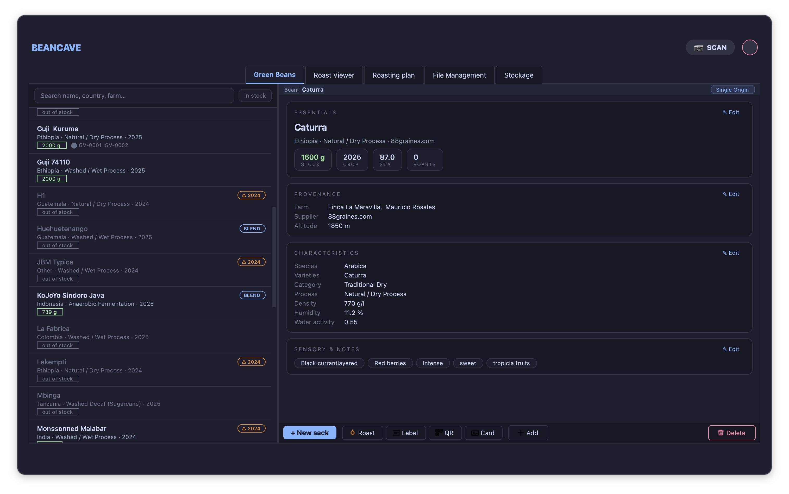
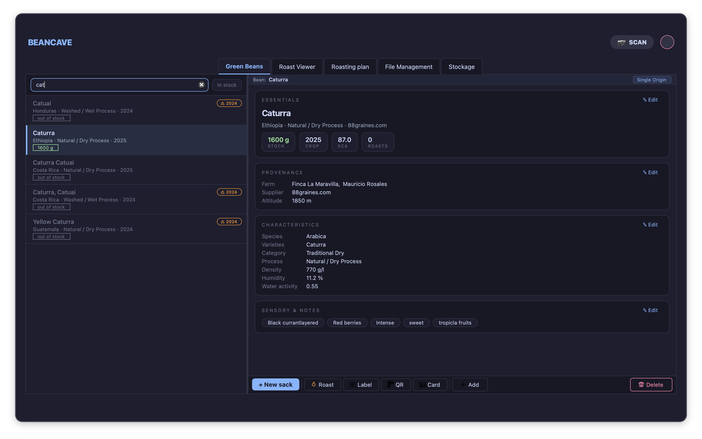
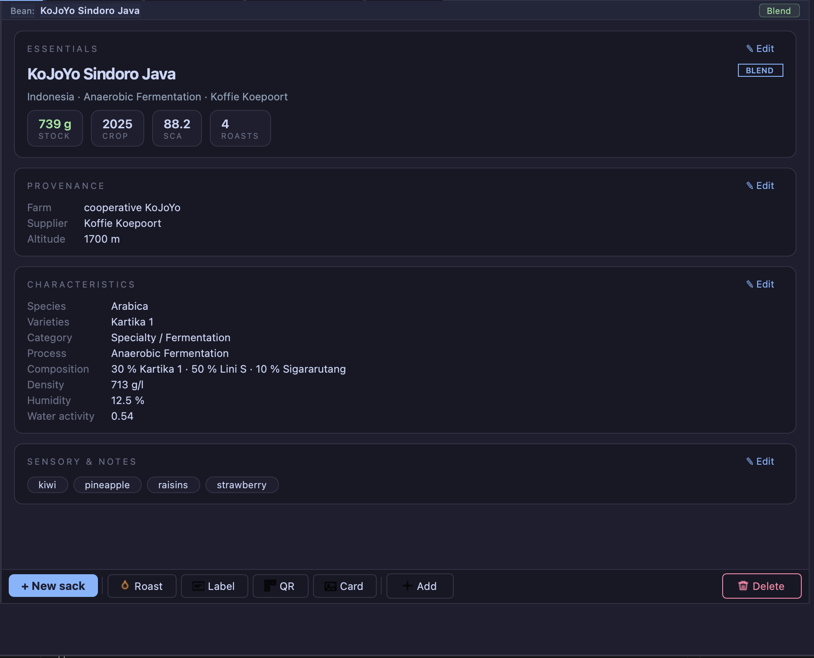
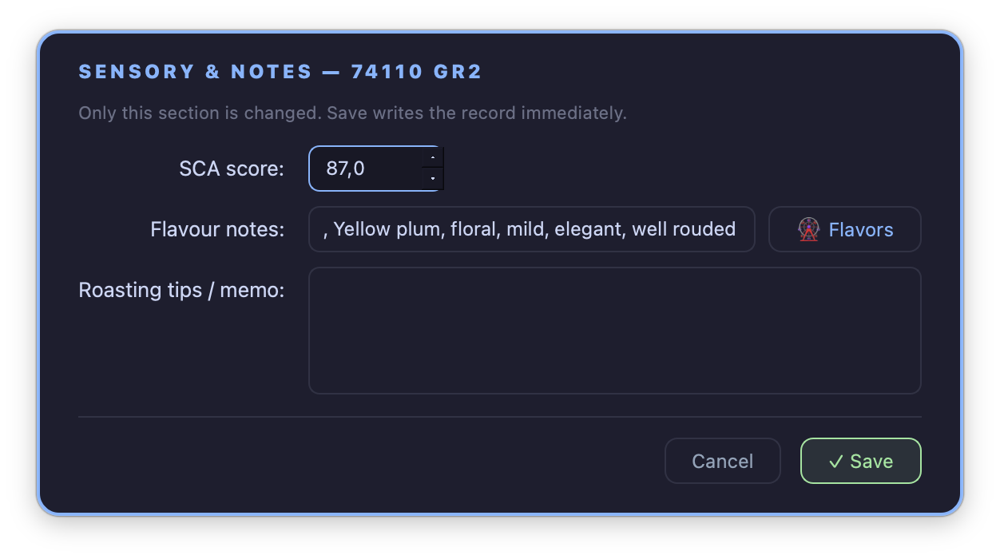
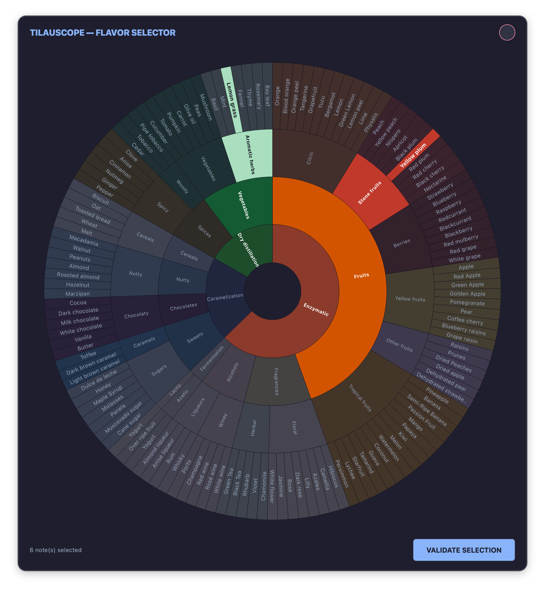
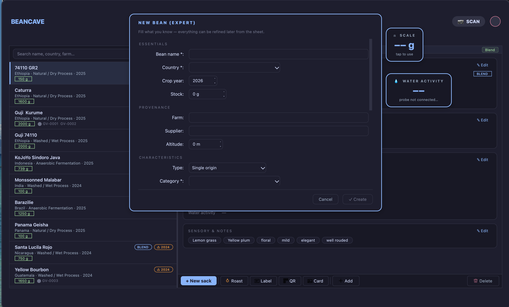
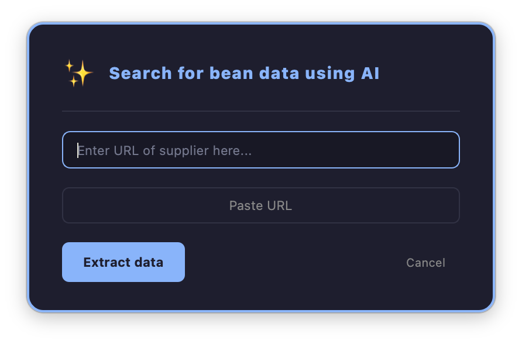

# BeanCave — your green coffee

!!! abstract "Artisan does / TilauScope adds"
    **Artisan does** — stores the coffee as free text in each roast file. Two roasts of the same
    bag are two unrelated strings, and nothing knows how much of that bag is left.

    **TilauScope adds** — BeanCave: a record per green coffee, with an identity that every roast
    of it points back to. That identity is what makes the rest possible — stock that goes down as
    you roast, a [roast plan](the-roast-plan.md) that learns from previous roasts of *this* coffee,
    and a history you can read.

BeanCave is where a TilauScope setup begins. It opens from **TilauScope → BeanCave**, and the
first time it opens it runs the
[first-time setup wizard](getting-started.md#first-time-setup).

---

## The four tabs

| Tab | What it is for |
|---|---|
| **Green Beans** | The catalogue and the bean records. This chapter. |
| **Roast Viewer** | Reading back a finished roast — curve, statistics, tasting. See [After the roast](after-the-roast.md). |
| **Roasting plan** | Generating a [roast plan](the-roast-plan.md) and its PDF. |
| **Stockage** | How your coffee is keeping: [water activity](glossary.md#aw--water-activity), conditioning, sack labels — see [Sacks, stock and conservation](sacks-and-storage.md). |

---

## The catalogue

The Green Beans tab is a readable list, not a spreadsheet: each coffee on a few compact lines
with its stock, its origin and its freshness.

**Search** — *Search name, country, farm…* filters as you type.

**In stock** — *Hide out-of-stock beans* narrows the list to what you can actually roast today. A
coffee you have finished stays in the database, with its history intact, without cluttering the
list.

Each entry carries badges that answer the questions asked when choosing what to roast: whether it
is a **blend**, how old the harvest is — *Harvest is 2 years old* — and whether it is **out of
stock**. Where sack labels are used, the labels attached to that coffee are shown too.

!!! note
    An empty list after filtering says so — *No bean matches the current filter.* — rather than
    looking like an empty database.

---

## The bean record

A record opens **to be read**, not to be edited. It is laid out in zones, and **each zone has its
own ✎ Edit dialog** — so correcting an altitude does not mean re-opening a form with forty fields
in it.

| Zone | What it holds |
|---|---|
| **Essentials** | Name, origin, crop year, stock — as stat tiles. |
| **Provenance** | Farm, supplier, altitude. |
| **Characteristics** | Type, category, process, species, varieties, [density](glossary.md#density), [humidity](glossary.md#moisture-content). |
| **Sensory & notes** | [SCA](glossary.md#sca-score) score, flavour notes, roasting memo. |
| **Sacks** | The physical bags of this coffee, and their labels — see [Sacks, stock and conservation](sacks-and-storage.md). |
| **Roasts** | Every roast of this coffee. |

Each zone's edit button states what it covers — *Edit name, origin, year and stock*, *Edit farm,
supplier and altitude* — so there is no guessing which dialog holds which field. Editing a zone
changes **only** that zone: *Only this section is changed. Save writes the record immediately.*

### Weighing and measuring from the record

**Stock** accepts a live weight: with a scale configured, clicking the ⚖ reading captures the
exact figure instead of a typed approximation — *With a scale configured, click the ⚖ reading to
capture the exact weight.*

**Density** can be measured the same way, from a fixed-volume container, with **Measure**. If no
scale is set up, the dialog says so plainly — *No scale configured* — rather than offering a
button that does nothing.

An unmeasured density now reads *not measured*, and the roast plan leaves the coffee's structure
alone rather than treating the empty field as a very light bean. Records saved before this
change carried 500 g/l for "empty"; they are cleared the first time the cave is opened, so a
coffee whose density you did measure at that figure needs entering again.

**Water activity** can be measured directly from the record with an AquaGauge. What the value
means for storage is in [Sacks, stock and conservation](sacks-and-storage.md).

**Density**, **Humidity** and **Water activity** each read back what the figure means, in plain
words, right after the value: *790 g/l (dense)*, *12.4 % (moist)*, *0.54 (typical)*. It appears
both in the *Characteristics* zone of the record and in the fields you edit. The comment turns
amber when the value sits outside the usual range, and red when a water activity is high enough
to be a storage risk. The bands are the same ones the roast plan and the coach's advice use, so a
value never reads *normal* in one place and is flagged in the other. An unmeasured value says
nothing.

**Flavour notes** are entered on the flavour wheel rather than typed as free text, which keeps the
vocabulary consistent from one coffee to the next.

!!! info "Hardware"
    Live weighing needs an Acaia scale; density measurement needs a scale configured as scale 1 in
    Artisan; water activity needs an AquaGauge. Everything else on the record is typed.

<!-- CAPTURE 3.6 — the stock field with a live scale reading available. -->

---

## Adding a coffee

**Add New Bean** asks how you want to start: **From current fields**, which pre-fills from what
you have already typed, or **Blank bean**, which starts fresh. A full expert form follows, with
required fields named up front — *Fill the required fields (\*): name, country, category, process,
species, varieties* — and the reassurance that matters when a bag has just arrived: *Fill what you
know — everything can be refined later from the sheet.*

**Blends** are declared as such, with their components and ratios.

!!! tip "The guided way in"
    For a bag that has just arrived, the **+ New sack** assistant is the better route: it walks
    through registering a new coffee, restocking an existing one, or opening a new crop year, and
    reviews everything before saving. The expert form exists for when you know exactly what you
    are entering. See [Sacks, stock and conservation](sacks-and-storage.md) for the assistant in
    full.

    When the coffee is already in the catalogue and this is simply its next harvest, select it and
    use **🌱 New crop** instead: it inherits everything that does not change and asks only for the
    new year, the weight and the measurements of the lot.

### Filling a record from the supplier's page

Rather than copying a dozen fields by hand, paste the supplier's URL — *Enter URL of supplier
here...* — and TilauScope fills the record from that page, blends and component ratios included.
The result is presented for review before anything is saved.

!!! note
    This needs an AI provider configured — see [Configuration](configuration.md#-integrations--outside-services).
    Extraction reads a web page written for humans, so **check the result**: it is a first draft
    to correct, not an authority.

---

## The roast history of a coffee

The **Roasts** zone lists every roast of this coffee, with the total weight roasted computed for
you. This is the same history the [roast plan](the-roast-plan.md#what-the-plan-learns-and-when)
learns from, which is why keeping records attached to the right coffee matters: a roast filed
against the wrong bag teaches the plan the wrong lesson.

A roast opens into the **Roast Viewer** — curve, key events, statistics and tasting. See
[After the roast](after-the-roast.md) for what it shows and how to read it.

---

## Sharing and printing

A bean record can be exported as a **landscape image sized for social networks**, and so can a
roast — green coffee, roast level, key figures and the curve on one card (see
[After the roast](after-the-roast.md#sharing-a-roast) for the roast card).

Labels for beans, roasts and sacks print from here, each carrying a QR code that opens the
corresponding record. The **📷 SCAN** button reads those codes with the webcam; a phone camera
works too — see [Labels and QR](labels-and-qr.md) for printing and scanning in full.

!!! note
    Printing and scanning are optional throughout. A setup that never prints a label never sees a
    prompt about one.

---

## Roast files

Auditing incomplete roast files, linking one to a green coffee, and recomputing how many roasts
each coffee has is not a BeanCave tab — it opens from **TilauScope → Roast Profile
Maintenance…**. See [Repairing incomplete roast files](after-the-roast.md#repairing-incomplete-roast-files).

---

## Next

- What to configure so all of this works: see [Configuration](configuration.md).
- Tracking bags and keeping condition: see [Sacks, stock and conservation](sacks-and-storage.md).
- Printing and scanning labels: see [Labels and QR](labels-and-qr.md).
- Generating a plan for a coffee: see [The roast plan](the-roast-plan.md).
- Roasting it: see [Preparing a roast](preparing-a-roast.md).
