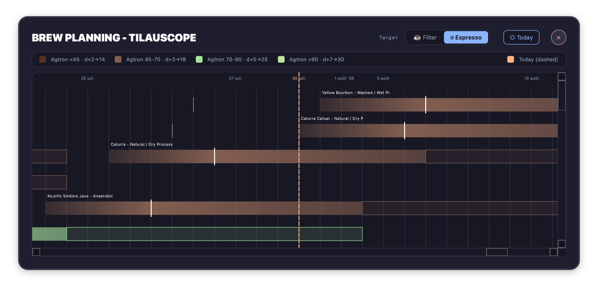
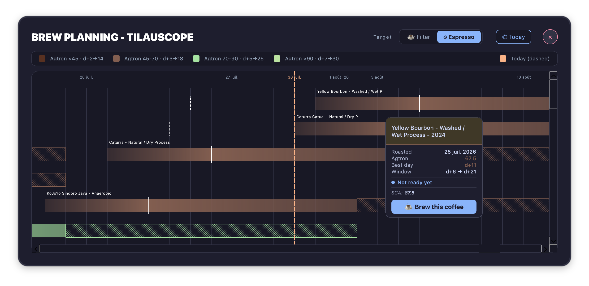
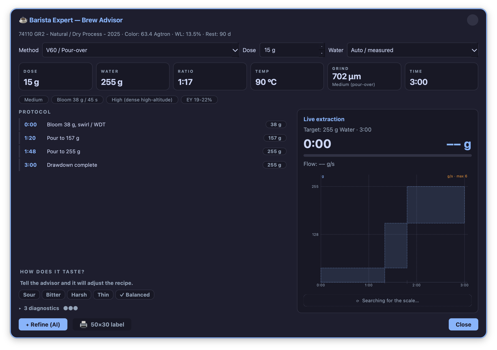
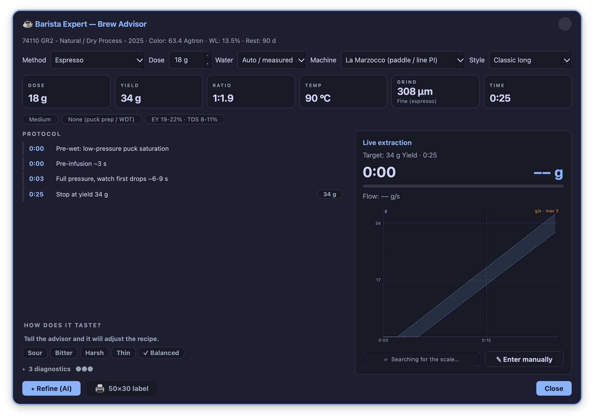
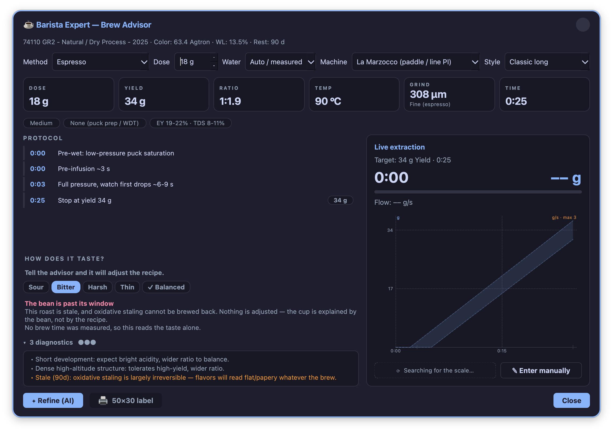
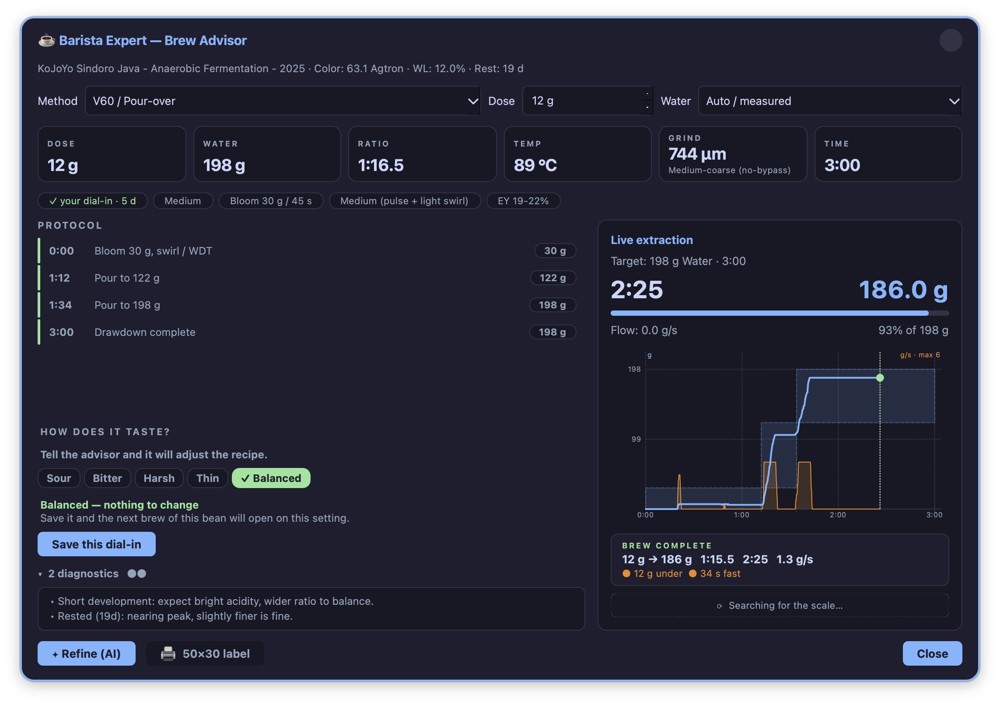
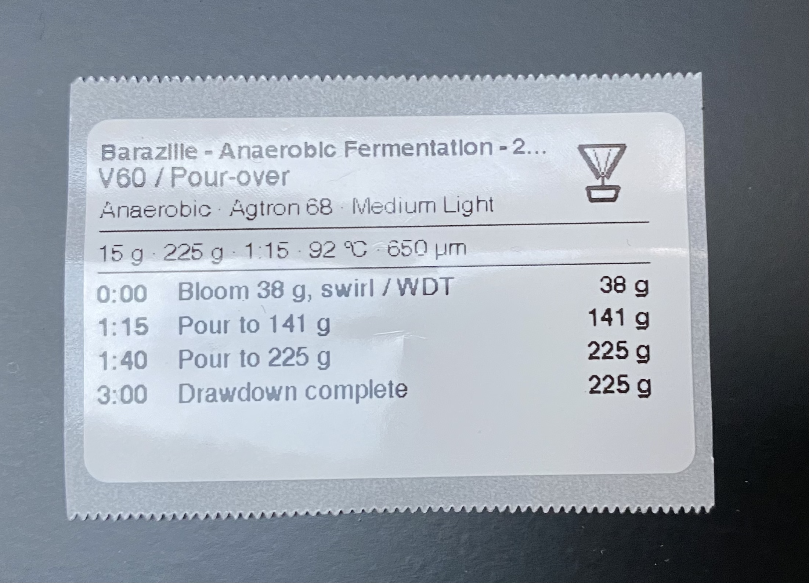

# Filter coffee and espresso (Brew)

!!! abstract "Artisan does / TilauScope adds"
    **Artisan does** — nothing here. Brewing is entirely outside Artisan's scope.

    **TilauScope adds** — a sense of when a roasted coffee is ready to brew, a recipe
    calculated from that coffee's own roast, an iterative way to dial it in by taste, and a
    printed recipe card to work from at the machine.

Brewing lives inside **BeanCave**, reached from a roast rather than from a separate menu:
either the Roast Viewer's **Dial-in** button on a specific roast, or the **☕ Brew this
coffee** prompt offered by the rest calendar below.

---

## When a coffee is ready

**Planning**, in the Roast Viewer, opens a calendar of every roast in the catalogue, each
shown as a bar across the days since it was roasted: too soon to brew, in its best window, or
past its peak and fading. A lighter roast needs longer to rest and holds its peak longer once
it gets there; a darker roast is ready sooner but fades sooner too. Espresso and other
pressure methods want a few extra days' rest beyond filter, and the calendar shifts for
either — a **☕ Filter / ⚙ Espresso** switch at the top applies that shift to the whole view
at once.

Hovering a roast shows exactly where it stands — *ready in N days*, *N days left in its
window*, or *past its window, drink soon* — along with the coffee's own details, and a
**☕ Brew this coffee** button that opens Dial-in directly on it, once it has a recorded
colour and is linked to its coffee. A roast missing either says so instead of offering to
brew it.

!!! note
    This calendar is about *when to brew*, not the roast's own timeline — it has nothing to
    do with how the roast itself was paced. See [After the roast](after-the-roast.md) for
    that.

---

## Dial-in

**Dial-in** calculates a starting recipe for a chosen coffee from its own roast — colour,
weight loss, how it was developed, its origin and altitude, how many days it has rested — and
the brewing method chosen: filter methods (V60, French press, AeroPress, Pulsar, Weber Bird,
Moka) or espresso.

The recipe covers dose, ratio, water temperature, grind, and a step-by-step timed pour or
extraction sequence suited to the method — bloom and pulses for a pour-over, fill and press
timing for an immersion brewer, the full lead-in sequence for espresso once a machine profile
is set.

**For espresso**, the machine itself matters: setting a machine profile (E61, dual boiler,
lever, and others) shapes the pre-infusion timing to match it, and a **Classic / Turbo** shot
style toggle chooses between a ratio-driven shot length and a fixed, fast one.

!!! note
    A coffee with water quality entered — general and carbonate hardness — has that folded
    into the grind recommendation as well, on its own, independent of temperature.

### Dialling in by taste

Four buttons — **Sour / Bitter / Harsh / Thin** — plus **Balanced**, describe how the last
brew tasted. TilauScope reads what actually happened against what was planned — brew time,
ratio, whether the coffee is at the right point in its rest — and proposes a bounded
correction, one reasonable grind step at a time.

It distinguishes a genuine under- or over-extraction from a **channeling** problem — bitter
with a fast time, or sour with a slow one, both point at uneven water flow through the bed
rather than grind size, and TilauScope says so rather than proposing a grind change that
would not fix it. Sour and bitter together, at the same time, likewise points at distribution
rather than grind. A coffee still resting is flagged plainly, since a young coffee can taste
off for reasons no adjustment will fix.

Accepting a correction does two separate things: it becomes the starting point the next time
Dial-in opens for this coffee and method, and it is added to this coffee's brew journal below
— what changed, and what it tasted like.

### Brewing live, with a scale

With a scale paired, **Start** tracks the brew live against the planned pour, weight and
timing on one chart, and detects when it finishes on its own. On machines with their own
built-in scale, a manual entry card takes the same figures by hand instead.

Stopping shows a short comparison of what was planned against what happened, before taste is
even entered — a first read on the brew, before the subjective one.

### The brew journal

Every measured brew is kept, per coffee and method, back a couple of dozen tries — enough to
look back on, though today the only place that history is actually shown is a **before and
after** card comparing the last two tries once a new correction is applied: what changed, and
whether the result moved. It is a record kept for the moment a fuller history view is worth
building, not yet a browsable log of its own.

---

## The printed recipe

**🖨 50×30 label**, at the bottom of Dial-in, prints the current recipe to a small label:
dose, water or yield, ratio, temperature and grind for espresso; a compact recipe line and
the full timed step sequence for every other method — each with an icon for the method (a
couple of the less common ones share a plain cup icon rather than a dedicated one).

Printing needs the same paired Niimbot printer as every other label in TilauScope, loaded
with its narrower roll — see [Hardware and peripherals](hardware.md) and
[Labels and QR](labels-and-qr.md). The button explains what is missing rather than doing
nothing if the printer isn't ready.

---

## Where the numbers come from

Roast colour and water activity — both used above — can be typed in, or read live from a
paired colour meter or water-activity meter; see
[Hardware and peripherals](hardware.md#colour-meter) and
[Hardware and peripherals](hardware.md#aquagauge--water-activity-meter).

---

## Next

- The roast this recipe is calculated from: see [After the roast](after-the-roast.md).
- The coffee it belongs to: see [BeanCave](beancave.md).
- Printing the recipe: see [Labels and QR](labels-and-qr.md).
- Any unfamiliar term: see the [Glossary](glossary.md).
