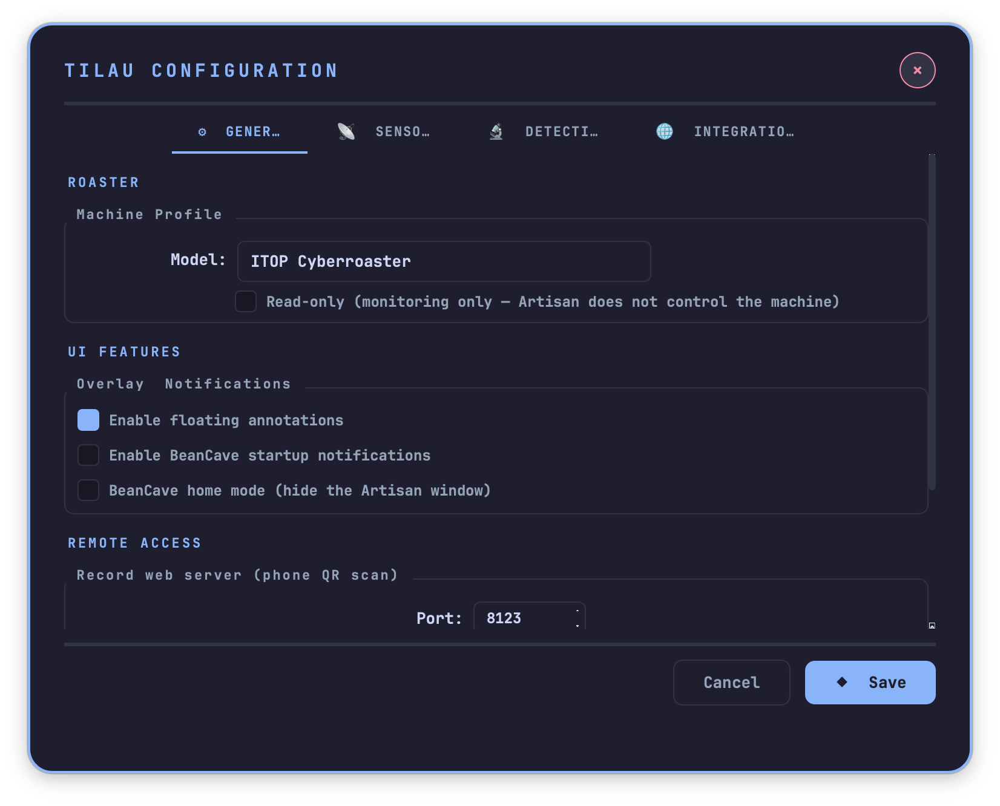
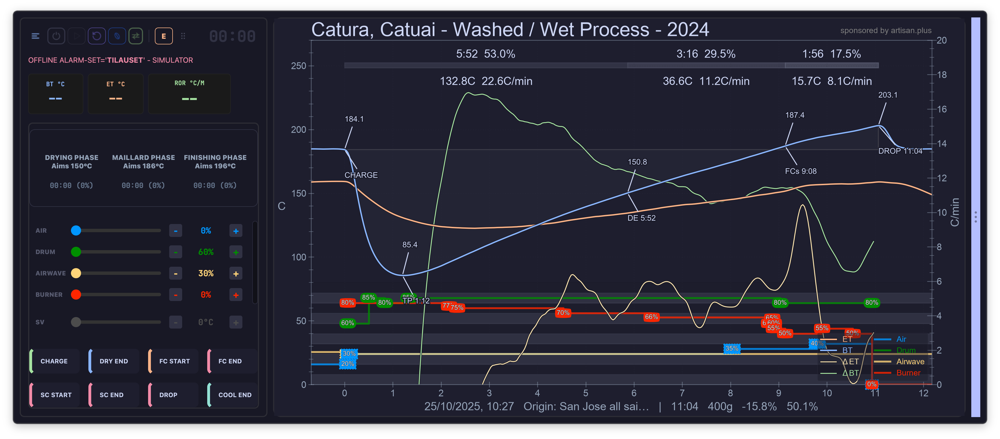
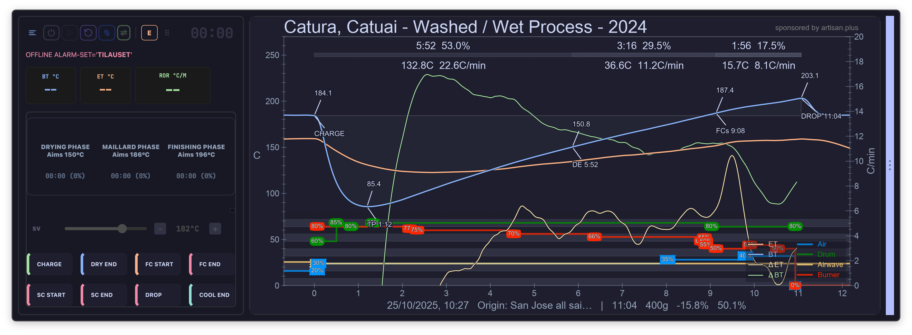
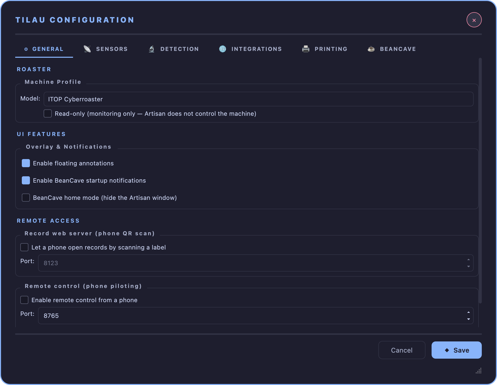
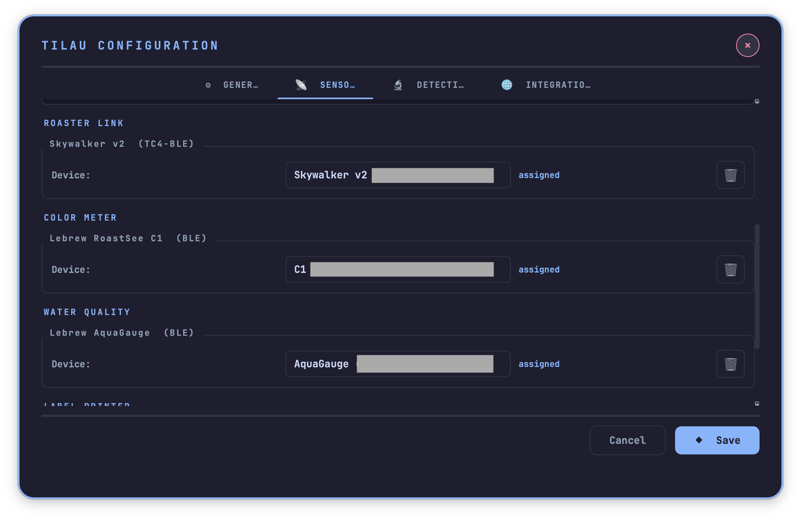
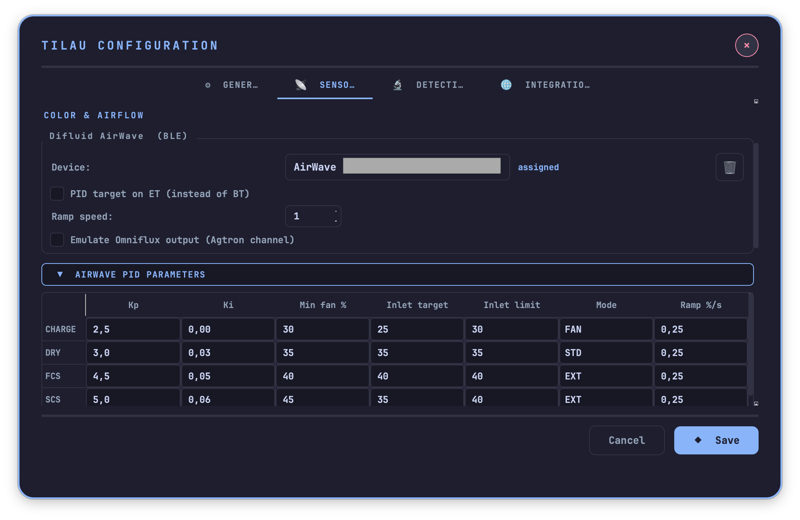
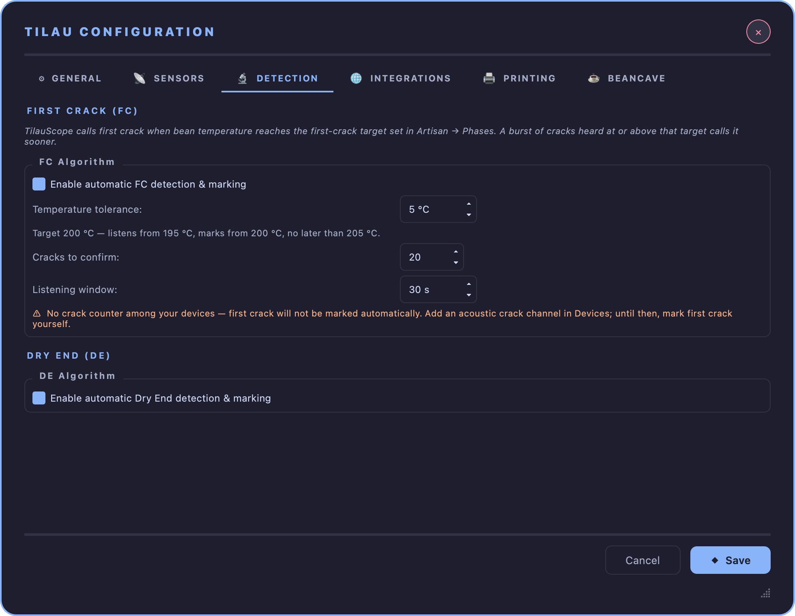
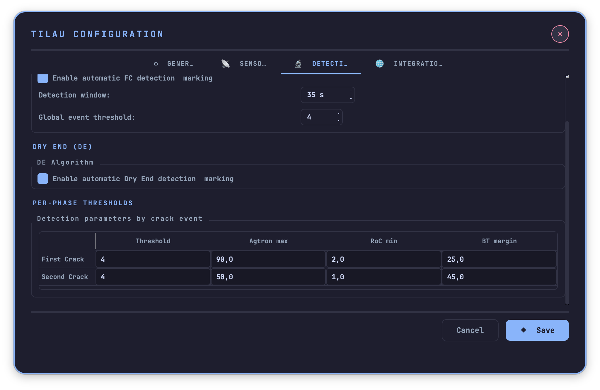
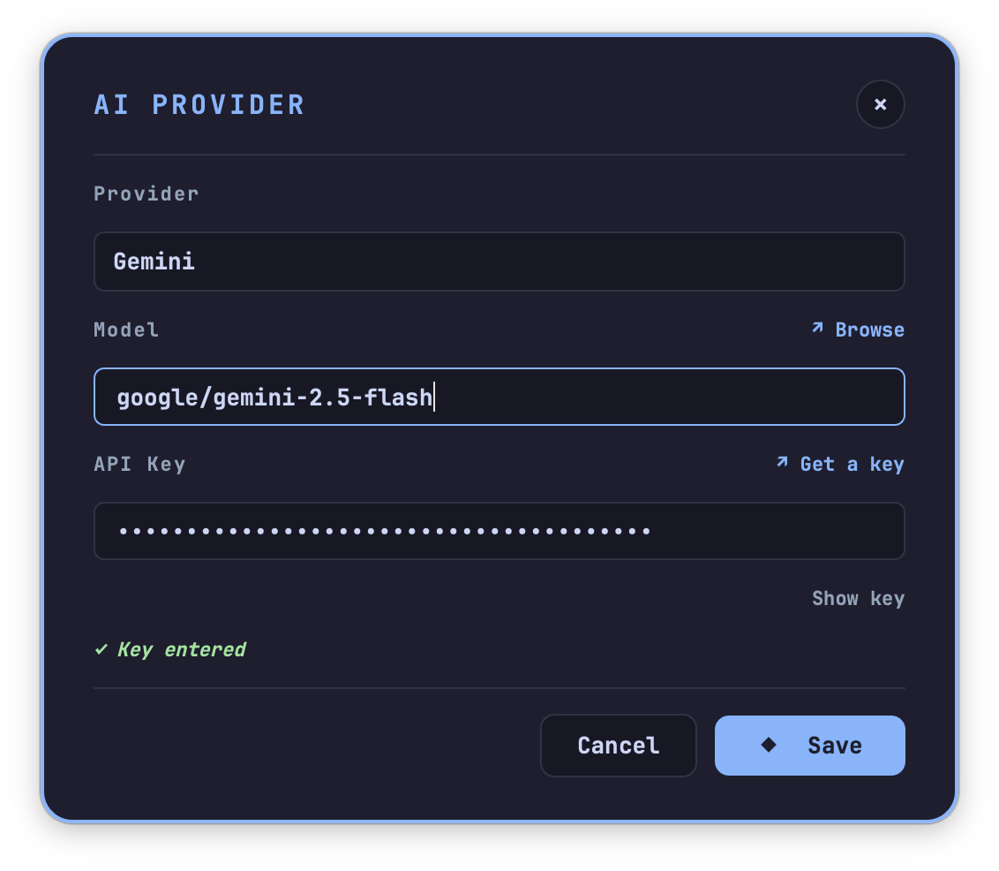

# Configuration

!!! abstract "Artisan does / TilauScope adds"
    **Artisan does** — configures each device in its own dialog, spread across menus, with no
    single place that says what a working setup looks like.

    **TilauScope adds** — one dialog, four tabs, covering everything the fork needs to work: the
    machine, the sensors, how milestones get detected, and the outside services it can talk to.
    This chapter exists because a wrong or missing setting here is the most common reason a
    guided feature seems broken when it is simply unconfigured.

Open it from **TilauScope → TilauScope Config...**. Nothing here is required to start
TilauScope — the [first-time setup wizard](getting-started.md#first-time-setup) already covers
the essentials — but this is where every one of those choices can be revisited, and where the
finer settings live that the wizard does not ask about.

---

## ⚙ GENERAL — the machine, and how TilauScope behaves

### Machine Profile

**Model** selects the active roaster profile from sixteen predefined machines. This is the
single most consequential setting in the whole dialog: it is what makes the
[roast plan](the-roast-plan.md), the pre-roast [insights](preparing-a-roast.md#judging-the-batch-before-it-starts)
and the guidance during roasting specific to your machine rather than generic. Leaving it unset
does not stop TilauScope from working, but every recommendation it gives will be a guess rather
than something tuned to your drum.

**Read-only (monitoring only — Artisan does not control the machine)** is for a roaster adjusted
entirely by hand. Ticking it hides every control slider, in Artisan and in the assistant, and
TilauScope confines itself to recording [BT](glossary.md#bt--bean-temperature) and
[ET](glossary.md#et--environmental-temperature). Unticking it restores your previous slider
configuration exactly — nothing is lost by toggling it. An uncatalogued machine can be used this
way with no model selected at all.

### UI Features

**Enable floating annotations** shows phase-event markers directly on the roast graph.

**Enable BeanCave startup notifications** shows inventory alerts and reminders when BeanCave
opens.

**BeanCave home mode (hide the Artisan window)** starts TilauScope in the BeanCave shell with
the Artisan window hidden.

!!! info "Ongoing"
    BeanCave home mode only takes effect **after a restart** — ticking it does not change
    anything until TilauScope is closed and reopened. It also works today without covering
    everything the fork does; see [Getting started](getting-started.md#settings).

### Remote access

**Record web server (phone QR scan)** and its **Port** run the small web server a phone camera
talks to when scanning a label — see [Labels and QR](labels-and-qr.md). **Remote control (phone
piloting)**, its own **Port**, and **Pair a phone…** set up controlling the roast from a
phone — see [Piloting from a phone](phone-piloting.md). Both take effect only after a
restart, and are covered in their own chapters, since what they enable matters more than the
toggle itself.

<!-- CAPTURE 4.4 — the UI Features and Remote access groups. -->

---

## 📡 SENSORS — every device, by role

Each device gets its own group, always in the same shape: a **Device** dropdown listing what has
been found nearby, a status cell, and whatever parameters belong to that device alone. Bluetooth
scanning runs in the background for the whole time this tab is open — there is no separate Scan
button to press.

| Group | Device | What it configures |
|---|---|---|
| **Ambient** | TilauAmbient (BME280 / BLE) | Which probe to use, and the acoustic sensitivity for crack detection through its microphone. |
| **Color & Airflow** | Difluid AirWave (BLE) | Which extractor to use, whether its PID targets ET instead of BT, correction ramp speed, and whether it should emulate an Omniflux colour channel. |
| **Roaster Link** | Skywalker v2 (TC4-BLE) | Which roaster link to use. |
| **Color Meter** | Lebrew RoastSee C1 (BLE) | Which colour meter to use. |
| **Water Quality** | Lebrew AquaGauge (BLE) | Which water probe to use. |
| **Label Printer** | Niimbot B21S (BLE) | Which printer to use. |

Devices detected nearby but not recognised are listed separately, for identification only — see
[Getting started](getting-started.md#first-time-setup).

!!! info "Hardware — AirWave PID parameters"
    A collapsible **AirWave PID parameters** section under the AirWave group exposes its full gain
    table (Kp, Ki, minimum fan percentage, inlet target and limit, mode, ramp) per airflow mode.
    It is collapsed by default because the defaults suit the AirWave out of the box — open it only
    if airflow needs tuning to a specific room or drum.

---

## 🔬 DETECTION — how milestones get marked automatically

This tab tunes the algorithms behind
[Auto First Crack and Auto Dry End](preparing-a-roast.md#automating-the-start): what counts as a
crack, and what counts as the end of drying, in terms specific enough to matter for your machine
and your microphone.

### First Crack (FC)

Detection fuses two signals — acoustic events from TilauAmbient, colour and rate-of-colour-change
from Omniflux — into a single call.

**Enable automatic FC detection & marking** turns the algorithm on. Two parameters shape it:

- **Detection window** — the sliding time span, in seconds, over which crack density is measured.
- **Global event threshold** — the minimum number of acoustic events inside that window needed to
  confirm first crack.

!!! note
    This threshold is independent from the *Crack audio sensitivity* setting in the SENSORS tab.
    That one controls how sensitive the microphone itself is; this one controls how many of its
    events, within the window, are needed to call it a crack.

### Dry End (DE)

**Enable automatic Dry End detection & marking** turns on a different kind of detection: it
watches the convergence of the [BT/ET RoR](glossary.md#ror--rate-of-rise) ratio, the slope of the
gap between the two probes, and BT's progress toward the Dry End target — the same target that
must be set in **Artisan → Phases** for [Auto Dry End](preparing-a-roast.md#automating-the-start)
to do anything. Colour is used as a bonus signal where a colour device is configured.

### Per-Phase Thresholds

A small table sets the finer detection parameters for first crack and second crack separately:
**Threshold**, **Agtron max**, **RoC min**, **BT margin**. These are the values the fused
algorithm above actually reads; most setups will never need to touch them.

---

## 🌐 INTEGRATIONS — outside services

### MQTT Broker

**Broker URL**, **Port**, **Topic**, **Username**, **Password**, and a **Test Connection** button
that checks the connection before it is relied on. This is what the
[ambient humidity tracking](beancave.md) and any [MQTT-fed device](the-window.md) depend on.

**TLS** encrypts the link to a broker that asks for it — see [TLS](glossary.md#tls). Ticking it
moves the port from 1883 to 8883, the usual pair, unless you have entered a port of your own, in
which case yours is kept. The broker's certificate has to come from a recognised authority; a
certificate the broker issued to itself is refused and the connection fails.

**Protocol** is the version spoken to the broker: **MQTT v3.1**, **MQTT v3.1.1** or **MQTT v5**.
Leave it on v3.1.1, which every broker accepts, unless yours states otherwise.

**Timeout** is how long the broker is given to accept the connection before it is declared
unreachable — a broker on the other side of the internet, or an encrypted one whose handshake
takes a moment, needs more than the three seconds used by default. **Keepalive** is the idle time
after which the connection is checked; see [keepalive](glossary.md#keepalive).

Below the broker settings, **Sensors** lists the individual readings taken from that broker. Each
line names one sensor: an **ID** to refer to it by, the **Topic** it is published on, the
**Command** — the field to read inside the message when the message carries several values —
a **Multiplier** and **Divider** to bring the raw figure into the unit you want, and the **Unit**
that figure is then expressed in. Every cell is edited directly in the list.

**Unit** is where you declare that a sensor publishes a temperature: **°C**, **°F**, or the dash
for anything that is not one — humidity, fan speed, pressure. A temperature is converted on
arrival into the unit the application is working in, so a probe publishing in Celsius reads
correctly during a Fahrenheit session and the other way round. Multiplier and divider are applied
first, the conversion second: a probe sending tenths of a degree needs a divider of 10 *and* its
unit set. A sensor left on the dash is recorded exactly as published, whatever the session unit. **Add sensor** appends a line, **Delete** removes the selected one,
and **Check sensor** reads the selected sensor once from the broker and reports the value it
obtained. A sensor whose topic happens to be silent at that moment is still kept — the check is
there to confirm a reading, not to grant permission.

The list is saved along with the rest of the settings when the window is closed with OK, and
discarded on Cancel. It can be edited whether or not the broker is reachable; only **Check
sensor** needs a live connection.

A sensor only ever shows what its publisher sends. Two settings on the publishing side decide
whether a reading is there when a roast starts: messages have to be published as
[retained readings](glossary.md#retained-reading), so the last known value is handed over the
moment TilauScope subscribes, and the publication interval has to be short enough to be useful —
thirty seconds or less. Without the retained flag a channel stays empty until the publisher
speaks of its own accord, which on a home automation gateway can take several minutes. When that
happens the channel reads nothing, and the topics still silent half a minute after connecting
are named in the diagnostic log.

**Poll request topic** and **Poll every** cover the other half of the problem, for a sensor that
reports too slowly rather than not at all. Rather than wait,
[polling](glossary.md#polling) asks the gateway for a reading. Fill in the topic the gateway
accepts requests on — a Z-Wave gateway typically publishes it as
`zwave/_CLIENTS/ZWAVE_GATEWAY-<name>/api/pollValue/set` — and choose how often, or leave the
topic empty to never request anything. Below ten seconds the network cannot keep up, so ten
seconds is used instead.

What to ask for is worked out from each sensor's own topic, so there is nothing else to fill in.
A sensor whose topic does not identify a device and a value that way is left alone, and so is
one the gateway refuses or one that never answers — a battery sensor sleeps between its own
reports and cannot be reached in between. Each of those cases is named once in the diagnostic
log, and the sensor is dropped from the rotation rather than asked again every cycle.

<!-- CAPTURE 4.11 — the INTEGRATIONS tab, MQTT Broker group with TLS ticked (port showing 8883),
Protocol on MQTT v3.1.1, Timeout and Keepalive visible, the Poll request topic and Poll every
fields filled in, two sensors in the list, one row selected, and the Unit column showing °C on
one of them. -->

### AI Provider

A status line states whether a provider is configured, and **Configure AI Provider…** opens the
picker. This is what
[filling a bean record from a supplier's page](beancave.md#filling-a-record-from-the-suppliers-page)
needs — nothing that reads or writes a bean record silently sends data anywhere without this
being set up first.

<!-- CAPTURE 4.9 — the INTEGRATIONS tab, MQTT Broker group filled in with TLS, Protocol, Timeout
and Keepalive showing, Test Connection just clicked and the success message on screen.
(Replaces assets/configuration-4.9.png, taken before those fields existed.) -->

---

## Next

- What each setting here changes on the ground: [BeanCave](beancave.md),
  [Preparing a roast](preparing-a-roast.md), [The guided roast](the-guided-roast.md).
- The one-time wizard that sets the essentials automatically: see
  [Getting started](getting-started.md#first-time-setup).
- Each device — pairing, limits: see [Hardware and peripherals](hardware.md).
