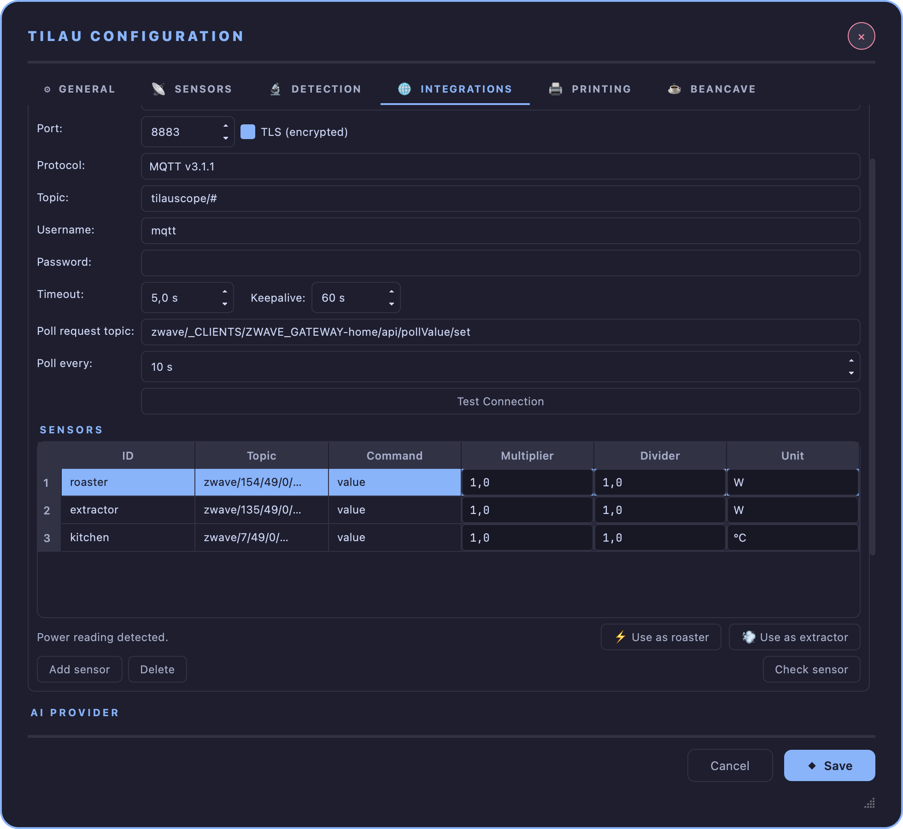
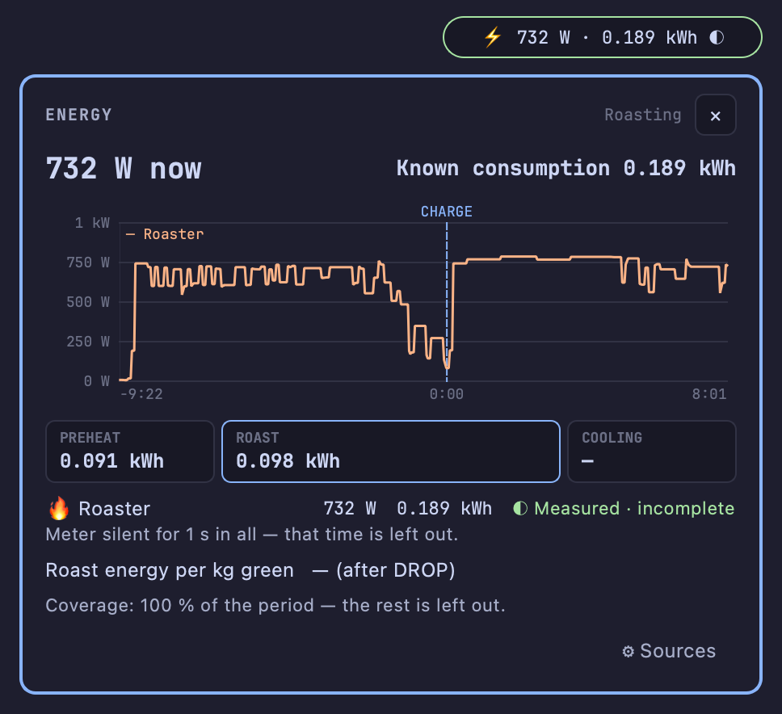
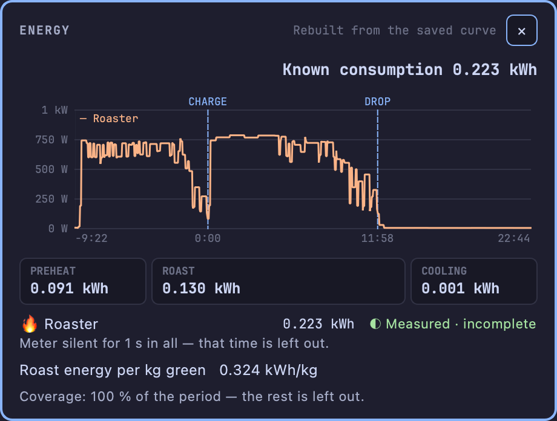

# Energy

!!! abstract "Artisan does / TilauScope adds"
    **Artisan does** — an energy and CO₂ estimate in **Roast Properties → Energy**, computed from
    loads you describe yourself: each heater's rated power, the events that drive it, and a
    protocol for preheating, between batches and cooling.

    **TilauScope adds** — the power actually drawn, read from a power meter, from the moment
    monitoring starts: the energy spent before charge, during the roast and after drop, the energy
    per kilogram of green coffee, and for every figure where it comes from. Roasts saved earlier
    with a power reading get their energy too, and every roast shows it in BeanCave.

Artisan's own Energy tab is unchanged and remains available. What this chapter describes is a
separate, simpler reading built on measurement rather than on a description of the machine.

What is counted is the electricity the installation draws — [power](glossary.md#power-w-and-energy-kwh)
in watts at any instant, energy in kilowatt-hours over time. It is not the heat taken up by the
coffee.

---

## Setting up a meter, step by step

!!! info "Hardware — a power meter that reports over MQTT"
    Any plug-in or in-line meter able to publish its power reading to a network broker: a Z-Wave
    or Zigbee smart plug behind a home-automation gateway, for example. The operator's own setup is
    a Z-Wave plug on the roaster's socket, published by a Z-Wave gateway to the home broker.

Two sources are recognised, by the name given to their sensor:

| Sensor name | What it measures |
|---|---|
| **roaster** | Everything plugged into the roaster's meter — heater, drum motor, fan |
| **extractor** | The smoke extractor, when it has a meter of its own |

The name tells TilauScope *what* the sensor is; its **Unit** set to **W** confirms that the value
is a power reading. Both are needed.

1. **Plug the roaster into the meter**, and check in the gateway's own interface that the meter
   publishes its power in watts on the broker. Note the topic it publishes on — on a Z-Wave
   gateway it typically ends in `/49/0/Power`, for example `zwave/154/49/0/Power`. Publishing it
   as a [retained reading](glossary.md#retained-reading) lets TilauScope show a value the moment it
   connects.
2. **Connect TilauScope to the broker**: **TilauScope → TilauScope Config... → 🌐 INTEGRATIONS →
   MQTT Broker**. Fill in **Broker URL**, **Port**, **Username** and **Password**, then **Test
   Connection** — see [Configuration → MQTT Broker](configuration.md#mqtt-broker).
3. **Declare the meter as a sensor**, in the **Sensors** list just below: **Add sensor**, then type
   the meter's topic in **Topic**. If the meter sends a message holding several values rather than
   a bare number, put the name of the power field in **Command** (often `value`). Leave
   **Multiplier** and **Divider** at 1 unless the meter reports in another unit than watts.
4. **Name it**: with that line selected, the buttons **⚡ Use as roaster** and **💨 Use as
   extractor** appear under the list as soon as the topic ends in *Power* or the unit is W. Press
   the one that matches. It writes the name — **roaster** or **extractor** — and sets **Unit** to
   **W** in one go. Typing the name and choosing W by hand does exactly the same.
5. **Check it**: **Check sensor** reads the selected line once from the broker and reports the
   power it got. A meter that is silent at that moment is still kept.
6. **Repeat steps 3 to 5 for the extractor**, if it has its own meter. If instead it is plugged
   into the roaster's meter, see *One meter behind the other* below.
7. **Save with OK**, then **turn monitoring off and on again**: the sensor list is read each time
   monitoring starts.
8. **Confirm**: the ⚡ pill appears in the header. Open it and unfold **⚙ Sources** — each source
   reads **Roaster — zwave/154/49/0/Power · W · last reading 4 s ago**. The meter is in use.

Nothing else is required: the energy is counted from the sensor itself, whether or not it is also
added as an extra device. Adding the MQTT extra device as well draws the power on the roast graph
and keeps it in the roast file, like any other channel.

!!! note "When the pill does not appear, or a source is not used"
    No pill at all, with monitoring on, means that no sensor is named **roaster** or **extractor**:
    go back to step 4 (spaces and capitals in the name do not matter).

    Once the pill is there, **⚙ Sources** in the energy sheet names the problem for each source,
    and **Set up meter** opens the Sensors list scrolled into view, with the first sensor still
    missing its unit selected:

    - *no MQTT sensor named "extractor"* — only the roaster has a meter, which is fine unless the
      extractor should be counted;
    - *sensor "roaster" is not set to W: unit not confirmed* — step 4 was not done;
    - *two sensors are named "roaster": keep one* — neither is used until one is renamed;
    - *no reading yet* — the sensor is set up but nothing has arrived from the broker: check the
      topic, the broker connection, and the meter itself.

!!! note "One meter behind the other"
    When the extractor is plugged into the same meter as the roaster, the roaster reading already
    includes it. Tick **Extractor is plugged into the roaster meter** under **⚙ Sources** in the
    energy sheet: the extractor is then shown as part of the roaster reading and never added a
    second time. The setting applies from the next monitoring session, or straight away before
    START.

!!! tip "Meters that report only on change"
    Many smart plugs send a reading when the power changes, plus a periodic report — about once a
    minute. A stable power between two reports is not a fault, and is counted as measured. When a
    meter stays silent well beyond its usual rhythm, that stretch is left out and flagged rather
    than filled in. Setting **Poll every** in the broker settings makes a silent meter show up
    sooner.

<!-- CAPTURE 15.2 [scene:config_energy] — TilauScope Config → INTEGRATIONS, the Sensors list with a line
"roaster" on topic zwave/154/49/0/Power selected, Unit on W, and the "Power reading detected." bar under the list
with its ⚡ Use as roaster and 💨 Use as extractor buttons. -->

---

## Reading it during a session

While monitoring is on and a power source exists, a pill appears on the second line of the header,
just before the emergency heat cut: **⚡ 1.28 kW · 0.184 kWh ●** — the power now, and the energy
used since monitoring was turned on. Its outline takes the colour of the figure's
[provenance](glossary.md#energy-provenance), and hovering it names that provenance in words. It
asks for nothing during the roast: energy never calls for a gesture on the machine.

Pressing the pill opens the **energy sheet**, a floating window that can stay open beside the
roast:

- **Power now** and the **total** since monitoring started. The total is only called *Total* when
  every expected source was tracked over the whole period; otherwise it reads **Known
  consumption**, and the line at the bottom names what is missing.
- **The power curve**, in watts, on the roast's own clock — time counted from CHARGE, negative
  during the preheat, with CHARGE and DROP marked. A dotted line is an estimate; a grey band
  marked *no reading* is time with no source at all. Hovering the curve gives the time and the
  power at that point.
- **Three periods**: **Preheat** (monitoring ON to CHARGE), **Roast** (CHARGE to DROP) and
  **Cooling** (DROP to monitoring OFF), each in kWh. Preheat and Cooling also count any wait at
  either end of the session; hovering a period gives its exact bounds.
  The period in progress is outlined. Hovering **Roast**, once dry end and first crack are
  marked, splits it into drying, Maillard and development.
- **One line per source**, with its energy and its provenance, and a short note when something is
  off — a meter that fell silent, or a figure that is only estimated.
- **Roast energy per kg green** — the roast's energy divided by the green weight
  ([kWh per kg green](glossary.md#kwh-per-kg-green)). It is shown only
  once DROP is marked, the green weight is known and every expected source covered the whole
  roast; otherwise it reads *—* with the reason.

The session follows monitoring, not recording: the energy of the preheat is kept even though
Artisan itself records nothing before START. Closing the sheet, or never opening it, changes
nothing to what is counted.

<!-- CAPTURE 15.0 [scene:energy_live] — mid-Maillard, a roaster meter named "roaster" (unit W): the ⚡ pill of the header, and the
energy sheet it opens, outlined in blue — power now, Known consumption, the power curve in W with CHARGE marked and
the Roast period outlined, the Roaster line reading Measured. -->

---

## After the roast

Each roast saves its energy record with it, preheat included. Opening the roast again — right
after STOP or months later — gives the same figures, recalculated on its milestones: moving
CHARGE or DROP afterwards moves the periods with them.

- **The roast review** carries one line: **⚡ 0.105 kWh roast · 0.300 kWh/kg green · Measured ›**.
  Pressing it opens the energy sheet for that roast.
- **BeanCave → Roasts** shows an **Energy** figure beside the four others: the roast's kWh, with
  the kWh per kg and the provenance underneath. It opens the energy sheet of that roast, read-only
  — the live controls (**Set up meter**, **⚙ Sources**) are not offered for a roast already made.

<!-- CAPTURE 15.1 [scene:energy_saved] — the energy sheet of a saved roast opened from its Energy figure, headed "Rebuilt from the
saved curve": the power curve with CHARGE and DROP, the three periods, and the kWh per kg of green. The Energy
figure itself shows in the Roasts tab capture of the After the roast chapter (8.2). -->

### Roasts saved earlier

A roast recorded before this feature existed has no energy record, but if it carried a power
reading named **roaster** (or **extractor**) among its extra devices, its energy is rebuilt from
that saved curve when it is opened. Such figures are marked **rebuilt**, and differ from a live
record in two ways:

- they start at START — the preheat before it was never saved;
- only the changes in the saved curve count as readings, so a long stable stretch — typically the
  cooling after drop — can show as *incomplete*.

A simulated roast is never rebuilt.

---

## Without a meter

Some roasters have their power described in TilauScope's machine database. On those, the roaster's
power is **estimated** from the burner setting, **between CHARGE and DROP only**, and every figure
built on it says *Estimated*. Before charge the machine's own thermostat decides how much it heats,
whatever the setting; after drop the heater is cut while the setting stays where it was. Neither can
be read from the burner setting, so neither is estimated.

| Roaster | Estimate |
|---|---|
| **Skywalker V2** | A power curve measured on the operator's own roasts with a meter on the roaster's socket — within a few percent of the measured roast energy |
| **Skywalker V1** | Its 1 000 W rating, not yet checked against a measurement |

When a meter is present, its reading always wins: the estimate only fills a stretch where the meter
fell silent during the roast, and the figure then reads *Mixed*. On any other machine, or outside
the roast, no meter means **Not tracked** — a figure is never invented.

!!! warning "The extractor is never estimated"
    An extractor's speed setting says nothing reliable about the power it draws. Without a meter of
    its own, it stays *Not tracked*, and the total reads *Known consumption*.
