# Getting started

!!! abstract "Artisan does / TilauScope adds"
    **Artisan does** — records and plots your roast, and exposes every setting it has:
    devices, probes, sliders, alarms, themes. Configuring it is your job, and there is a
    lot of it.

    **TilauScope adds** — a first-run wizard that gets you roasting without touching
    Artisan's settings, a single menu for everything the fork adds, and one button that
    switches the whole interface between a guided layout and a full expert layout.

---

## The TilauScope menu

Everything the fork adds is grouped under a single menu, rather than being spread across
Artisan's own menus.

**TilauScope** in the menu bar gives you:

| Entry | What it does |
|---|---|
| **Switch to TilauScope** / **Switch to Artisan window** | Moves between the two windows. The label always names where you are *going*, not where you are. |
| **BeanCave** | Opens the green-bean database. |
| **TilauScope Config...** | All fork settings, in four tabs. |
| **Redo First-Time Setup...** | Replays the first-run wizard. |

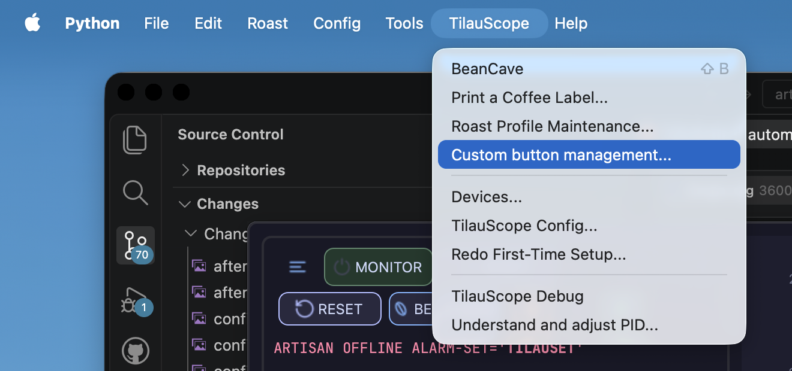

### Version and bug reports

**About TilauScope** lives where your system puts it: on macOS in the **TilauScope** menu
beside the Apple logo, on Windows and Linux under **Help**.

It tells you which version and build you are running — the number to quote whenever you
report a problem. It also credits Artisan Roaster Scope, the application TilauScope is
built on, and links to the source code, which is public.

The same window has a **Report a bug** button. It gathers the application's logs into a
single archive and asks you where to save it, then offers to open the issue tracker so you
can attach it. The archive is what makes a problem reproducible; a report without it
usually cannot be acted on.

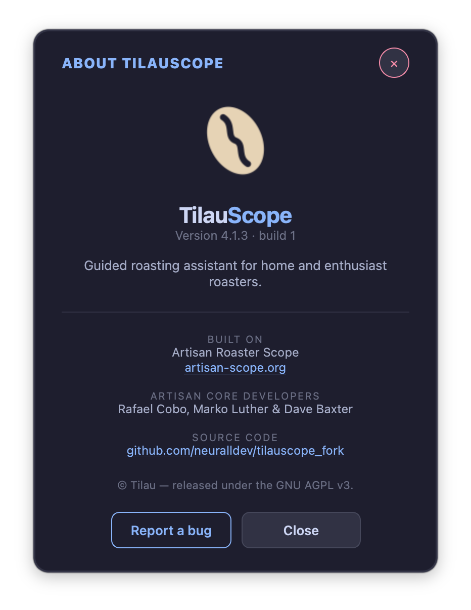

!!! note
    The same archive is still available from the green-bean database, under **Export
    Logs**. Both do exactly the same thing.

---

## First-time setup

The first time you open **BeanCave**, a five-step wizard runs. It asks the handful of
questions that actually change how the app behaves, applies everything at the end, and
leaves Artisan's remaining settings alone.

!!! note
    The wizard is triggered by opening BeanCave, not by opening TilauScope. If you never
    open BeanCave, you never see it — use **TilauScope → Redo First-Time Setup...** to run
    it on demand.

**1. Temperature unit.** *Which unit do you want to work in?* Every temperature you will
ever see — curves, milestones, setpoints — follows this choice. It is set once.

**2. Your roaster.** *Which roaster do you use?* This is the most consequential answer in
the wizard: the machine determines the roast plan, the slider labels, and the recommendations
given during a roast. A recommendation that suits a high-[thermal-mass](glossary.md#thermal-mass)
drum is wrong on a [radiant](glossary.md#radiant-heat-firnir) machine, so TilauScope needs
to know which type it is.

**3. Hardware.** *Connect your hardware* → **Search & auto-register**. TilauScope scans
for gear and registers what it recognises, so you don't have to configure Artisan's
device slots by hand. Each device found is named by its *role* rather than by its
Bluetooth identifier — roaster, smoke extractor, charge and output weighing, ambient
probe, water activity, bean colour reader — so you can tell what you actually have.

Devices that are detected but not supported are listed separately, under
*Other Artisan BLE devices detected*, and labelled *recognised · not configured*. Nothing is
presented as working when it is not.

**4. Folders.** *Where should your files live?* Choose where your BeanCave green-bean
database and your roast logs are stored.

**5. Review.** *Ready to apply.* The wizard lists every choice — unit, roaster, device
profile, theme, folders — and **nothing is written until it is confirmed**. The wizard can
be left at any point with **Skip for now**, so roasting can begin immediately.

!!! warning
    Finishing the wizard writes settings that Artisan also owns, including your device
    profile and theme. If you have already tuned Artisan by hand, be aware that replaying
    **Redo First-Time Setup...** will overwrite those choices again.

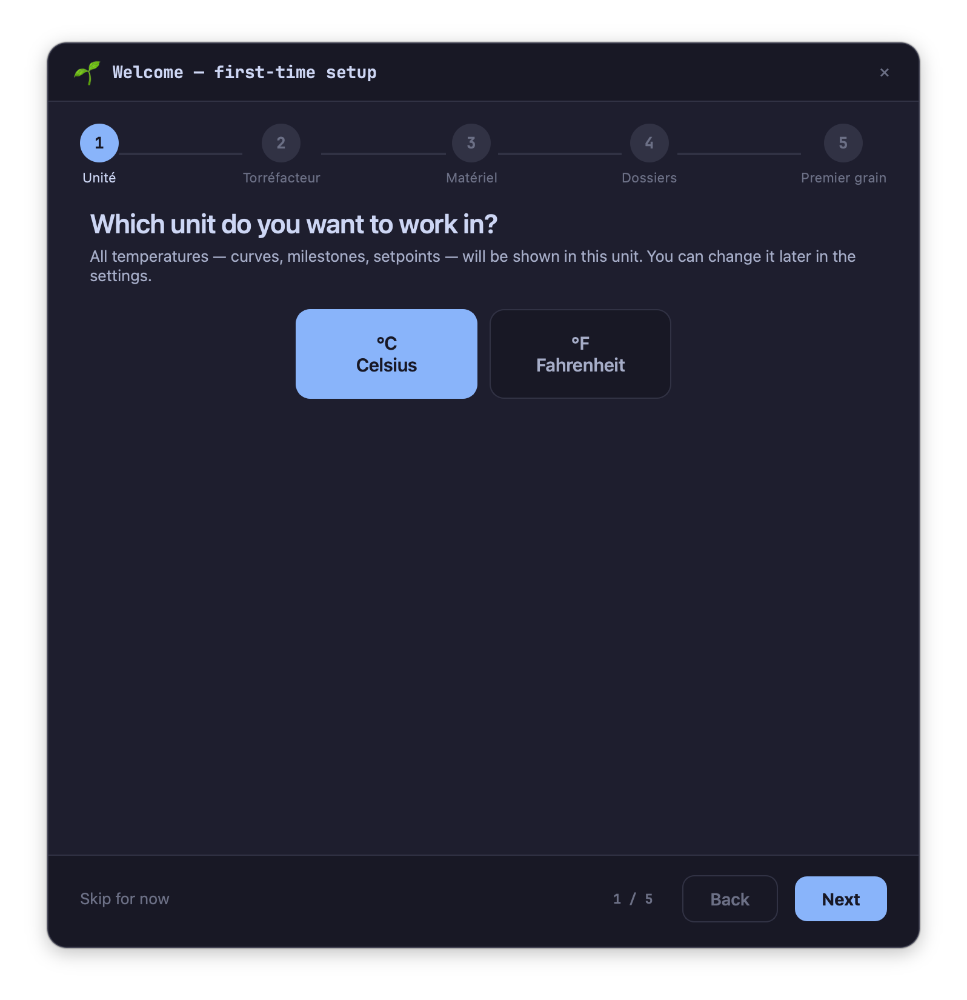
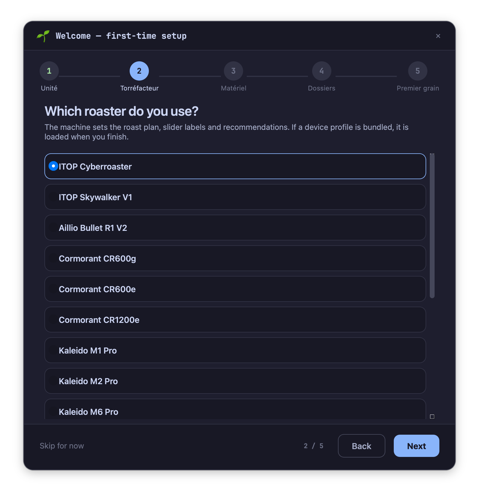
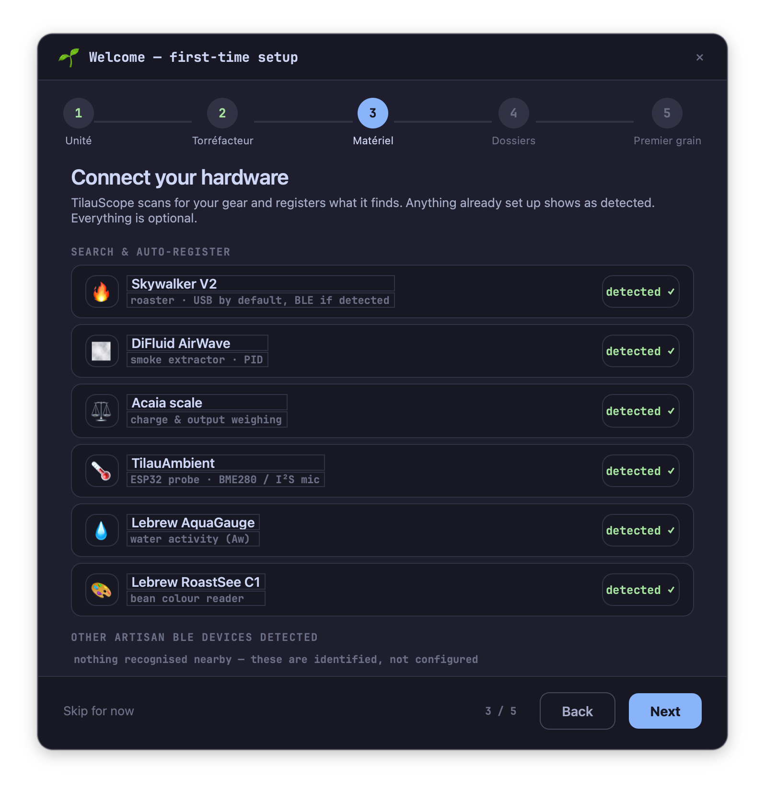
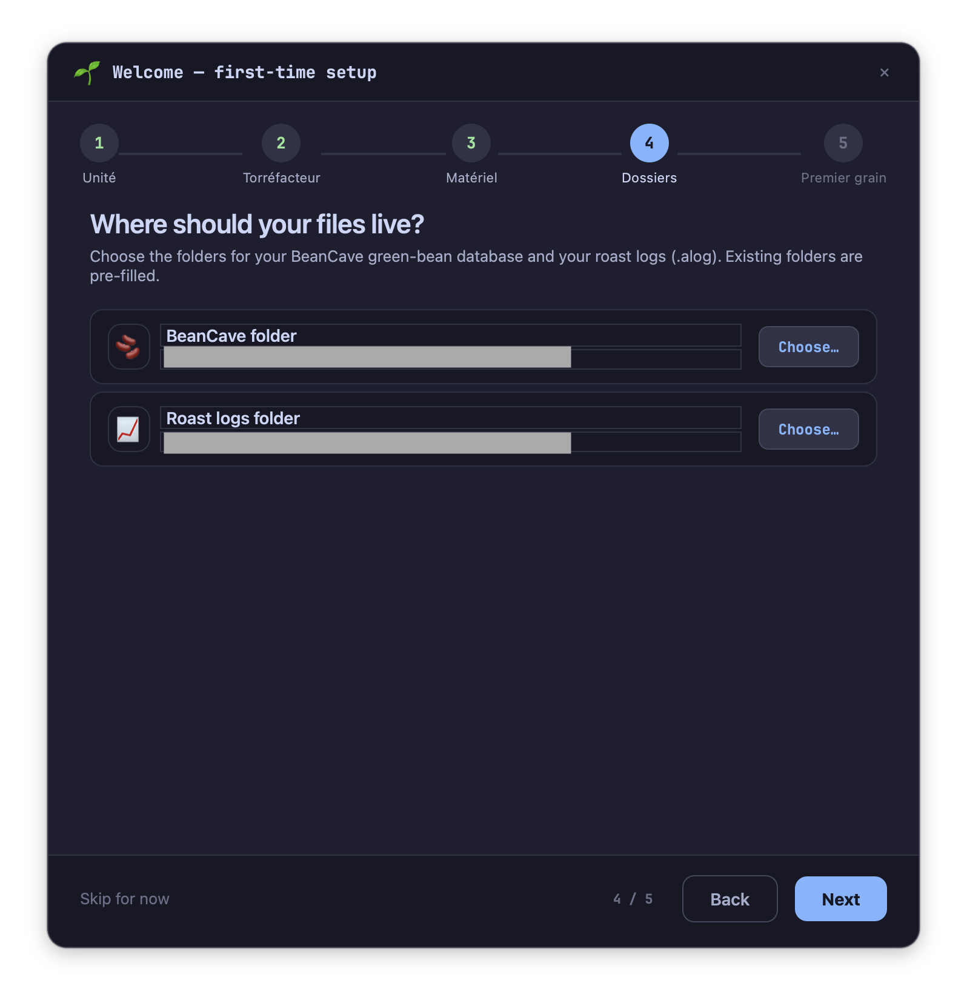
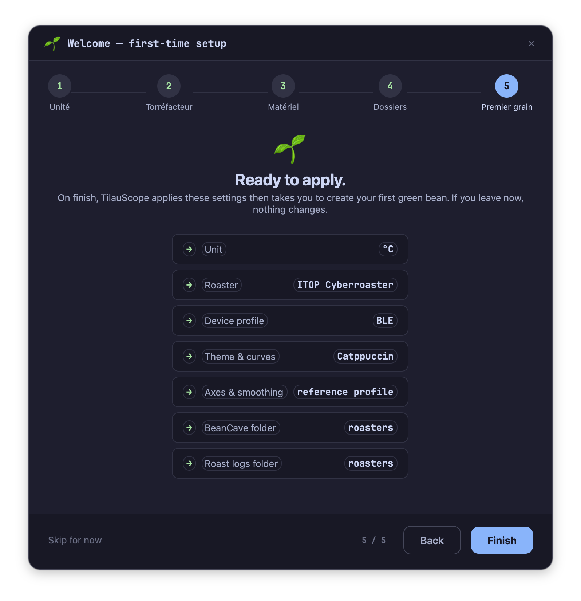

---

## Guided or Expert

TilauScope runs at one of two levels, and a single pill in the panel header switches
between them: **G** for Guided, **E** for Expert. Click it to toggle.

**Guided** is the default. The roast assistant is docked in place of the control panel, so
there is a single place to look while roasting. The graph gains a Coach view that reduces
the roast to one recommendation plus a phase verdict.

**Expert** returns the interface to its full form: the control panel comes back, and the
assistant no longer takes over the layout.

!!! warning "Alarms are suspended in Guided"
    In Guided, the alarm actions you configured in Artisan **do not fire**. This is
    deliberate — it stops two sources of instructions from contradicting each other while
    you roast — but it means an alarm you rely on will stay silent. The status line tells
    you which regime is active: **🔕 …SUSPENDED** in Guided, plain **ALARM-SET** in Expert.
    Switch to Expert if you want your own alarms back.

Whatever the level, the assistant can be **docked** in place of the control panel or
**detached** into its own floating window, using the ⤢ button in the header.

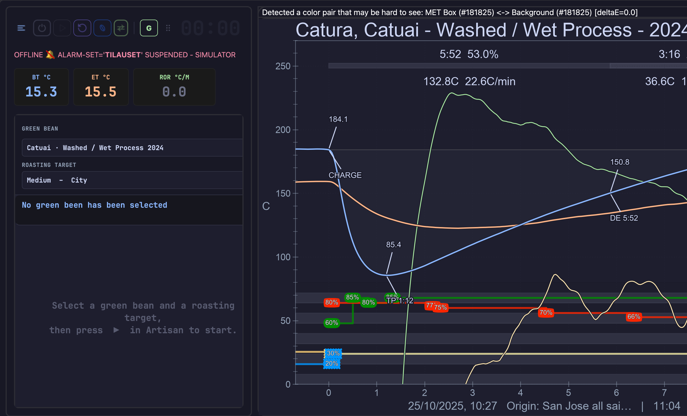
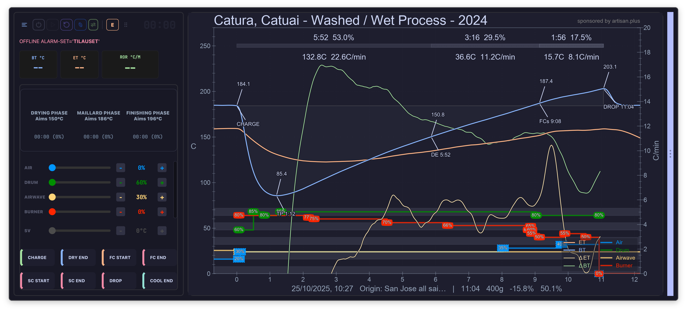

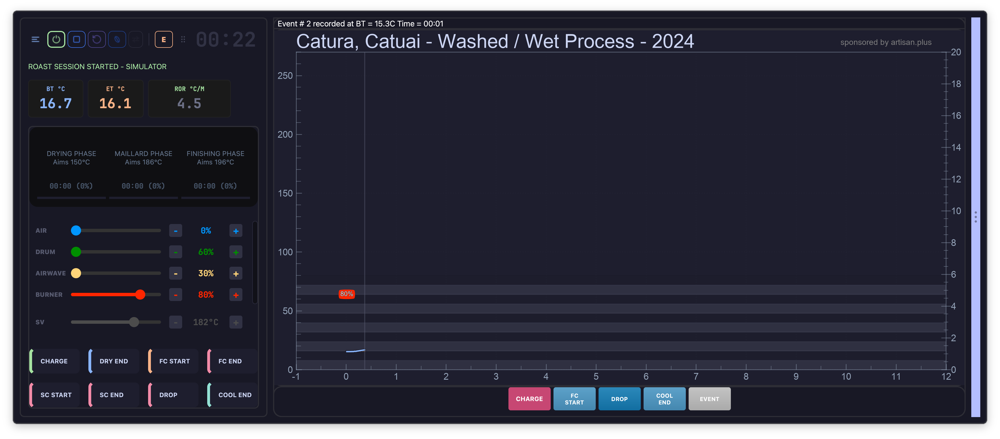
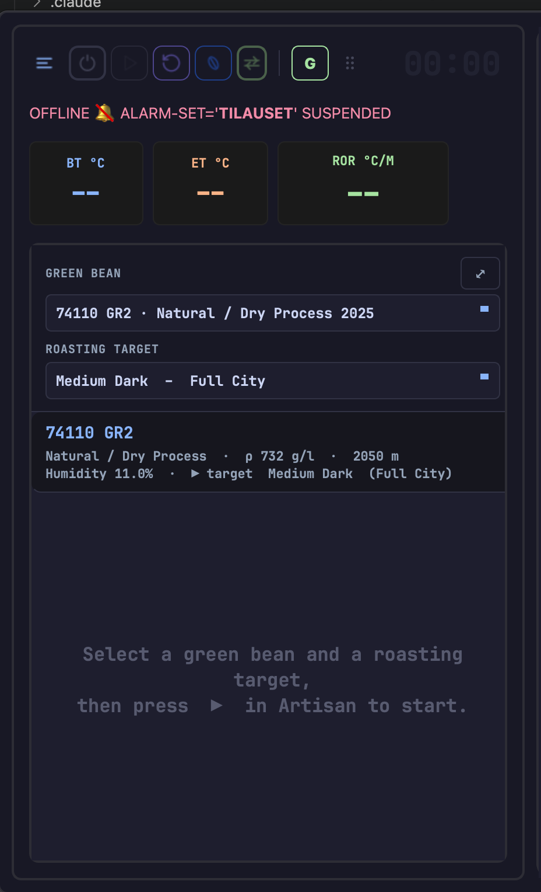
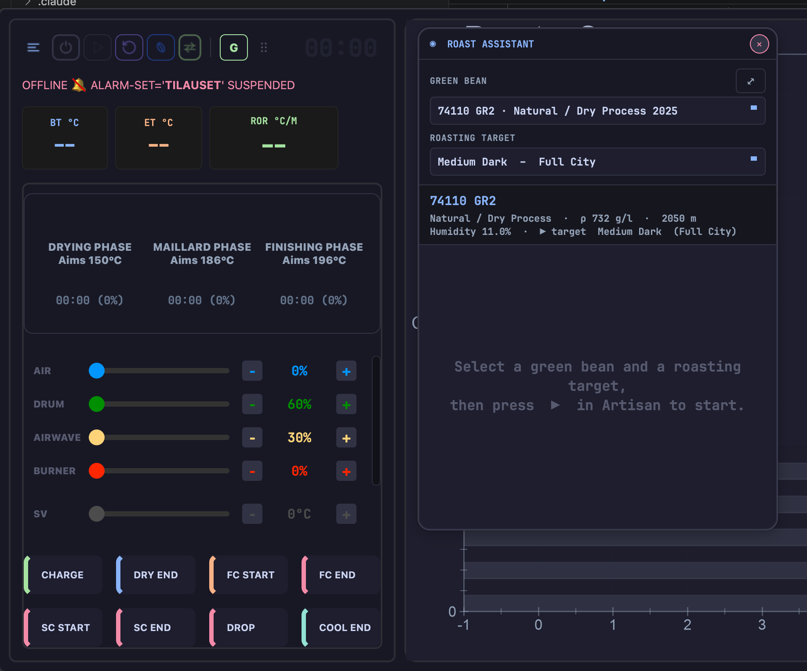

---

## Settings

**TilauScope → TilauScope Config...** groups every fork setting by intent, in four tabs.

**⚙ GENERAL** — your machine and the interface. *Roaster → Machine Profile → Model:*
changes roaster without replaying the wizard. *UI Features* turns on floating annotations
on the roast graph, and BeanCave startup notifications (stock alerts and reminders when
BeanCave opens).

**📡 SENSORS** — every coupled device, grouped by role, with Bluetooth scanning running in
the background while the tab is open.

**🔬 DETECTION** — the parameters behind milestone detection (first crack, dry end) and the
per-phase thresholds. This is where you make detection match your machine's behaviour
rather than adapting to a generic default.

**🌐 INTEGRATIONS** — the MQTT broker and the AI provider.

!!! info "Ongoing — BeanCave home mode"
    **⚙ GENERAL** also offers *BeanCave home mode (hide the Artisan window)*, which makes
    BeanCave the main window. It only takes effect **after a restart**. It works today, but the
    full experience is still being built: expect to return to the Artisan window for anything the
    fork does not cover yet.

See [Configuration](configuration.md) for every setting in this dialog, tab by tab.

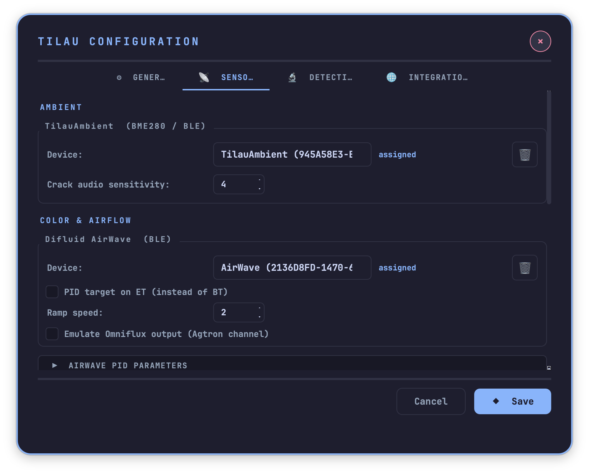
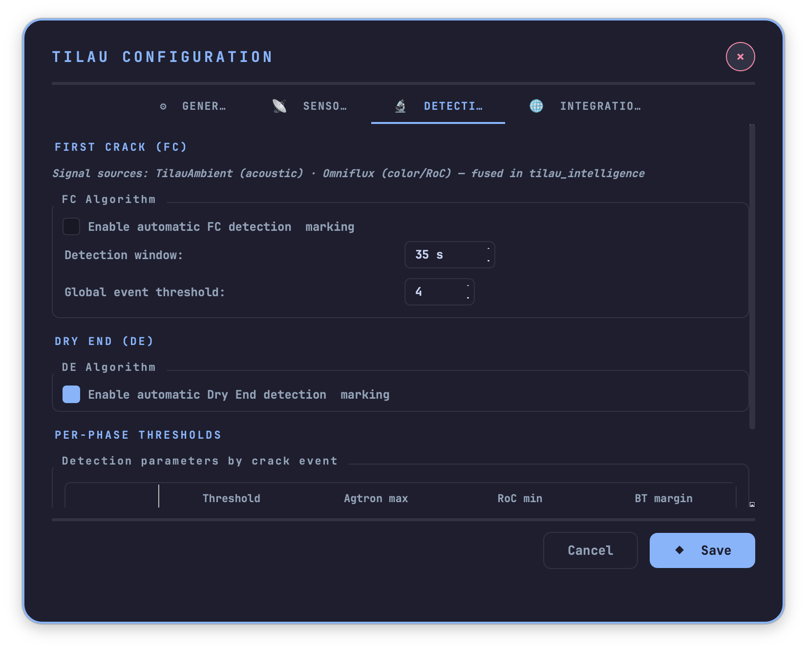
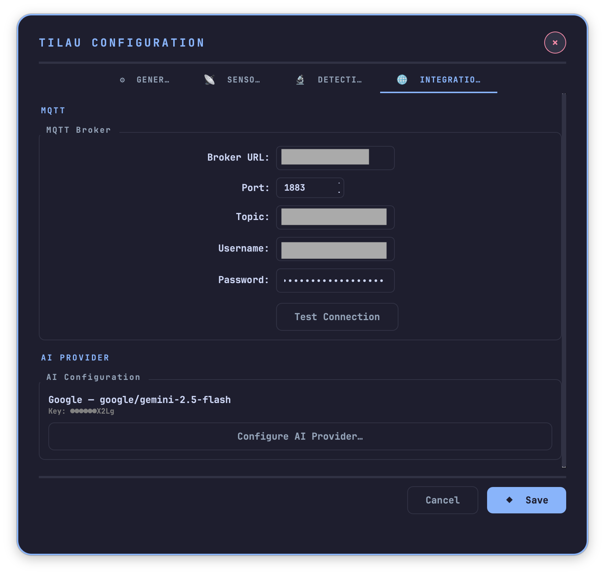

---

## Updates

TilauScope updates itself. When a new version is available you get **⬇ Download & Install**,
a progress view while it downloads, and then **🛠 Install Now & Quit** once it is ready.
**Later** postpones the whole thing — an update never interrupts a roasting session in
progress.

If the installer cannot be launched automatically, TilauScope reports it and gives the path
to the installer, rather than failing silently.

The first time a new version is opened, a **What's new** screen summarises what changed. It
appears once per version.

---

## Next

- Your green coffee, from the start: see [BeanCave](beancave.md).
- The roasting window itself — readouts, controls, the live column: see [The TilauScope window](the-window.md).
- Every setting, tab by tab: see [Configuration](configuration.md).
- Preparing a roast — bean, batch size, preheating: see [Preparing a roast](preparing-a-roast.md).
- How the roast plan is built and what it learns from your history: see [The roast plan](the-roast-plan.md).
- What the assistant reports during a roast: see [The guided roast](the-guided-roast.md).
- Any unfamiliar term: see the [Glossary](glossary.md).
