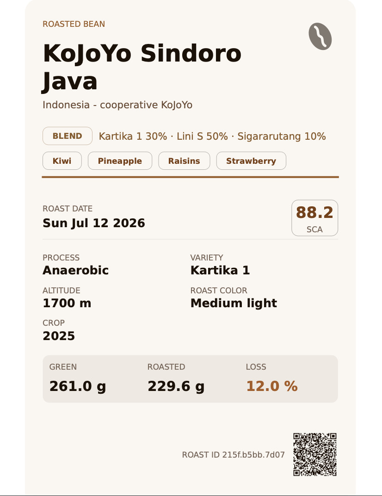
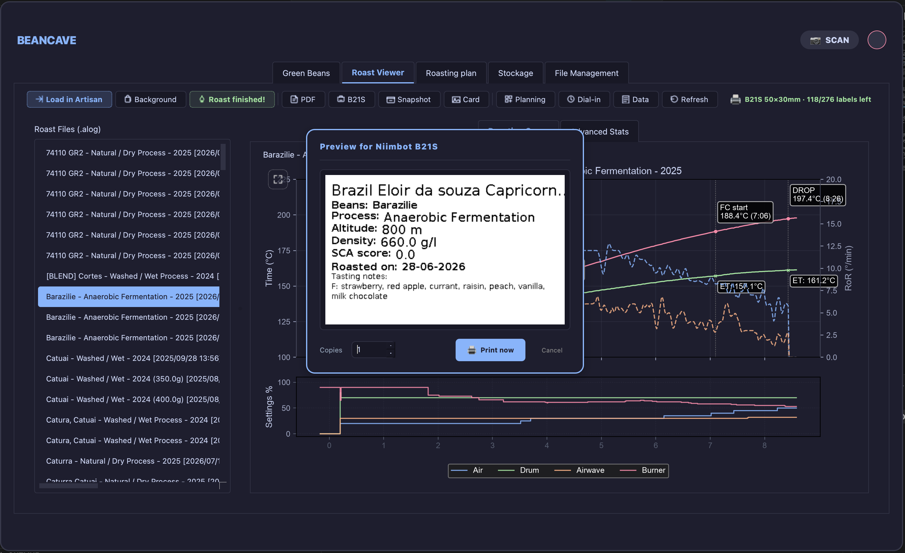
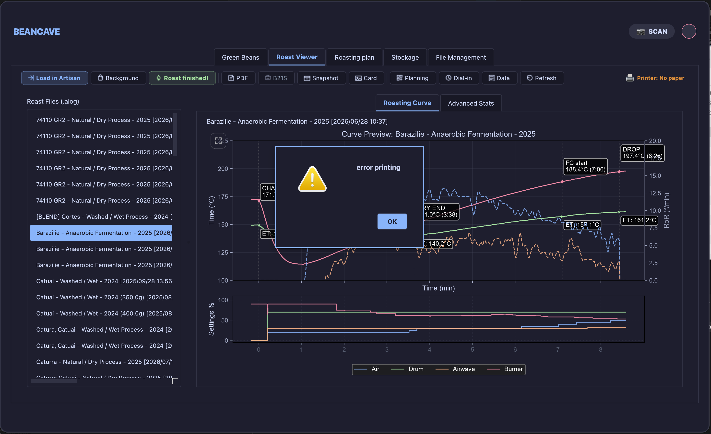
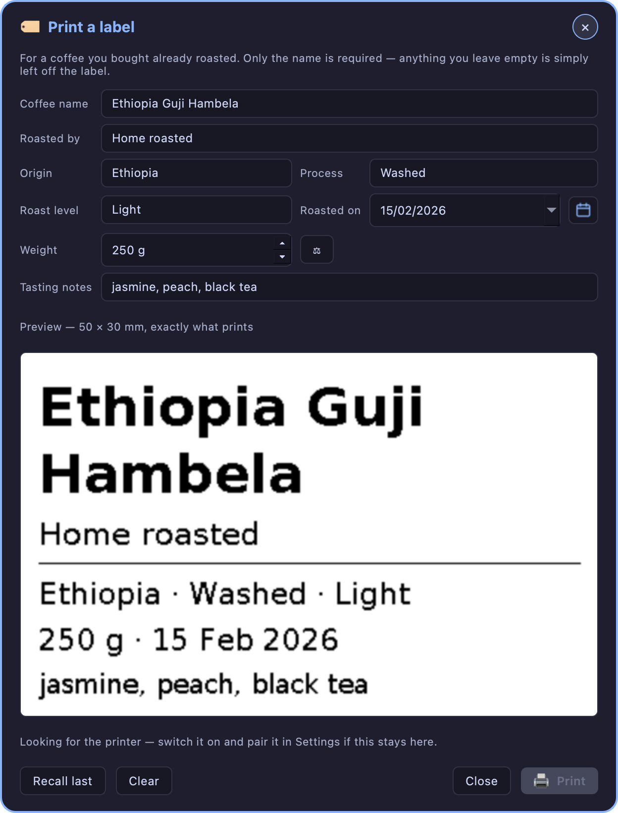
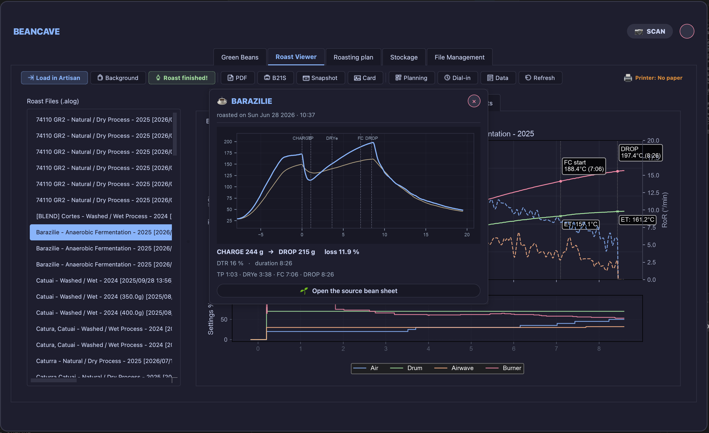

# Labels and QR

!!! abstract "Artisan does / TilauScope adds"
    **Artisan does** — nothing here. Artisan has no concept of a printed label or a
    scannable record.

    **TilauScope adds** — printed labels for a roast, a coffee or a storage sack, each
    carrying a QR code, and two ways to scan one back open: a webcam in BeanCave, or a
    phone's own camera.

Labels are covered here as **objects that get printed and scanned**. What a sack label
tracks — the pool of ids, assigning and releasing one — is covered in
[Sacks, stock and conservation](sacks-and-storage.md).

---

## What each label carries

| Label | Printed from | What it shows | Its QR opens |
|---|---|---|---|
| **Roast label** | A roast's record → **Print label**, or the result form at the end of a roast → **🏷 Label PDF** | Bean, origin, roast date, key roast figures, flavour notes, a QR | The roast's record |
| **Green bean label** | A coffee's record → **Print label** | Supplier, crop, process, altitude, density, cupping notes, a QR | The coffee's record |
| **Sack label** | The sack labels tool (see [Sacks, stock and conservation](sacks-and-storage.md)) | A label id and a QR — nothing else | Whichever coffee currently holds that id |

Roast and bean labels print as a PDF sized to the label itself — 10×15 cm by default, or 7×9 cm
for a compact pochette, set once in [Configuration → 🖨 Printing](configuration.md) — so any
printer set to print at 100% (no "fit to page") puts it straight onto a sleeve of that size, no
cutting needed. Sack labels print directly to a Niimbot thermal printer, sized for its 50×30 mm
roll.

A roast label can be printed the moment the roast ends, from the result form itself, without
waiting for the roast to be filed — it uses the roasted weight and colour just entered, so
the weight loss and colour on the label are the ones being recorded. Printing changes
nothing in the record: the form can still be corrected and printed again, or abandoned. If
the form is saved without a label having been printed, TilauScope asks once whether to print
one before closing.

---

## Printing on the Niimbot

Roast labels can also print directly to a paired Niimbot thermal printer, in two sizes: a
full spec sheet on an 80 mm roll, or a condensed card on a 30 mm roll (small enough that the
QR is dropped — there is no room to make it useful at that size). Sack labels always use the
30 mm roll.

**🖨 Print label** opens a preview with a copies count, then prints in the background.
Printing is refused, with a plain explanation rather than a silent failure, when the roll is
out of labels, when the loaded paper isn't recognised, or when it doesn't match the size the
label needs.

### While a label is printing

Every print in TilauScope — a roast label, a recipe card, a batch of sack ids — reports the
same way: a small pill in the corner of the window, described in
[While the app is working](the-window.md#while-the-app-is-working). The window stays usable
throughout, and the printer's own state stays where it always is, so a print never hides
whether the printer is ready or how many labels are left on the roll.

A run of several labels counts them — *3 of 12* — and offers **✕**, which stops the run
**after the label currently coming out**: one already moving through the print head cannot be
recalled. The pill then reports how many were actually printed, and only those count against
the roll.

A finished print says so in the pill and disappears on its own; nothing has to be clicked
away. A failed one turns red, names what to do, and stays until it is dismissed. The one
message that still interrupts is the roll running low, because that is a change of paper to
make before the next batch, not a result to read.

!!! info "Hardware — Niimbot B21S"
    Printing needs a paired Niimbot B21S. The printer identifies its own paper roll
    automatically; recognising a roll it has never seen needs an internet connection the
    first time, after which that roll size is remembered.

---

## What a label can spell

Labels print the text as it was typed. Accents and other marks are kept, and a name written
in Greek, Cyrillic, Arabic, Hebrew, Chinese, Japanese, Korean or Vietnamese prints in its own
script — Arabic, Persian and Hebrew read right to left, as they should. Earlier versions
dropped accents and could leave a non-Latin name blank.

Thai is the one exception: it has no letterforms available and prints blank. Written in the
Latin alphabet, a Thai coffee prints normally.

---

## Scanning a label

A printed label can be opened back up two ways.

**From BeanCave, with a webcam.** **📷 SCAN** opens a live camera preview; holding a label
up to it decodes the QR and opens straight to what it points to — the roast card, or the
coffee's record. The camera runs only while this window is open, and stops the moment it
closes.

**From a phone, with its own camera app.** No app or pairing is needed: the label's QR is a
plain web address. Opening it on a phone already on the same network as TilauScope shows the
same record — bean details, or a roast's curve, figures and tasting notes — as a page in the
phone's browser.

!!! note
    The phone needs to be on the same local network as the computer running TilauScope.
    Off that network, the page simply doesn't load — there is no remote access built into
    this feature.

A sack label works the same way as the other two: scanning it, from either path, opens
whichever coffee currently holds that label. A label not currently attached to any coffee
says so plainly rather than opening a blank or wrong record.

---

## Next

- What a sack label tracks, and managing the pool of ids: see
  [Sacks, stock and conservation](sacks-and-storage.md).
- The coffee records these labels point to: see [BeanCave](beancave.md).
- Any unfamiliar term: see the [Glossary](glossary.md).
