# Preparing a roast

!!! abstract "Artisan does / TilauScope adds"
    **Artisan does** — offers a roast properties dialog where every field is typed in by
    hand, and a PID whose setpoint is set manually before each batch.

    **TilauScope adds** — a preparation sheet that already knows which coffee is being
    roasted, reads the batch weight off the scale, judges the batch before it starts, and
    starts preheating on its own. Nothing is written to the roast until the sheet is
    confirmed.

Selecting a bean in **BeanCave** and choosing to roast it opens **ROAST SETUP**, a sheet in
four tabs. Everything below lives there, unless stated otherwise.

---

## The bean and the batch

The **⬥ ROAST** tab opens with the coffee itself: name, origin, farm, process, variety,
altitude, SCA score — pulled from its BeanCave record, so the coffee about to be roasted can
be checked at a glance without going back to the database.

**Roast title** is pre-filled from the bean name, process and harvest year, and remains
editable.

**Batch** shows the number this roast *will* receive, and a **track batches** checkbox turns
numbering on without opening Artisan's own batch dialog.

!!! note
    The batch number shown is a forecast. It is only consumed at [DROP](glossary.md#drop),
    so opening and closing the sheet, or abandoning a roast, never burns a number.

**Green weight** drives everything downstream — the roast plan, the stock count, the
[weight loss](glossary.md#weight-loss) figure. The start button stays disabled until a weight
is entered, because a roast without a weight produces a wrong plan and a meaningless yield.

Ticking **Decrease bean stock by this weight after OK** takes the batch out of the bag's
stock in BeanCave, with no second entry.

**↺ Rebuild from bean** regenerates the descriptive bean text that Artisan stores in the
roast file, straight from the BeanCave record.

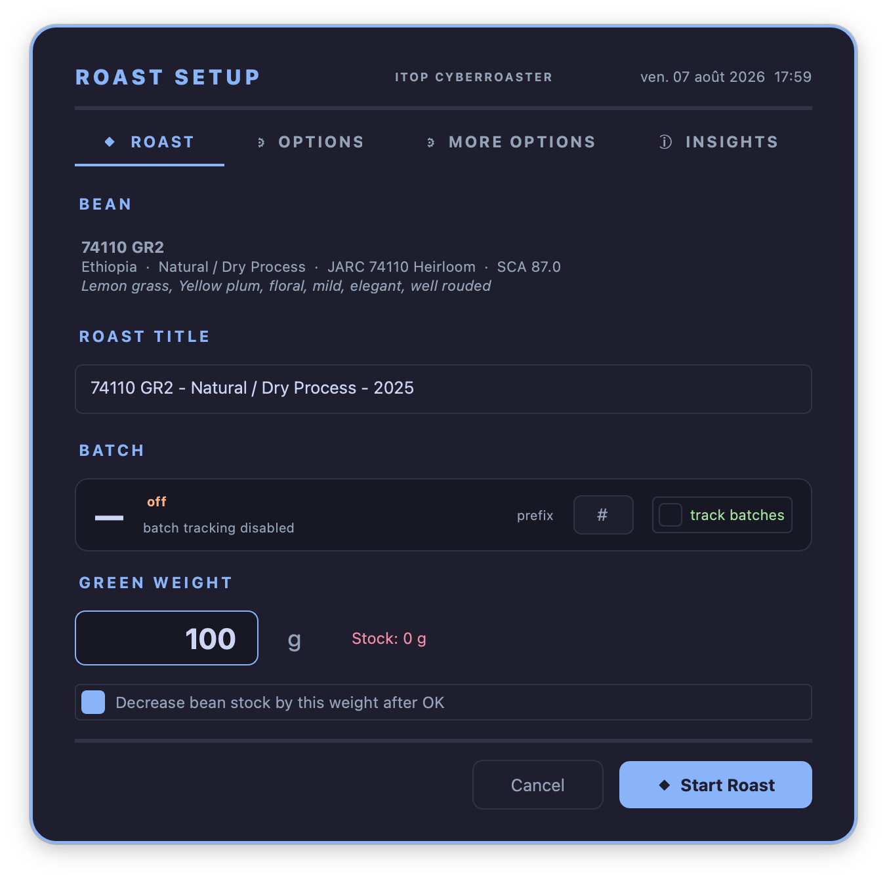
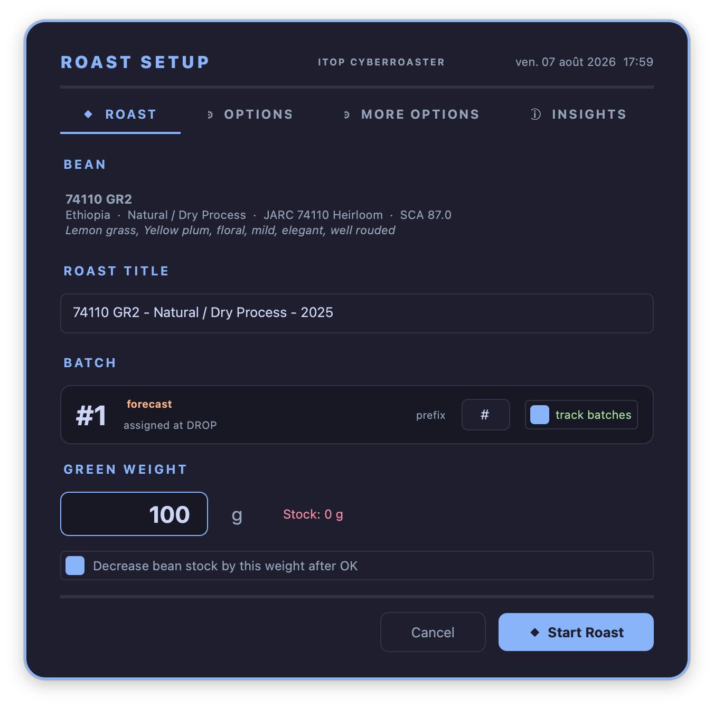

### Weighing from the scale

With an Acaia scale paired, a **⚖ SCALE** window floats beside the sheet showing live weight.
Clicking the value writes it into **Green weight**; double-clicking it tares the scale. No
retyping, and no leaving the sheet.

If a weight has already been entered by hand, TilauScope asks **Replace Weight?** first,
rather than silently overwriting it.

The line under the value says what the scale is doing: *tap to use* when a reading is live,
*connecting…* while the link is being established, *disconnected* when it is lost, and
*no scale — tap to retry* when it could not be reached. A scale that has gone idle is asked
again for about a minute; tapping the empty value asks once more. The scale stays connected
after the sheet is confirmed, so it is still live at the end of the roast.

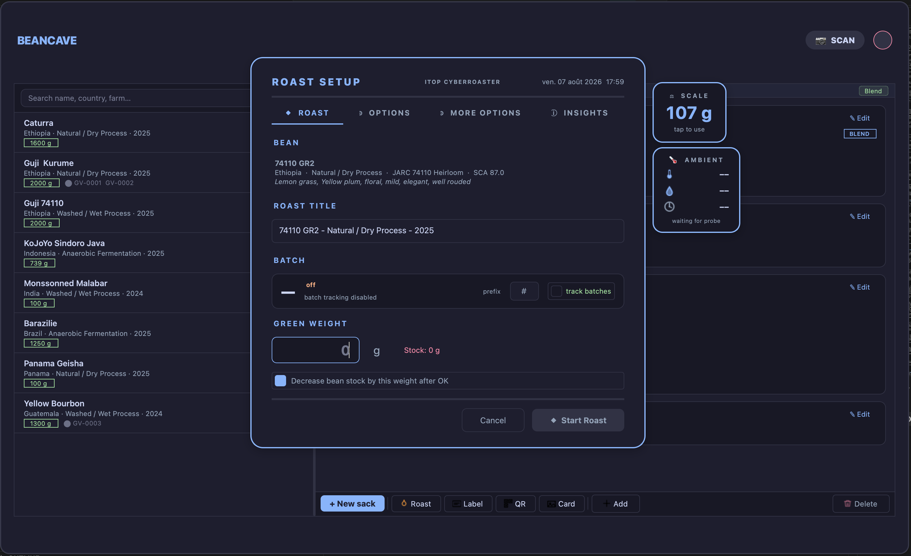

---

## What the coffee and the room are doing

The **⚙ OPTIONS** tab holds *Physical properties*: [density](glossary.md#density),
[moisture](glossary.md#moisture-content) and green bean temperature, pre-filled from the
BeanCave record where they are known. These three feed the roast plan directly and shape the
projected drying time — a humid, dense coffee does not dry like a dry, light one.

With an ambient probe configured, a **🌡 AMBIENT** window floats beside the sheet with live
room temperature, humidity and pressure, and those readings are stored in the roast file
when the sheet is confirmed. The day's conditions are recorded and accounted for without
being typed in.

**Target roast profile** sets the [Agtron](glossary.md#agtron) level being aimed for. It
drives the roast plan and the predictions on the INSIGHTS tab.

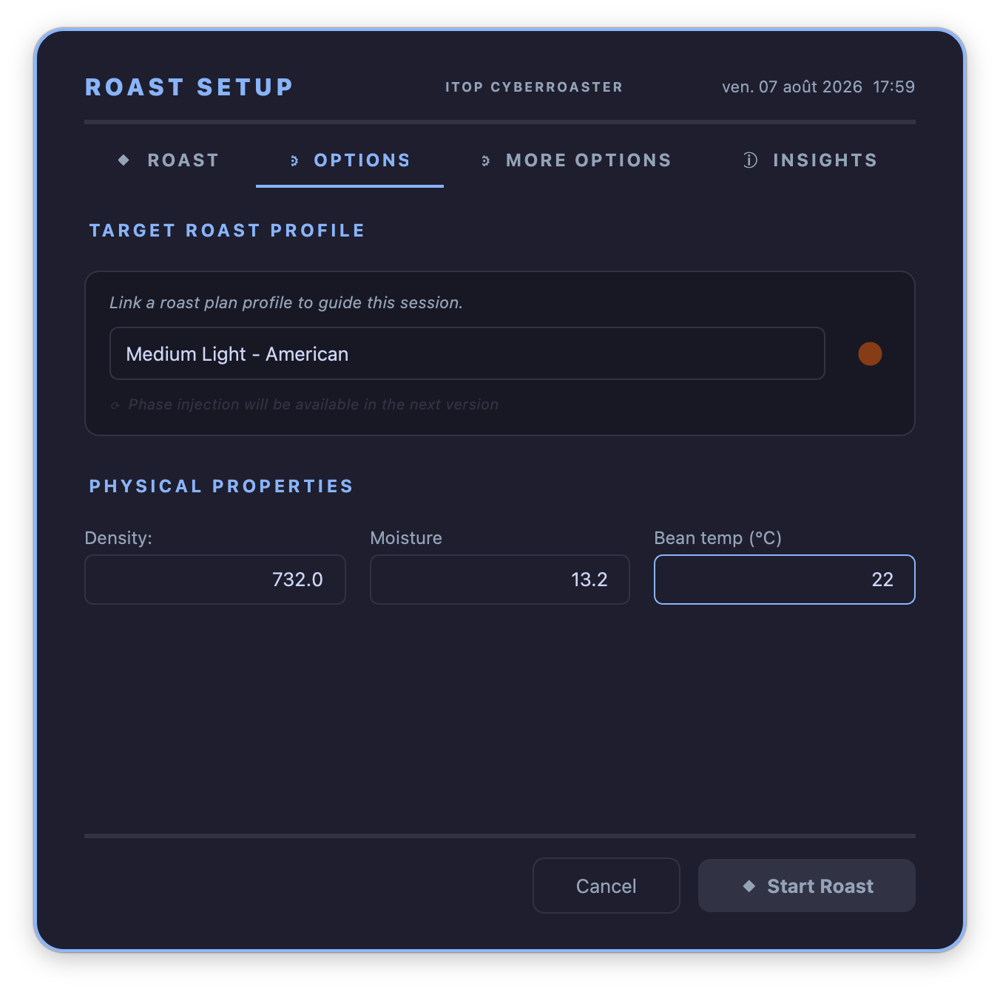
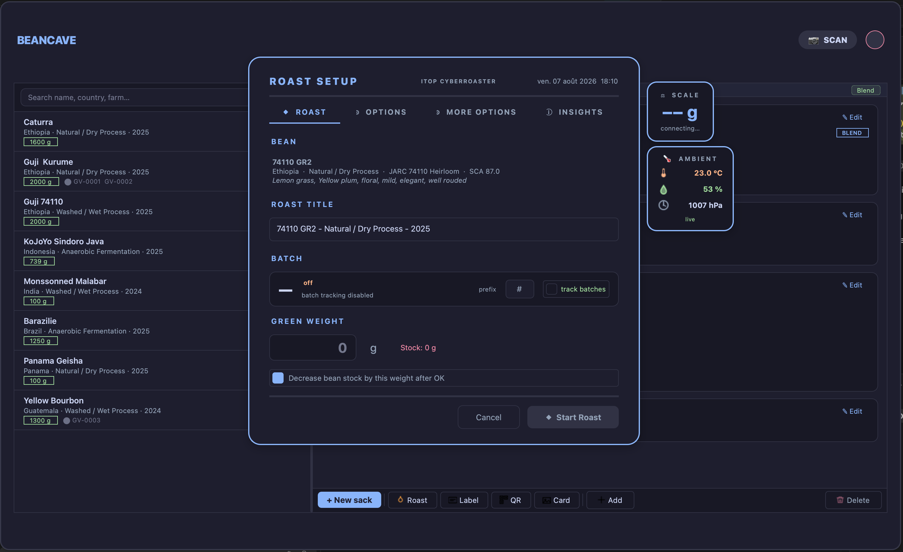

---

## Judging the batch before it starts

The **ⓘ INSIGHTS** tab reads the batch and says what it expects — before the drum turns.

**Green signals** flags whatever is outside the norm in this coffee or this batch size, and
what it implies for the roast.

**Load & setup** shows whether the batch suits the machine, with a fill bar for under- and
overloading.

**Phase cheat-sheet (RoR)** gives the [RoR](glossary.md#ror--rate-of-rise) bands worth
holding in each phase, available before the roast rather than discovered during it.

**Predicted targets** projects total time, [DTR](glossary.md#dtr--development-time-ratio) and
weight loss.

**STRATEGY** condenses the whole thing into one sentence for this coffee, on this machine, at
this target.

!!! note
    *Predicted targets* stays empty until a target roast profile is chosen in **⚙ OPTIONS** —
    the message *Select a roast plan in OPTIONS to predict DTR, weight loss and time.* is a
    prerequisite, not a failure.

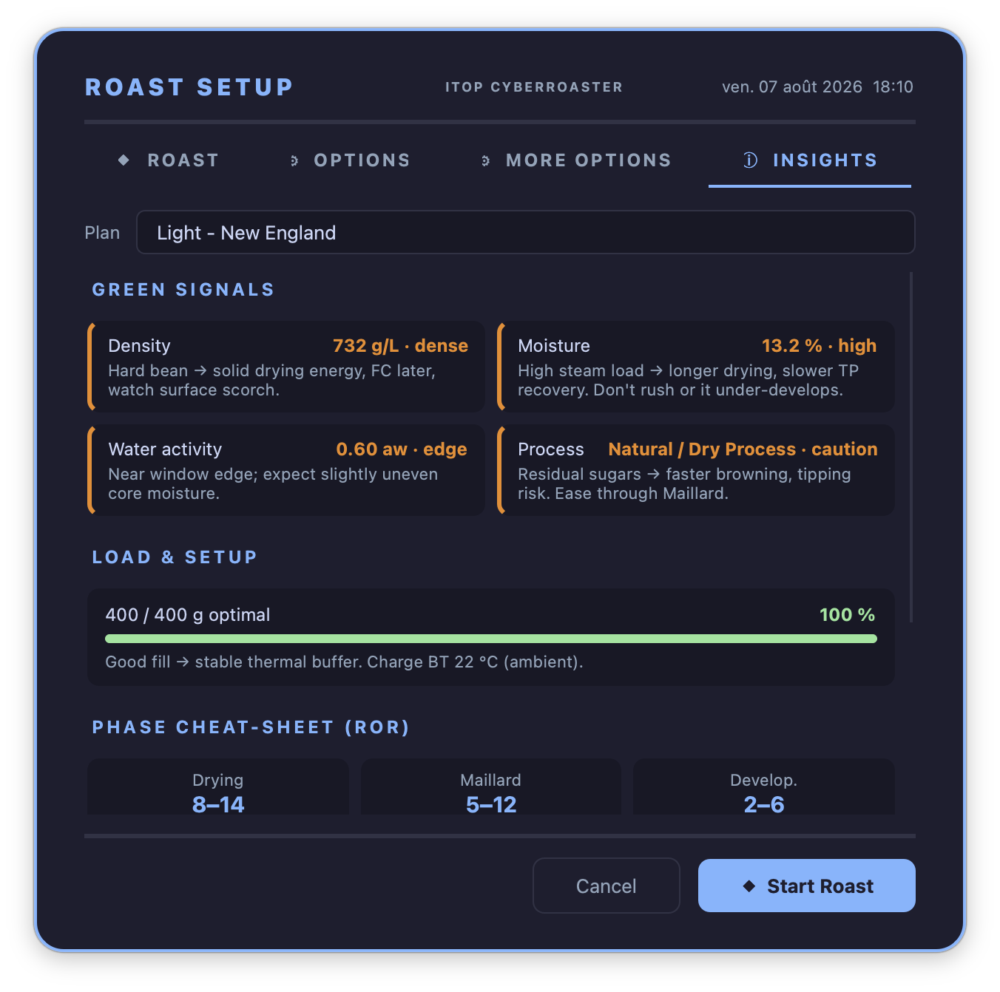
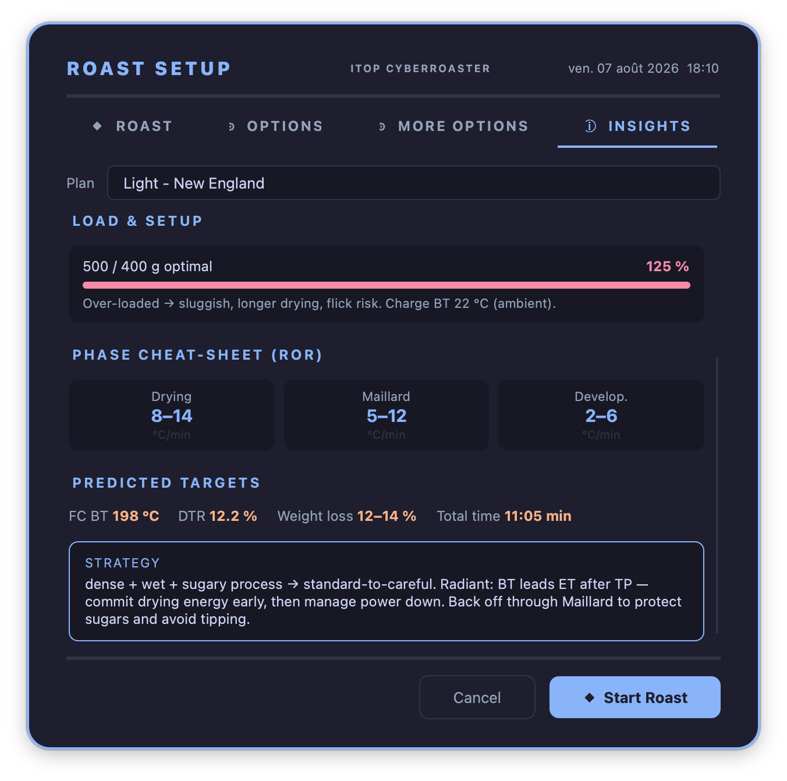

---

## Automating the start

The **⚙ MORE OPTIONS** tab decides what happens without being asked.

**Enable TilauPID at start of roast**, with its **Target temp**, starts preheating the moment
START is pressed — see [Preheating: TilauPID](#preheating-tilaupid) below for what it then
does. **Input: BT / ET** chooses whether preheating aims at bean temperature or at air
temperature.

Under *Roast automation*, four milestones can be marked automatically:

| Option | What it does |
|---|---|
| **Auto Charge** | Marks [CHARGE](glossary.md#charge) on its own. |
| **Auto Drop** | Marks [DROP](glossary.md#drop) on its own. |
| **Auto Dry End** | Marks [dry end](glossary.md#de--dry-end) on its own. |
| **Auto First Crack** | Marks [first crack](glossary.md#fc--first-crack) from the crack counter. |

!!! note "Auto Dry End has a prerequisite"
    It needs a Dry-phase BT target set in **Artisan → Phases**. Without one, the box can
    still be ticked but the automation is switched off when the sheet is confirmed, and
    TilauScope says so: *Set a Dry-phase BT target in Artisan Phases first*. The feature is
    not broken — it has nothing to aim at.

!!! info "Hardware — Auto First Crack"
    Automatic first-crack marking listens for cracks, so it needs an acoustic source: the
    TilauAmbient probe or an Omniflux. See [Hardware and peripherals](hardware.md).

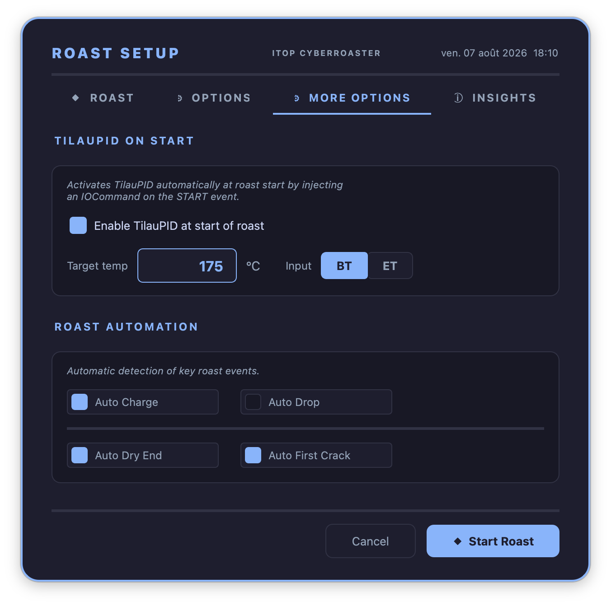

---

## Telling TilauScope which machine it is

The machine profile is not part of the sheet — it is set once, in **TilauScope → TilauScope
Config...**, under *Machine Profile → Model*, from sixteen predefined roasters. See
[Configuration](configuration.md#-general--the-machine-and-how-tilauscope-behaves) for the full
detail of that dialog.

The profile is what makes the guidance specific: the roast plan, the pre-roast benchmarks,
the slider labels and the load checks all follow from the machine's real characteristics —
its [thermal mass](glossary.md#thermal-mass), the top rate of rise it can reach, how finely its
controls can be set. The [turning point](glossary.md#tp--turning-point) is not among them: how
far the temperature dives after charging depends on how hard you are firing and on what went in,
so the plan does not pretend to predict it — it draws a placeholder and replaces it with the real
turning point the moment it happens, about a minute in.

### Machines TilauScope cannot drive

For a machine adjusted entirely by hand, tick **Read-only (monitoring only — Artisan does not
control the machine)**. Every control slider disappears — in Artisan and in the assistant —
and the application confines itself to recording [BT](glossary.md#bt--bean-temperature) and
[ET](glossary.md#et--environmental-temperature). Guidance becomes advice to act on rather
than a control to move.

Unticking it restores the sliders exactly as they were, so a manual slider setup is not
overwritten by a trip through read-only mode.

An uncatalogued roaster needs no profile at all: leave **Model** on *— select a roaster
model —* and tick read-only.

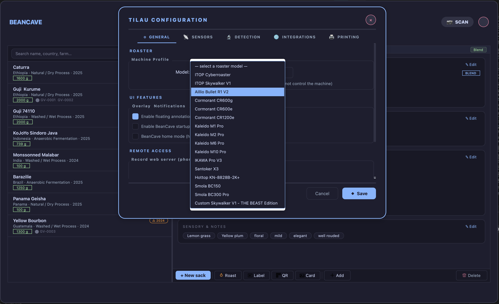

---

## Drum speed is set before the roast, not during it

Drum speed is treated as a setup parameter. It is computed once for the batch, from weight
and density, and applied at [CHARGE](glossary.md#charge) — then left alone. On machines where
changing drum speed mid-roast disturbs the temperature reading, TilauScope will not propose
the gesture at all.

There is nothing to set: the value arrives with the roast plan and needs no attention. It is
listed here because *when* drum speed is decided matters — see
[The roast plan](the-roast-plan.md) for the value itself, and
[The guided roast](the-guided-roast.md) for what happens at charge.

---

## Preheating: TilauPID

Preheating decides how the first two minutes of the roast will go. Charge into a machine that
has not settled, or into one that has overshot and is on its way back down, and the drying
phase is already compromised before any lever has been touched. **TilauPID exists to make that
starting point repeatable**, which is why it is worth understanding rather than simply leaving
switched on.

Ordinary PID control chases the error it can see right now: it heats until the setpoint is
reached, by which point the machine's stored heat is still arriving and the temperature sails
past. TilauPID instead steers on where the temperature is *projected* to end up, so it eases
off before the setpoint rather than after it.

Once the machine has remained close to the setpoint with an almost flat rate of rise for ten
seconds, a deliberately slow integral trim removes any small remaining temperature offset. It
cannot act during the ramp or a fast approach, is limited to six burner percentage points and
unwinds when the machine leaves the hold zone. This gives the steady hold time to settle
without allowing accumulated correction to drive the next approach or an overshoot.

### During preheating

Between START and [CHARGE](glossary.md#charge), the assistant shows its **Preheat** page: how
far the machine is from the [setpoint](glossary.md#sv--setpoint-value), which way
[RoR](glossary.md#ror--rate-of-rise) is trending, and one instruction to act on. The page
comments on what it is doing rather than leaving you guessing — *PID ramping to SV — let it
work, charge when BT is stable ± 2°*, then *Approaching SV — PID will cut heat; slight
overshoot is normal*, and finally *✅ SV reached — stabilize then charge*. The charge button
becomes available once bean temperature is stable.

The page carries a **Burner** slider, so preheating can be corrected by hand without leaving
the assistant. On a read-only machine the slider is hidden.

TilauPID stops applying heat immediately if its selected temperature reading disappears,
becomes invalid or changes in a way the machine cannot physically produce. A single bad
reading holds the burner at zero until three valid readings have followed it. Repeated bad
readings, a frozen sensor while the machine should be heating, or several seconds without a
reading stop preheating and show a message; press START again only after checking the probe
and its connection. An interrupted or sensor-degraded preheat is never used to recalibrate
the controller.

In **Simulator**, replay can run faster than real time. TilauPID therefore does not apply its
wall-clock jump, frozen-sensor or missing-update tests to replayed samples; a fast but valid
recorded temperature cannot latch the controller off. Missing, non-numeric and out-of-range
values are still rejected, while all temporal protections remain active on a real machine.

### Following the preheat on the roast graph

The assistant window is not required to see what preheating is doing. Whenever TilauPID is
running, a **Preheat** panel is drawn on the roast graph itself, next to the bean temperature
curve, and stays there until [CHARGE](glossary.md#charge) is marked. It reports the target
[setpoint](glossary.md#sv--setpoint-value), the temperature being steered on — bean or air,
whichever the **Input** setting selects — the remaining gap to the setpoint, the current
[RoR](glossary.md#ror--rate-of-rise), the burner power TilauPID is applying, and how long the
climb still has to run. The header changes colour as the machine closes in, and the remaining
time is replaced by *Ready to charge* once the setpoint band is reached.

This is the same information the assistant's Preheat page gives, minus the commentary and the
burner slider, for roasting straight from the Artisan window.

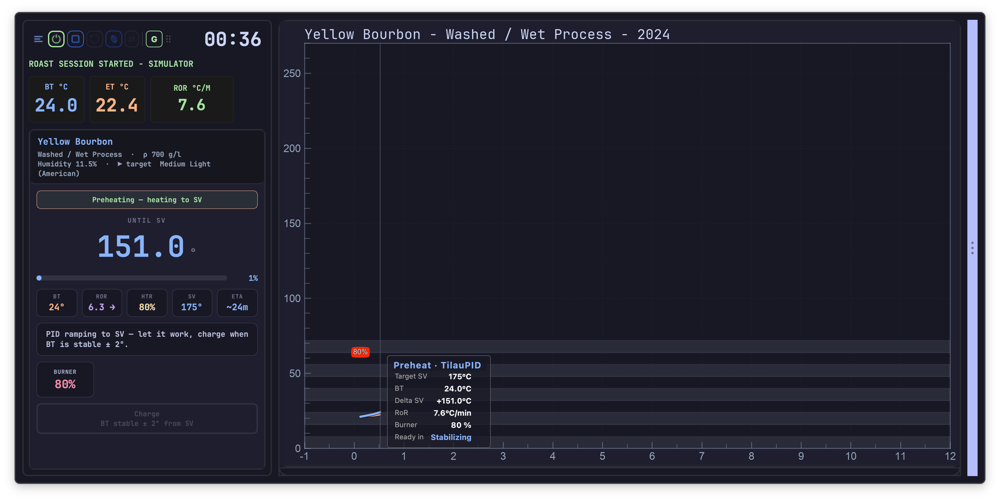

### It learns your machine

**Preheating calibrates itself across roasts.** Two things are re-derived from your own
previous roasts at the same setpoint: the power needed to *hold* that temperature, and how
early to ease off to arrive without overshooting. Both are properties of your machine and your
room, not of a specification sheet — which is why they are measured rather than assumed.

There is no calibration button and nothing to maintain. A completed preheat can benefit the
next one once it contains enough trustworthy evidence: at least a minute of observation, a
complete temperature window and, for holding power, a continuous stable hold around the
setpoint. TilauPID uses filtered, robust measurements and limits how far one session may move
either setting, so one probe spike or unusual start cannot dominate the model.

Learning is kept separate for each machine and selected BT/ET input. Each qualified setpoint
becomes a learned point at its actual temperature; between two nearby learned points, holding
power and lead time are interpolated continuously. This avoids a control change simply because
the requested setpoint crossed an arbitrary 10 °C boundary. Outside the learned range, the
nearest point fades back to the physical or historical fallback over 15 °C, and points more
than 40 °C apart are not joined as though they described one thermal regime. Existing learned
10 °C values are retained as initial interpolation points during migration. Historical profiles
from another machine or input, simulated profiles, interrupted sessions and sensor-degraded
sessions are ignored. Excluding a roast from cooking-plan learning does not discard its
separate preheat evidence. The controller
also keeps the preceding learned values and the evidence behind each update, so a bad update
can be diagnosed and rolled back without changing Artisan's profile format.

The slow hold correction itself starts from zero on every preheat. When it produces a genuinely
stable hold, the resulting burner power is included in the qualified holding-power evidence;
the next preheat can therefore begin with a better base value and need less integral correction.

An advanced offline identification tool can also build a thermal-model candidate from saved
real preheats. The archive is analysed outside START, so this work cannot freeze the controls.
The candidate then enters [shadow validation](glossary.md#shadow-validation): for three
consecutive qualified real preheats it predicts temperature from the measured burner commands
without controlling the heater. Only a candidate that remains within the prediction-error
limits becomes a bounded fallback for holding power and response lead. Simulation and
interrupted, short or poorly excited sessions never qualify; a later qualified
failure withdraws the fallback. Direct stable-hold evidence and learned setpoint values always
take priority, and no Artisan profile structure is changed.

!!! note "Checking what it learned"
    Each time the model is consulted, TilauPID writes a short diagnostic to the application
    log stating what your history suggests for that machine, input and setpoint — the holding
    power it settled on, how much lead time it expects to need, the thermal candidate's
    shadow/active state, the number of qualified updates and the evidence used for the latest
    one. It is there for the roaster who wants to see the
    reasoning behind the preheat, or to understand why a preheat behaved differently from the
    last one. Nothing needs to be read for TilauPID to work.

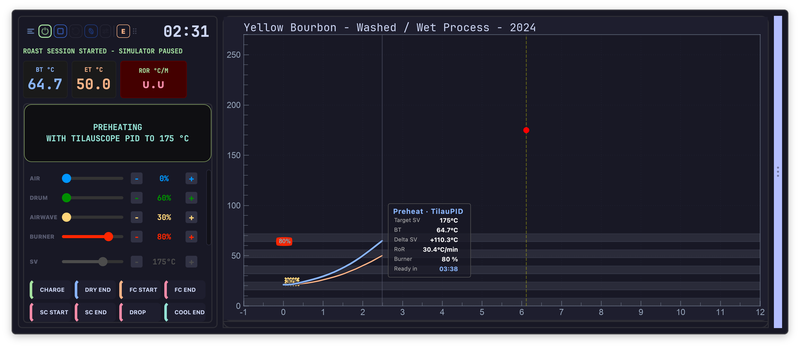

!!! note "PID Autotune is a different tool"
    **TilauScope → PID Autotune** is an advanced, separate tool. It calibrates *Artisan's own*
    PID gains by watching bean temperature as the machine heats, band by band. It is unrelated
    to the preheating described above, which needs no calibration from you. Use it only to
    tune Artisan's PID itself; it has its own **PID Parameters Help** for what the gains mean.

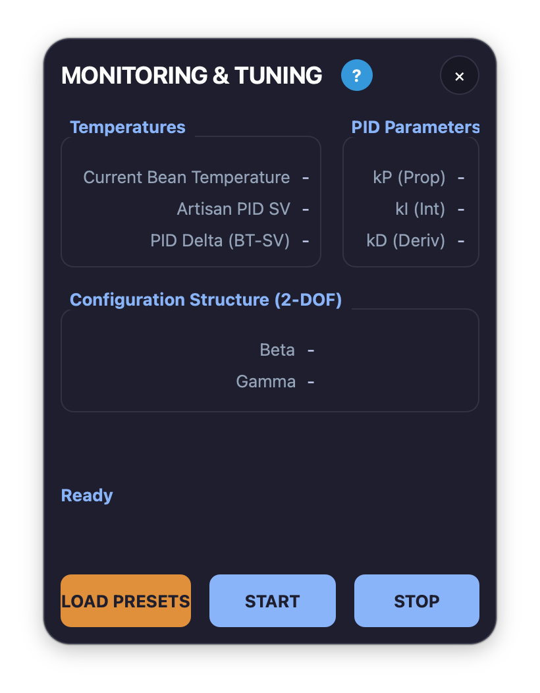

---

## Starting

Confirming the sheet closes it with a **Start a new roast** message naming the coffee, and
the guided assistant opens and docks itself, ready for the roast.

---

## Next

- The green coffee this sheet draws from: see [BeanCave](beancave.md).
- What the plan contains and what it learns from previous roasts: see [The roast plan](the-roast-plan.md).
- What the assistant reports once the drum is turning: see [The guided roast](the-guided-roast.md).
- The devices mentioned here — pairing, limits: see [Hardware and peripherals](hardware.md).
