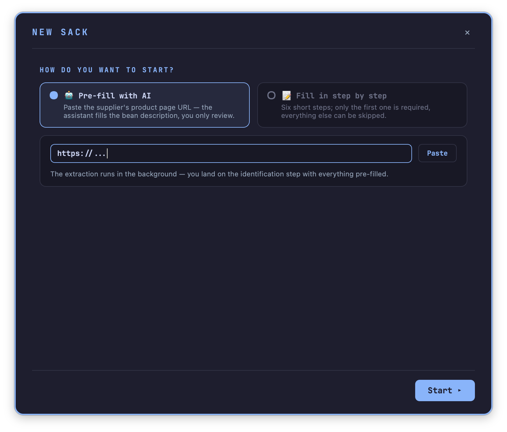
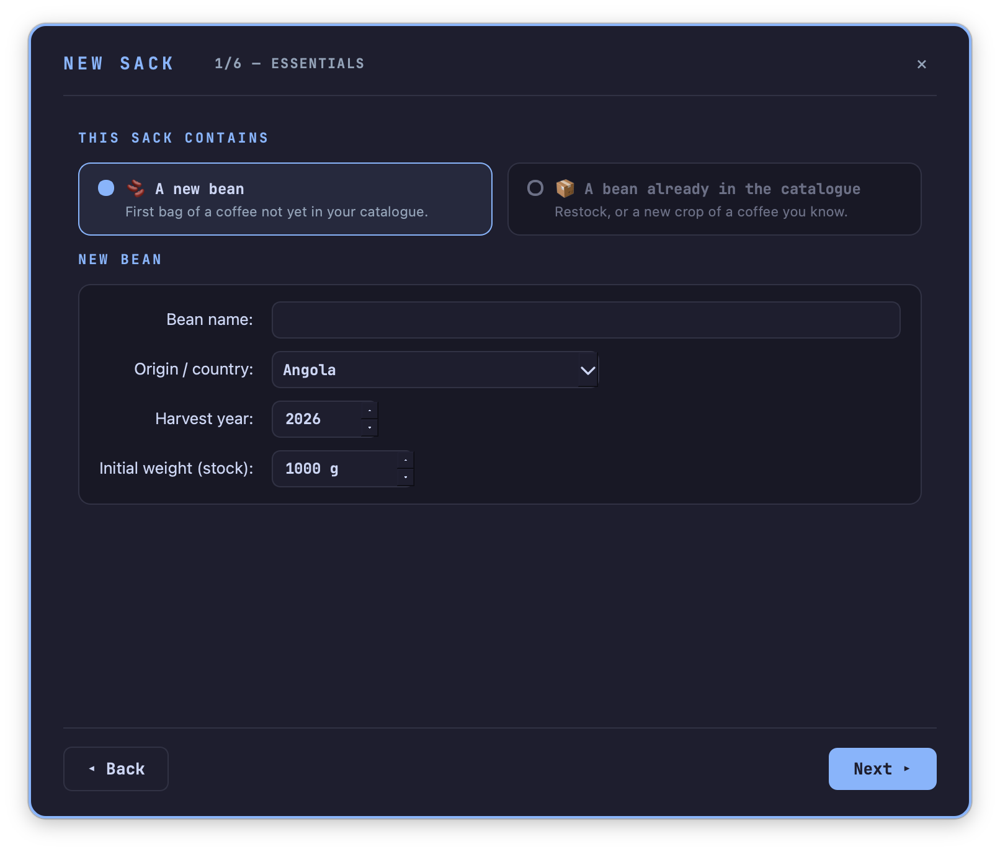
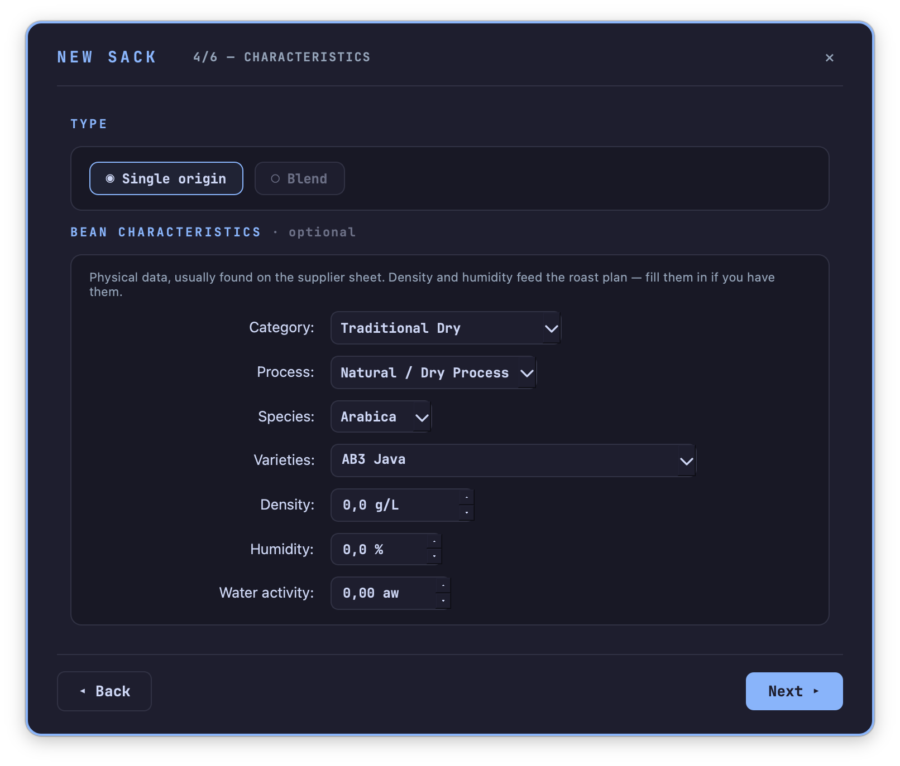
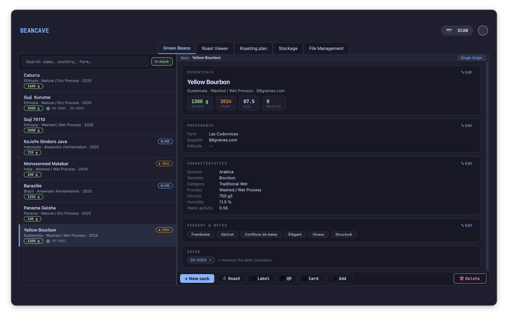
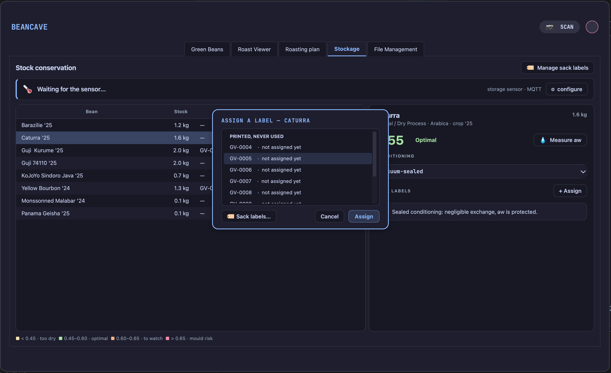
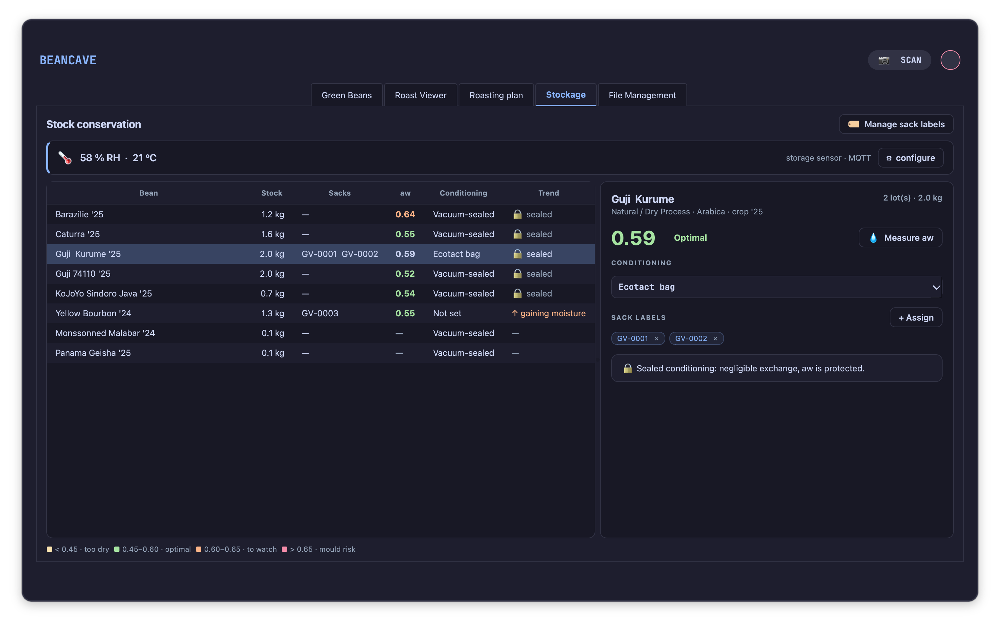
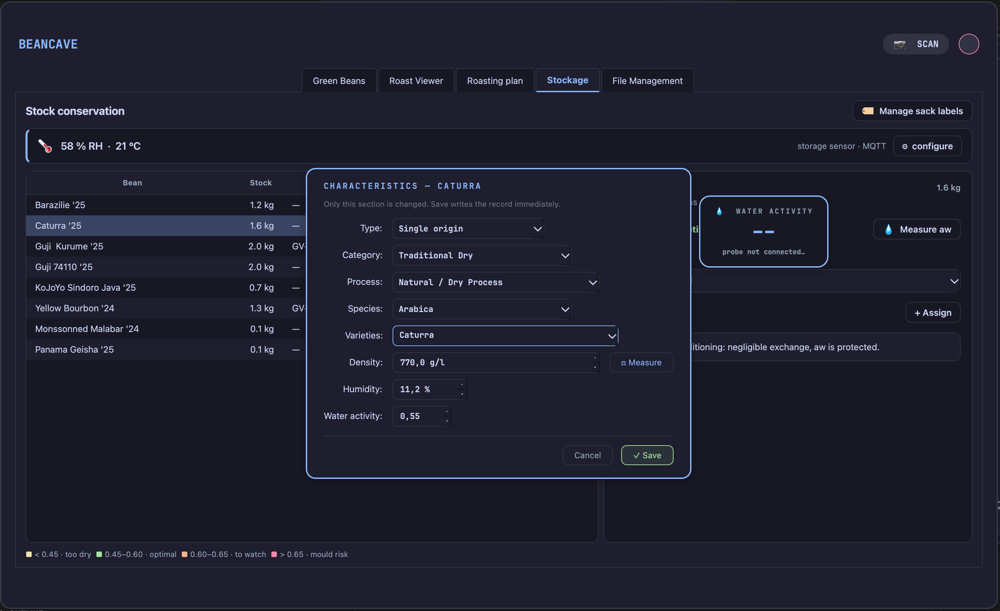
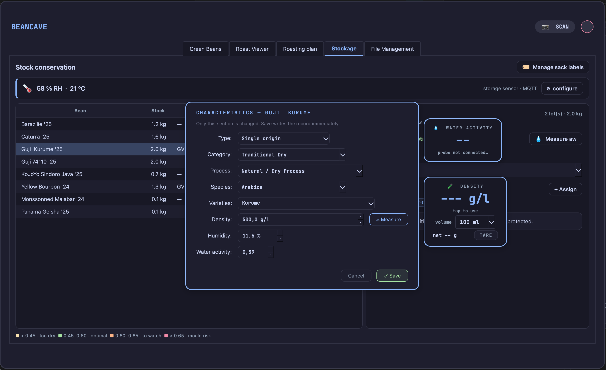
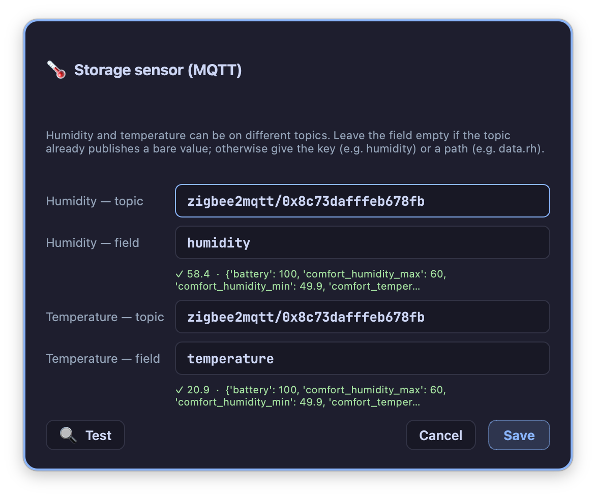

# Sacks, stock and conservation

!!! abstract "Artisan does / TilauScope adds"
    **Artisan does** — nothing here. Green coffee inventory and its keeping condition are
    outside Artisan's scope entirely.

    **TilauScope adds** — a guided way to bring a new bag into the catalogue, physical
    labels that identify a bag and can move between bags as they empty, and a
    [water activity](glossary.md#aw--water-activity) dashboard that says which bags need
    attention before they spoil.

This chapter covers the **+ New sack** assistant, sack labels and how they are managed, and
the **Storage** tab in [BeanCave](beancave.md). Printing a label physically, and scanning one
to open a record, are covered in the next chapter — this one covers what a sack label
*is* and what it tracks.

---

## Bringing a new bag in: the "+ New sack" assistant

**+ New sack**, next to the catalogue's other actions, opens a short wizard for the three
situations a new bag actually represents: a coffee never seen before, more of a coffee
already on the shelf, or the same coffee's next harvest.

**Start.** Either paste a supplier page URL and let AI fill in what it can, or go
step by step by hand. The AI path lands on the same review screen as the manual one — it is
a head start, not a shortcut that skips checking.

!!! note
    The AI option needs an AI provider configured first — see
    [Configuration](configuration.md#-integrations--outside-services). Without one, the
    card is present but disabled.

**What kind of bag is this.** The question is asked outright, not guessed from the name:

| Choice | What it asks for | What happens |
|---|---|---|
| **A new bean** | Name, origin, harvest year, starting weight | A new coffee record is created. |
| **Restock — same crop** | Which existing coffee, added weight | The weight is added to that coffee's stock. Nothing else changes. |
| **New crop of the same bean** | Which existing coffee, then the New crop step below | A new coffee record is created, inheriting the identity of the previous crop. |

Weight can be typed in or captured live from a paired scale, the same way it is throughout
TilauScope.

Restock skips straight past provenance, characteristics and sensory notes to the review
screen — a restock has nothing new to describe.

**New crop** has a step of its own, described in the next section.

**Sack identification** is the one step that can always be skipped. Give the bag a label id
now — recycled ids are offered first, then ever-printed-but-unused ones — or leave it and
attach a label later. A duplicate id is flagged before it can be reused by two bags at once.

**Provenance, characteristics, sensory notes** — the same fields as the bean record itself,
including [water activity](glossary.md#aw--water-activity), skipped for restock and new crop
as above.

**Review** closes the loop: one card per section, each with its own **✎ Edit** to jump back
without restarting, and a warning if a starting weight of 0 g is about to be confirmed.
**✓ Create the sack** writes the record and, if a label id was chosen, marks it assigned.

---

## The next harvest of a coffee you already roast: "🌱 New crop"

Select the coffee in the catalogue and press **🌱 New crop**, next to **+ New sack**. It opens
the same assistant, already locked on that record and reduced to three steps. The button is
greyed out until a coffee is selected.

A new crop is the same coffee from a different year. Its **identity** — origin, farm, altitude,
process, species, variety, category, blend composition — is inherited as it stands and is shown
at the top of the step so it can be checked at a glance. Its **name stays the same**; the
harvest year is what tells the two records apart in the catalogue.

**The new sack** asks only what belongs to the new bag: harvest year (proposed as the year after
the previous crop), weight received, and the supplier, in case the same coffee came through a
different one this time.

**Measured on this lot** asks for [density](glossary.md#density), humidity
([moisture content](glossary.md#moisture-content)) and
[water activity](glossary.md#aw--water-activity). These three start **empty**, on purpose: they
are measurements of one bag, not properties of the coffee, and they change with every harvest.
The previous crop's value is shown beside each field for reference only. If they have not been
measured yet, leave them empty — the review step says plainly that the roast plan will fall back
on averages, and they can be filled in later from the bean record. **Copy … values** carries the
previous crop's three figures over in one click, for a supplier who does not publish new ones.

Density and humidity can be measured with a paired scale and a fixed-volume container; water
activity can be read from an [AquaGauge](hardware.md) probe, whose live reading appears beside
the step and transfers into the field on a click.

**Sensory and score** stays folded away. The previous crop's flavour notes and score are carried
over — open it to correct them, and to tick *This crop replaces the previous one* if the old bag
is finished, which sets its stock to zero.

Brew dial-ins are **not** carried over: a recipe is tuned on one lot and does not transfer to
the next.

The two remaining steps are the usual ones — sack identification, still skippable, and review.

<!-- CAPTURE 3.4 — the 🌱 New crop step, entered from the catalogue with a bean selected that
has a density and humidity on its previous crop, so the reference lines are visible and the
three measurement fields are empty. -->

---

## Sack labels

A sack label is an id — printed on a small physical label, stuck to a bag — that lets a bag
be identified at a glance or by a scan. It carries no information of its own beyond the id;
what it points to is whichever coffee record currently holds it.

**Attaching and releasing.** Every place a coffee's sacks are shown — the bean record, the
Storage tab — shows them as small removable chips. Removing one asks *Is this bag empty?*
first, unless that confirmation has been dismissed permanently, and returns the id to
circulation rather than deleting it.

**Assigning a label from the Storage tab.** The Storage tab's per-coffee panel offers
**+ Assign**, picking from currently available ids — recycled first — rather than typing one
in freely, so a typo can never attach an id no printed label actually carries.

**When a bag empties.** The moment a coffee's stock reaches 0 g while it still holds a label,
TilauScope asks whether to keep the label attached or release it for reuse. Bags that reach
zero without going through that prompt are not lost track of: the Storage tab keeps a
standing notice of any label still attached to a coffee with no stock left, with one place to
review and release them in bulk.

**The label pool.** Behind the scenes, labels are tracked as a pool: printed and assigned,
printed and never assigned, or released and available again. New ids are handed out in
sequence; released and unused ids are always offered first before a new one is minted, so the
id space does not grow faster than the bags actually on the shelf.

!!! note
    Printing sack labels — a batch of new ids, a reprint, or registering an
    externally-printed one — and scanning one back open, are covered in
    [Labels and QR](labels-and-qr.md), from the same tool this section's ids come from.

---

## The Storage tab

**BeanCave → Storage** is a dashboard over every coffee currently in stock, sorted so the
one needing attention soonest is at the top.

### The bean list

Each row shows stock remaining, attached sacks, current
[water activity](glossary.md#aw--water-activity), [conditioning](glossary.md#conditioning),
and a moisture trend indicator. Coffees are ordered by risk: mould risk first, then watch,
then too dry, then optimal, then unknown.

### Water activity zones

Water activity is read against four bands:

| Band | Range | Meaning |
|---|---|---|
| **Too dry** | below 0.45 | More fragile aromatics, faster staling. |
| **Optimal** | 0.45 – 0.60 | Normal safe keeping range. |
| **Watch** | 0.60 – 0.65 | Worth checking again soon. |
| **Mould risk** | 0.65 and above | Recondition or roast as a priority; aim to bring storage humidity below 60% RH. |

### Conditioning and moisture trend

**Conditioning** — set per coffee from a short list (vacuum-sealed, valve bag, sealed jar,
open cloth bag, and so on) — decides how a coffee's moisture is expected to move. A sealed
bag is read as holding its own water activity regardless of the room; an open bag, or a
coffee with no conditioning set, is read as drifting toward the room's humidity, and the
trend indicator (gaining moisture / drying out / stable) follows that comparison.

!!! note
    A coffee with no conditioning recorded is treated as an *open* bag for this comparison,
    on purpose — a silent "unknown" would hide a real drift rather than flag one.

The panel also states a rough **[equilibrium moisture content](glossary.md#equilibrium-moisture-content--emc)**
for the current room conditions — a guide to what an open bag is drifting toward, not a
calibrated reading of the bean itself.

### Measuring water activity

**💧 Measure aw** on a coffee's panel opens its characteristics for editing, water activity
field included. With an AquaGauge probe paired, a floating reading window appears alongside
it — click the live value to drop it straight into the field.

### Storage-room humidity

A banner at the top of the tab shows the storage room's own humidity and temperature, where
configured. This reading comes from a network broker rather than a paired probe directly —
**⚙ configure** sets which topic and value to read it from.

!!! info "Hardware — storage-room humidity"
    Any sensor able to publish its readings to the same network broker TilauScope already
    uses can feed this banner — a TilauAmbient unit set up for the purpose, or another
    MQTT-capable humidity sensor. It is independent of the ambient probe paired for roast
    day, which is not read here.

---

## Next

- Printing and scanning sack, bean and roast labels: see [Labels and QR](labels-and-qr.md).
- The bean record these bags belong to: see [BeanCave](beancave.md).
- Any unfamiliar term: see the [Glossary](glossary.md).

