# The guided roast

!!! abstract "Artisan does / TilauScope adds"
    **Artisan does** — draws the curve, in real time and accurately, and leaves every decision
    to the roaster. What the numbers mean, and what to do about them, is yours to know.

    **TilauScope adds** — an assistant that reads the same data against the
    [roast plan](the-roast-plan.md) and says what to do next: which lever, which direction, when.
    It announces heat reductions before they are due, states whether the roast is ahead of or
    behind plan, counts down to [DROP](glossary.md#drop) and, when it is over, reports where the
    roast diverged from its plan.

!!! warning "The assistant recommends — it never moves your levers"
    Nothing described in this chapter touches the machine. Every instruction is for the roaster
    to carry out. There is no mode in which TilauScope takes the controls.

---

## The panel

The assistant is one panel, titled **◉ ROAST ASSISTANT**. It can sit **docked** in place of the
control panel, or be **detached** into its own window with the ⤢ button — see
[Getting started](getting-started.md#guided-or-expert). For the window around it — readouts,
machine controls, the live event column — see [The TilauScope window](the-window.md).

The two are placements, not an on/off switch: closing a detached assistant with its ✕ sends it
back to its dock rather than putting it away, so the guidance keeps following the roast. The
assistant exists at Guided level only — switching to Expert takes it down, wherever it was, and
ends the session it was running.

It follows the roast by itself, showing one page per stage: idle, preheat, drying, Maillard,
development, cooling. There is nothing to switch: the page changes with the phase, so what is on
screen is what matters now.

Before starting, two things are required: the coffee, from the **Green Bean** list, and the
*Target roasting level (Agtron scale)*. Without them the assistant will not run, because a roast
with no identity and no target teaches the plan nothing. If a roast starts anyway — in Guided the
recording itself starts the assistant — the panel says which of the two is missing, and completing
the selection starts the assistant on the roast already under way.
When the roast on screen already names a coffee — a record opened from the cellar, a replay — it
is pre-selected in the list, and the line under it shows the coffee it resolved to.

Under them, **Brewed as** — *Filter*, *[Omni](glossary.md#omni)* or *Espresso* — is the same
choice, and the same setting, as the *What is this coffee for?* of the
[roast setup sheet](preparing-a-roast.md#saying-what-the-coffee-is-for) and of the
[planning tab](the-roast-plan.md): change it in any of the three and all three follow. It is
here as well because the assistant can be opened without going through the setup sheet, and the
choice is worth a few seconds of development, which carries through to the drop temperature and
the weight loss to aim for. Once the roast starts it stops being a choice: the line under the
coffee's name states which one the plan was built on.

The list normally offers only coffees still in stock. The one being roasted is the exception:
it stays in the list even once its remaining stock has reached zero — roasting the bottom of a
bag must not make the coffee disappear from its own roast — and is marked *(empty stock)*.

In Guided level the assistant opens, starts and closes with the roast, whichever START you use:
TilauScope's own, Artisan's, or the one on your phone. At Expert level it is started manually.

<!-- CAPTURE 7.1 — the assistant docked mid-roast, Coach view: the line under the
coffee's name must show the roasting target followed by the destination, e.g.
"☕ Espresso  +10s dev". -->
<!-- CAPTURE 7.2 — the same assistant in Expert view, same roast. -->

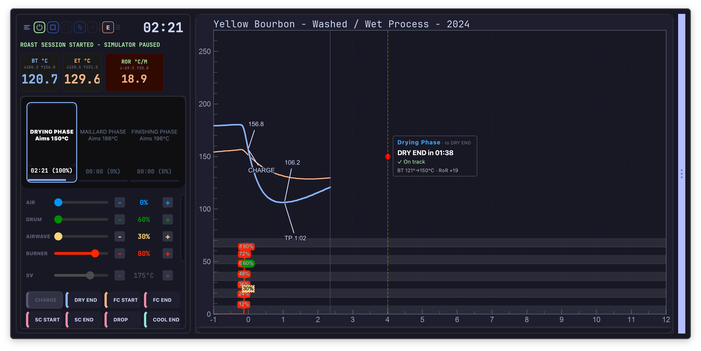

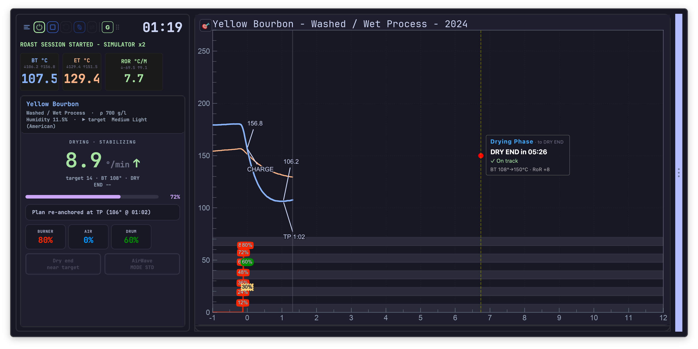

### Coach view and Expert view

In Guided level, a small button at the top right of the graph switches between two readings of
the same roast:

- **Coach view** — one recommendation and a phase verdict. Nothing else.
- **Expert view** — the full set of readings.

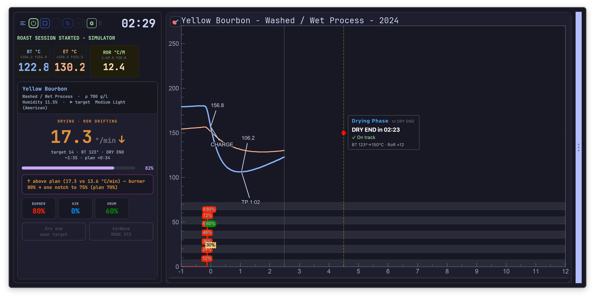
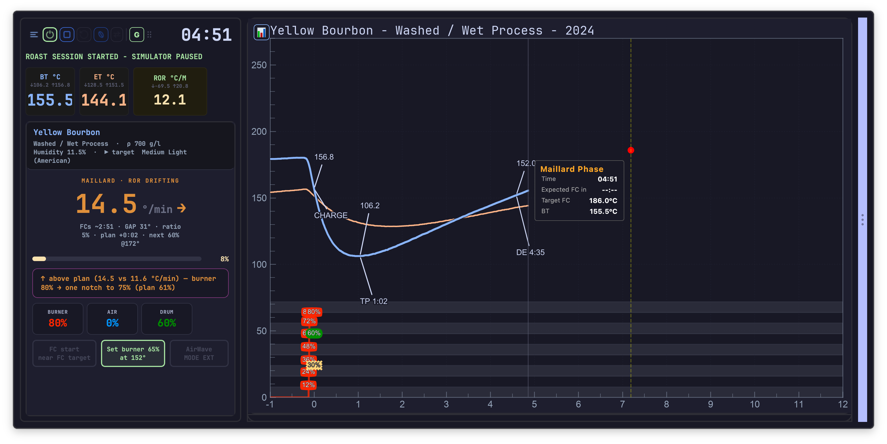

---

## What it tells you, phase by phase

### The current instruction

Recommendations are given as gestures, not analyses: *one notch up on the burner*, *one notch
down on the burner*. A notch is what the machine's own controls actually allow, so the
instruction can be carried out without arithmetic.

Instructions take the machine into account. On a high-[thermal-mass](glossary.md#thermal-mass)
drum the assistant asks for the step-down early — *High Thermal Mass: Step down heater now to
control FC entry* — and on a radiant machine earlier still, ahead of
[first crack](glossary.md#fc--first-crack). The same roast on two machines does not get the same
advice.

### Heat reductions are announced

During [Maillard](glossary.md#maillard), the next scheduled reduction is displayed before it is
due, as *next 48% @170°* — the power level and the bean temperature that triggers it. The heat
profile stops being a surprise: what is coming is on screen, with time to prepare for it.

### Airflow, by phase

Airflow guidance changes with the phase — *keep low to conserve heat* while drying, *moderate
for even drying*, then *raise to manage browning & chaff* — and the assistant warns when a fan
change would cost more than it gains: *Airflow is high-impact: Avoid fan changes to keep RoR
smooth*.

!!! info "Hardware — AirWave"
    With a DiFluid AirWave extractor paired, its mode can be changed from the panel itself
    (**MODE STD** / **MODE EXT**), without leaving the roast screen. See
    [Hardware and peripherals](hardware.md#airwave--smoke-extractor).

### Advice specific to this coffee

The guidance carries the coffee's own properties: *dense bean → needs sustained heat*, *low
density → heat transfer faster*, *humid → keep RoR moderate, longer drying ahead*, *dry beans →
watch for flash drying*, *natural/honey process → extended drying phase expected*. Two coffees
at the same batch size are not steered identically.

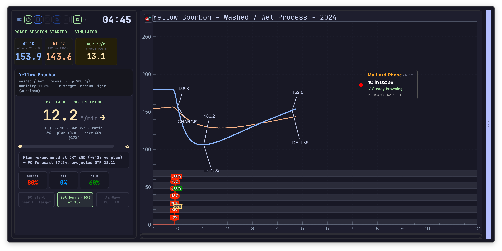
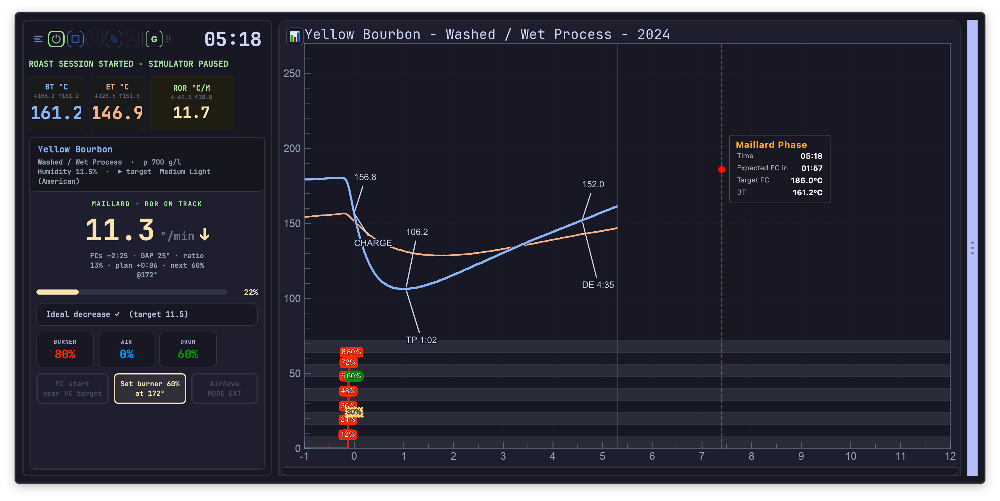

---

## Where the roast stands

**Against the plan.** During drying and Maillard the assistant states the lead or lag against
the planned curve — *plan +0:15* — or simply *on plan* / **ON PLAN ✓**.

**Against the expected slope.** [RoR](glossary.md#ror--rate-of-rise) is judged at the point on
the curve the roast has actually reached, not against a fixed number:
**RoR IN BAND** / **RoR OUT OF BAND**, with the band itself shown as *Ideal interval 12–15
°/min*. This is why the assistant does not call a roast "too fast" early in Maillard when that
slope is exactly what the plan asked for.

**In plain terms.** Readings come with their consequence: *RoR is high → volatile aromas
escaping*, *RoR too low → risk of baked coffee*, *RoR increasing — look after the slope*.

**Milestones ahead.** *DRY END ~1:20*, *FCs ~2:45*, and when they arrive, *now*.

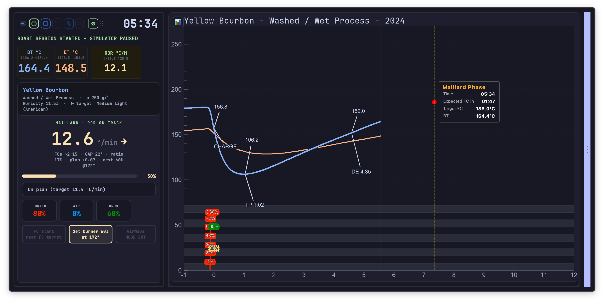

---

## Marking milestones

When a milestone is detected, the assistant does not mark it for you. It proposes: the relevant
button turns prominent, a prompt appears, and it beeps once. **Confirming is a click** — on
**Mark DRY END**, **Mark FC START** or **Mark DROP**. The roaster stays the authority on what
happened in the drum.

Each confirmed milestone re-plans the rest of the roast against reality, so targets and estimates
after it are recomputed rather than left stale.

A milestone marked at the wrong moment can be cancelled from Artisan's own event buttons, and the
assistant follows: it goes back to the phase the roast is in again, offers that milestone for
confirmation a second time, and lets go of the re-plan it had taken on it — so the corrected mark
is the one the rest of the roast is measured against.

This is the Guided behaviour. At [Expert](getting-started.md#guided-or-expert) level there is no
prompt to answer: a detected milestone is marked straight away, since the assistant is not
necessarily on screen to ask.

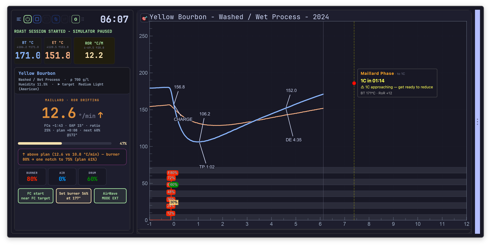

**Charge** is marked from the panel too. If it was marked by mistake, **Cancel charge** appears
for 15 seconds and undoes it.

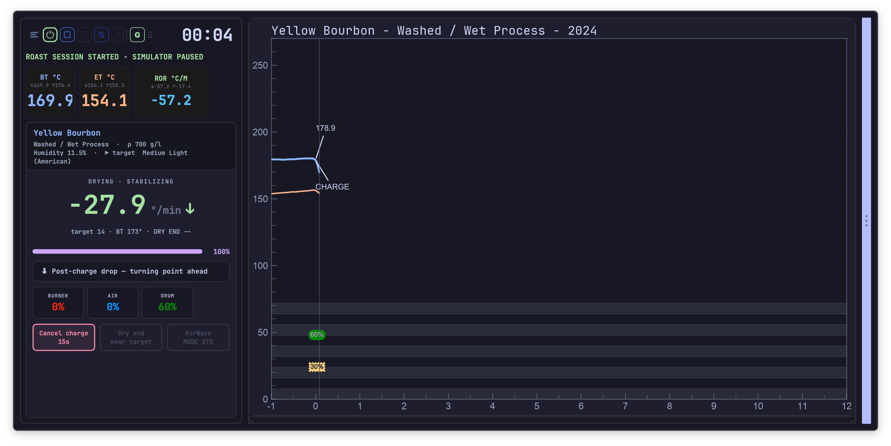

---

## Finishing the roast

**The DROP countdown** — *DROP ~0:45* — accounts for the curve flattening out at the end, so it
does not promise a drop that is still two minutes away. Under twenty seconds it says so
plainly: *⏱ DROP in less than 20 seconds — get ready!*

**Development is tracked against its target** as it happens: **DTR ON TARGET**, **DTR near
target**, **DTR OFF TARGET**, **DTR DRIFTING**. The
[DTR](glossary.md#dtr--development-time-ratio) the roast is heading for is visible while there
is still time to influence it.

!!! info "Hardware — colour reader"
    With a colour sensor fitted, colour is followed live against the target — *color in target
    range*, *too light*, *too dark*, and *in target range → envisage DROP*. It is one more input
    to the drop decision, not a replacement for it. See
    [Hardware and peripherals](hardware.md#omniflux--colour-and-crack-sensor).

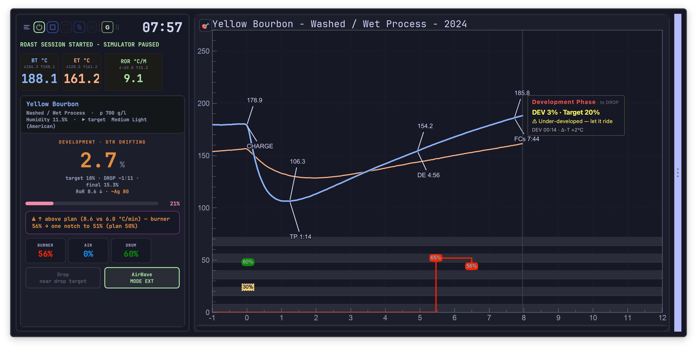
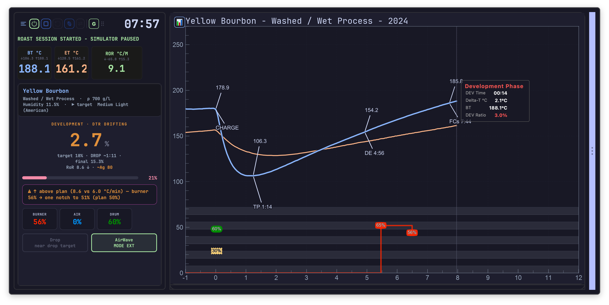

---

## When something goes wrong

The assistant raises problems while they can still be fixed.

| Alert | What it means |
|---|---|
| *⚠ RoR crash detected — DROP now or start heating again!* | The roast has [crashed](glossary.md#crash). Two ways out, both stated. |
| *↩ Recovery — RoR rebuilding after turning point* | Not a fault — the normal rebuild after [TP](glossary.md#tp--turning-point). |
| *⚠ Extended drying: ~5:30 vs plan 4:45 — baked risk, raise heater* | Drying is running long enough to risk a [baked](glossary.md#baked) cup. |
| *⚠ Extended Maillard — baked risk, raise heat or anticipate FCs* | The same problem, one phase later. |
| *⚠️ Premature browning detected!* | The opposite: the roast is developing colour too early. |
| *Flash drying risk — check FIR power* | Surface drying ahead of the core. See [flash drying](glossary.md#flash-drying). |
| *Hold the burner — a wet lot (12.4 %) turns high, then resists* | Not a fault, a reading. A wet coffee takes the heat quickly before its water starts to leave, so it turns at a higher temperature than the plan drew — and then resists once the water does start to leave. Cutting the burner on that high turning point is the classic way to run out of heat in the middle of the roast and end up [baked](glossary.md#baked). Shown once, only when the coffee's [moisture](glossary.md#moisture-content) was measured and the turning point really did land above the plan. |
| *⚠ Critical Gap between ET/BT — dangerous thermic gradiant* | The two probes have diverged dangerously. Never raised on a machine without an air probe. |
| *⚠ No bean temperature coming in — advice on hold until it returns* | The bean probe has stopped reporting. Rather than repeat advice built on a temperature the coffee has left behind, the assistant holds everything it says until a fresh reading arrives, and picks up on its own when it does. |

Alerts name the correction, not just the condition — *raise heater*, *reduce heater*, *DROP now
or start heating again*. An alert you cannot act on is noise.

!!! warning "Alarms behave differently in Guided"
    At Guided level, the alarm actions configured in Artisan do not fire, so that two sources of
    instructions cannot contradict each other. See
    [Getting started](getting-started.md#guided-or-expert).

---

## Cooling, and the next batch

At [DROP](glossary.md#drop) the assistant moves to its cooling page and stays useful: *Open drum
door & cooling tray, keep drum spinning. Don't cut main power until BT < 50°*, with **COOLING** /
**NOT COOLING** state and, if the beans are not cooling, an unambiguous *⚠ BEANS NOT COOLING -
RISK OF FIRE*.

For a second batch on a hot machine, **Restart batch** handles the whole turnaround on the same
coffee: it stops and saves the roast, resets, re-injects the same coffee, the same charge
weight and the coffee's density, moisture and green bean temperature, and starts preheating. Below the cooling threshold it goes immediately; above it, the
click **arms** the sequence — cooling continues and the relaunch fires on its own when the
threshold is crossed. A second click disarms it.

A roast that is already over can be followed the same way from its review: **Next batch**, at the
top of the review, prepares the same coffee, with its charge weight, density, moisture and green
bean temperature, and that roast as the background curve, without heating or recording anything. See [After the roast](after-the-roast.md#the-roast-review).

!!! note
    A batch relaunched this way is saved without its result form, so its finishing details —
    weights, colour, notes — are simply filled in later, from *Repair ALogs*. Nothing is lost.
    See [the cooling page.](after-the-roast.md#repairing-incomplete-roast-files).

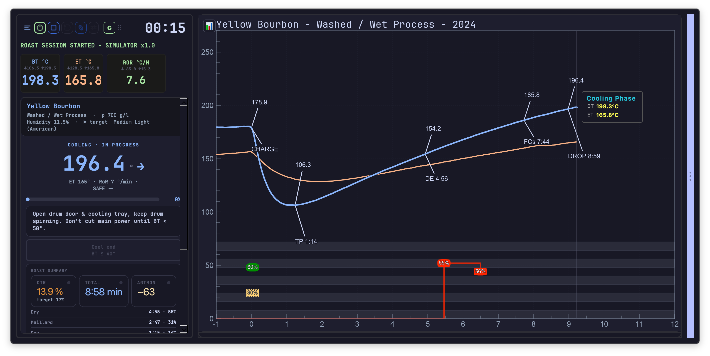

---

## After the drop

**ROAST SUMMARY** compares what happened to what was planned, phase by phase: *Actual BT* and
*Actual RoR* against the plan, each phase reported as having run *hotter* or *cooler*, and a
verdict — *Trajectory well held across all phases*, *Well held — slight drift in Maillard*, or
*Marked drift in Maillard*. This is the sentence worth reading: it says which phase to attend to
next time.

**Colour closes the loop.** The colour recorded here — measured or judged — corrects the drop
target of the next plan for this coffee. See [The roast plan](the-roast-plan.md#what-the-plan-learns-and-when).

**Notes** are recorded against the roast, while the detail is fresh.

**🚫 Exclude from learning** keeps a roast out of the plan's history. A batch that went wrong for
reasons that have nothing to do with the coffee — an interruption, a mistake, a probe problem —
should not become a reference. This is the switch that protects every future plan for that coffee.
Later, from the file list, you can also mark a roast as reviewed and sound — see
[After the roast](after-the-roast.md#repairing-incomplete-roast-files).

<!-- CAPTURE 7.15 — the ROAST SUMMARY, on a roast with a visible drift in one phase.
CAPTURE 7.16 — the colour entry and the Exclude from learning control. -->

---

## Machines TilauScope cannot drive

On a read-only roaster, the control sliders are absent and the assistant gives recommendations to
act on by hand instead. Everything else in this chapter — plan tracking, milestone suggestions,
alerts, the countdown, the end-of-roast summary — works exactly the same, because it all comes
from reading [BT](glossary.md#bt--bean-temperature) — and
[ET](glossary.md#et--environmental-temperature) on a machine with an air probe — not from
driving the machine.

---

## Alarms written as sentences

TilauScope can express alarms as readable rule sentences rather than as rows in a table, and can
show the resulting strategy as a narrative before the roast starts. The alarms themselves are
Artisan's; what changes is that the rule can be read back and checked.

A sentence names, in order, the event the alarm starts from, the delay after that event, the
sensor condition, and the action. Delay and condition are alternatives rather than a pair — the
alarm acts on whichever arrives first, and the sentence says so: *when CHARGE +2:00 or as soon as
BT > 190*. Any part left unset appears as a dashed placeholder — *+ delay*, *+ condition*,
*+ guard* — so a rule with neither a delay nor a condition, which can never act at all, is
visible as such and named in the banner at the top of the window.

A rule can also wait on another one. Given a [guard](glossary.md#guard), *if #3 fired* starts the
alarm the moment alarm #3 acts, and on that form the sensor threshold is a **change measured from
that moment**, not a temperature: *BT > +10 since then* means ten degrees above whatever the beans
read when #3 acted. A rule can equally be held back by another one — *only if #3 not fired* — but
that form has no starting event of its own, so it is offered on alarms anchored to a roast event
and closed off on those that already start on a guard.

Reopening the alarm editor mid-roast shows which alarms have already fired: the status dot next
to a fired alarm turns into a checkmark, and the time it fired at appears at the end of the
line — updated live while the window stays open, so nothing is lost by checking. An alarm that
fires while the window is open stays fired when you close it.

A whole alarm programme can be saved under a name from the **Presets** menu and reloaded later —
for a different bean, a different machine, or a different roast style — without rebuilding it
line by line.

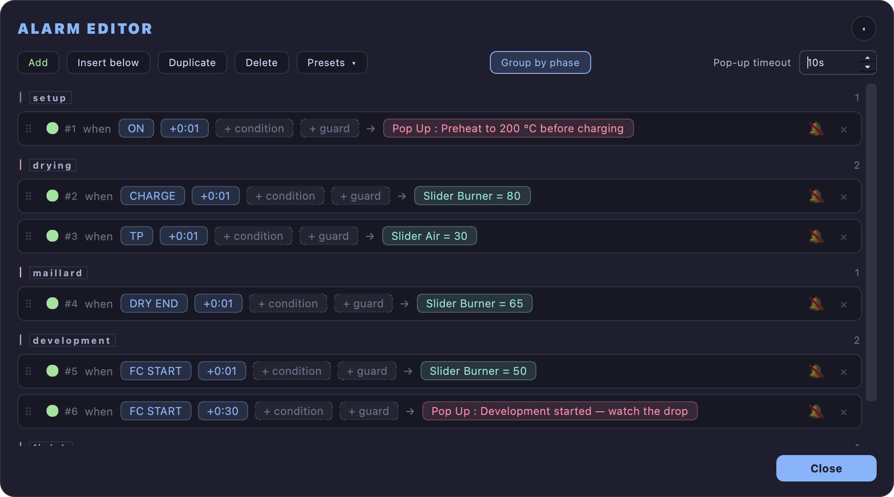

<!-- CAPTURE 7.17 [scene:alarms] — the alarm editor, grouped by phase, on a full programme. Every row now
carries a + guard placeholder after its condition, so the previous capture is out of date. -->

---

## Next

- How the plan being tracked here was built: see [The roast plan](the-roast-plan.md).
- Setting up the batch and preheating: see [Preparing a roast](preparing-a-roast.md).
- Reopening a record, reading it back, comparing roasts: see [After the roast](after-the-roast.md).
