# The TilauScope window

!!! abstract "Artisan does / TilauScope adds"
    **Artisan does** — one dense window: curve, LCD readouts, event sliders, alarm table,
    message line at the bottom. Everything is present at once, sized for a desk and a mouse.

    **TilauScope adds** — a separate roasting window built for the moment the drum is turning:
    large readouts that change colour as a temperature approaches its limit, machine controls in
    the form that suits the hand, phase blocks whose targets can be adjusted on the spot, and a
    live column on the right showing what just fired.

This chapter describes the window itself. What the assistant *says* inside it is
[The guided roast](the-guided-roast.md); this is the furniture.

<!-- CAPTURE 2.1 [scene:window_maillard] — the whole TilauScope window mid-roast, at a comfortable size, with the
sidebar expanded. This is the reference screenshot for the entire documentation. -->

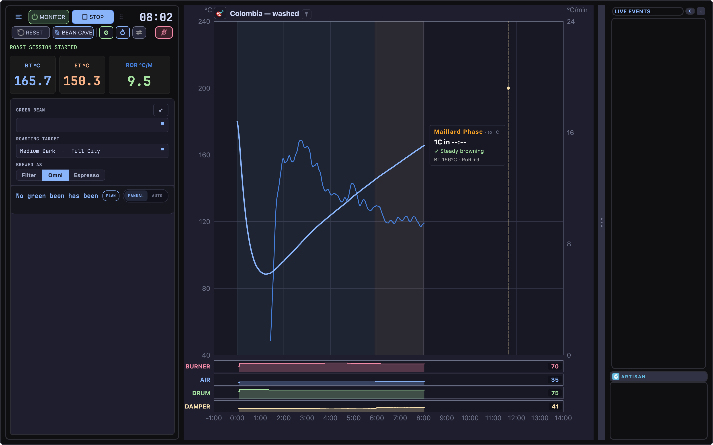

---

## The header

Two compact rows along the top carry the actions needed while roasting. The first row keeps the
monitoring, recording, and timer controls together; the second row holds less frequent actions.

| Control | What it does |
|---|---|
| **☰** | The main menu. Artisan's View menu and the settings TilauScope keeps fixed are left out — see [Configuration](configuration.md#artisan-settings-tilauscope-keeps-fixed). |
| **Power** | Turns monitoring on and off. |
| **START / STOP** | Starts and stops recording. |
| **RESET** | Clears the current roast. It stays on the secondary row, and is unavailable while a recording runs and for the whole of a [simulation](#when-a-simulation-is-running). |
| **BeanCave** | Opens the green-bean database. It stays on the secondary row, and is locked while monitoring is on — the database is a between-roasts screen. |
| **G / E pill** | The operator level — see [Getting started](getting-started.md#guided-or-expert). |
| **↻** | [Roast Replay](glossary.md#roast-replay). Lit while a replay is running; click stops it immediately. Only clickable before CHARGE, only once a background curve is loaded, and only on a machine whose profile supports replay — hovering it while disabled says which of these is missing: not supported by this machine, or available only before CHARGE. See [Preparing a roast](preparing-a-roast.md#automating-the-start). |
| **⇄** | Mirrors the window layout: the machine controls and the live column trade sides around the curve. The choice is remembered. |
| **⠿** | A grab strip for moving the window. It runs along the end of the secondary row. |
| **Crossed-out flame** | The emergency [heat cut](glossary.md#heat-cut). It appears at the end of the secondary row once monitoring is on, and is described below. |
| Timer | The roast clock. |

These are deliberately large and few. During a roast, the buttons that matter must be hittable
without aiming.

!!! note
    START/STOP will not start a recording if no meter is configured — there would be nothing to
    record. Configure a device, or run the simulator, first.

<!-- CAPTURE 2.2 [scene:window_header] — the header, cropped, at full width and legible. -->

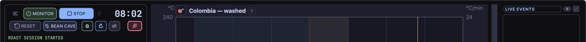

<!-- CAPTURE 2.2c — the header replay control shown disabled and hovered, with its tooltip
naming the reason: machine not supported, or before-CHARGE-only. -->

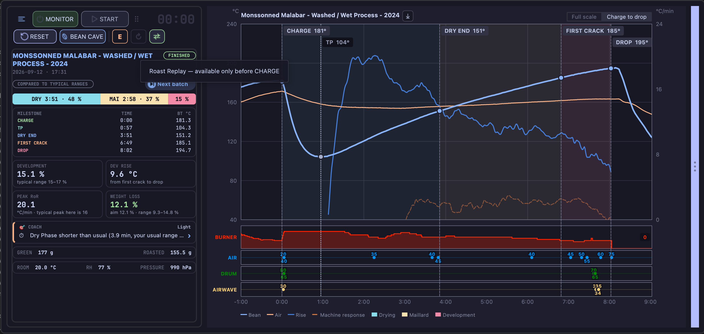

---

## Cutting the heat in an emergency

If a roast goes wrong — smoke you did not expect, a burner that will not come down, anything that
means the batch has to end now — the heat cut puts the machine into a safe state in one gesture.

It is the red button showing a **crossed-out flame**, the only red control of the header. It
appears at the end of the secondary row as soon as monitoring is on, and nowhere else, so it is
in the same place whether you are following the guided assistant or driving the controls yourself.
Hovering over it names what it does.

**Hold it down for one second.** A red sweep fills the button while you hold. Releasing early, or
sliding off the button, cancels it — a stray click cannot end a roast.

When it fires, TilauScope:

- stops anything that was driving the heat on your behalf — preheating control, PID, alarms and
  profile playback — so nothing pushes the burner back up a second later. Alarms still show when
  their condition is met, but none acts on the machine until monitoring is next turned on. A
  roast replay running at the time is ended with them, and the replay control in the header goes
  off to say so;
- drops any control change you made in the instant before pressing. A click on a lever is held
  briefly before it is sent, so that a burst of clicks travels as one command; a click still
  waiting when the heat cut fires is discarded rather than sent afterwards;
- sets the burner to zero;
- opens airflow and, if you have an extractor paired, extraction to full. On a roaster with no
  airflow lever, nothing is moved there — the control in that position drives something else.

The drum keeps turning. Stopping it would press the beans against a hot wall, and that is how a
scorch becomes a fire.

The panel then turns red and shows the one thing left to do: **empty the drum into the cooling
tray**. TilauScope does not do this for you — the beans come out by hand, and marking the end of
the roast without them actually leaving the drum would only put a false milestone in your record.
Monitoring and recording keep running, so you can watch the temperature come down.

On a machine TilauScope cannot command, the message asks you to turn the burner off yourself
instead. The heat cut still stops every automation.

**RESET**, or turning monitoring off, releases the red state and gives the panel its normal look
back.

<!-- CAPTURE 2.2b [scene:window_heatcut] — the panel just after the heat cut fires: red border, "HEAT CUT" message, red
     timer, and the flame button greyed out. Reproduce with the simulator running, then hold the
     crossed-out flame for one second. -->

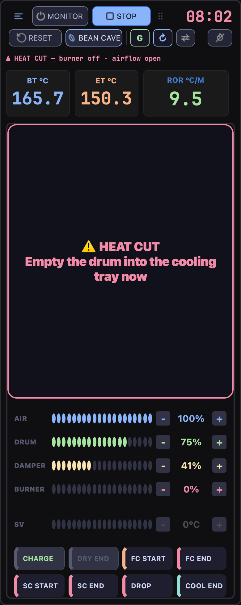

---

## The readouts

Three large readouts sit above the control panel: **bean temperature**, **environmental
temperature**, and **rate of rise** — the last one larger than the other two, because it is the
number that dictates what to do next.

They are not passive digits. **Each readout changes background colour as its value approaches a
limit**: neutral while there is margin, then dark yellow as the value enters the approach band,
orange, then deep red at the limit — and once the limit is passed, the background **pulses red**.
A temperature running away is visible peripherally, without reading the number.

Below them, a row of **extra counters** shows the readings of whatever additional devices are
configured in [Devices](devices.md), each with its name above its value — colour, humidity,
crack count, whatever the setup provides.

<!-- CAPTURE 2.3 [scene:window_readouts] — the three readouts in neutral state. CAPTURE 2.4 — the same readouts with one
in the red/approach state, ideally the BT readout near its limit. CAPTURE 2.5 — the extra
counters row on a setup with at least two extra devices. -->

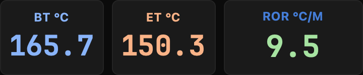

---

## The phase blocks

Three blocks — **DRYING PHASE**, **MAILLARD PHASE**, **FINISHING PHASE** — show the roast's
progress through its phases, each in its own colour: blue for
[drying](glossary.md#drying--dry), yellow for [Maillard](glossary.md#maillard), red for
[development](glossary.md#development). Each block carries a subtitle with its target.

**A phase target can be adjusted directly on its block**, with the scroll wheel or a trackpad
swipe over it. No dialog, no menu: the correction is made where the number is displayed, while
the roast continues.

When the roast reaches its end, the same area is taken over by the drop and cooling message, so
the instruction of the moment occupies the space that the phase blocks no longer need.

**If the machine stops sending temperatures, that area says so.** A roaster can be selected and
its port open and still return nothing — a cable out of its socket is enough. After about five
seconds without a reading, the block is replaced by a red-bordered warning naming the cause and
what to check, and the preheat message it replaces disappears rather than sharing the space: a
preheat that measures nothing is not a preheat, and the warning has to be the only thing in
view. The two temperature readouts show `u.u` throughout, which is what they show whenever no
value is arriving.

If nothing had been measured yet, **the recording is stopped as well**, since it had nothing to
record. Once the beans are in the drum this no longer happens: a break in communication is often
brief, and a roast under way is worth more than a tidy ending. The warning still appears after
the drop, because the cooling is steered on the falling temperature and its automatic detection
watches the same probe. It clears by itself the moment a reading arrives, and the panel goes
back to exactly what it was showing — the cooling message included.

<!-- CAPTURE 2.6 [scene:window_phases] — the three phase blocks mid-Maillard, with the active phase visibly current.
CAPTURE 2.7 [scene:window_cooling_msg] — the same area showing the drop/cooling message instead.
CAPTURE 2.7b — the same area showing the no-temperature warning. Reproduce by starting
monitoring with the roaster's cable unplugged and waiting five seconds. -->

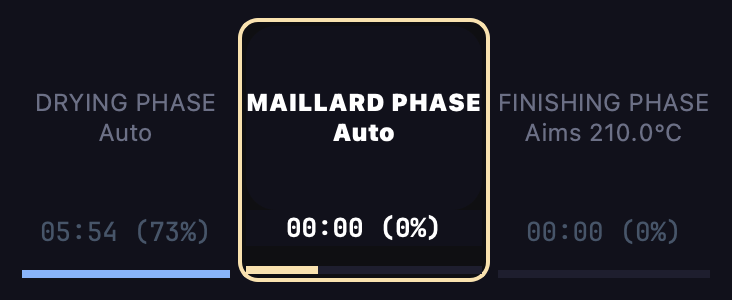

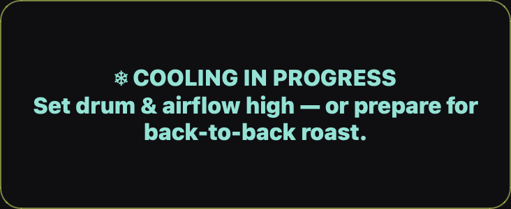

---

## The roast curve

The large area on the right is the roast itself, drawn by TilauScope. It is read at a glance and
at arm's length, so it carries what matters during a roast and leaves the rest for
[after](after-the-roast.md).

**What is on it.** The name of the roast above the plot — the batch number when the roast has
one, and the title you gave it, exactly as it is filed. The bean temperature as a thick line, its
[rate of rise](glossary.md#ror--rate-of-rise) as a thinner one on its own scale at the right, and
the three phases as coloured grounds beneath both.

**A loaded background curve is drawn with it**, in the same colours at a lower strength, so
the roast running now stays the line you read. It is placed on its own charge, so the two
roasts start together whatever alignment Artisan's own chart was using, and a reference
recorded without a charge mark starts from its own first reading. A curve drawn in the
plotter or produced by the analyser is shown the same way. It is on screen from the moment
it is loaded and stays there for the whole roast; during the preheat the chart belongs to
the drum climb, and the reference comes back at the charge. Right-clicking the curve offers
**Remove reference curve**, which unloads it.

**Beside the roast title sits a swap control.** What a click does depends on what is loaded; its
glyph shows the move that is coming, and hovering it says it in words:

- **⇄** a roast opened from a file **and** a background curve — the two change places, and so do
  their names above the plot;
- **⤓** a roast opened from a file alone — it becomes the background curve and the foreground is
  cleared;
- **⤒** a background curve alone — it is brought to the foreground.

A roast just finished and not saved yet is not a file: with a background curve loaded, the control
brings that curve forward, after asking whether to save the roast. The control is unavailable
while monitoring or recording, since it rewrites the roast being recorded, and it is not shown at
all when neither a roast opened from a file nor a background curve is loaded — with nothing to
move, there is nothing for it to do.

<!-- CAPTURE 2.8f — the roast title area on the curve showing the swap glyph beside the title,
both in its normal clickable state and greyed out while recording. -->

**Colours name probes, not quantities.** Each curve carries the colour of the readout it belongs
to — so the bean and its rate are one family, the air and its rate another. Inside a family the
temperature is the solid line and the rate the quieter one, which is why a rate is never mistaken
for the line the roast is read from. Change a curve colour in Artisan's own settings and both the
curve and its readout follow — blue for
[drying](glossary.md#drying--dry), yellow for [Maillard](glossary.md#maillard), red for
[development](glossary.md#development), deepening as the roast advances. Each milestone is marked
where it happened, with its name, the temperature it was marked at and the time since the charge.
Where milestones crowd — on a dark roast the end of first crack, second crack and its end fall
within a minute of each other — a label gives up its time, then its temperature, and keeps its
name: a milestone you cannot name is worth less than one without its reading. The
[turning point](glossary.md#tp--turning-point) is marked too, even though it is never something
you mark yourself, and its rule is dotted rather than dashed because it is read from the
temperatures rather than marked.

The same marks are drawn the same way wherever a roast is shown — on this curve, in the roast
viewer, on a roast card and on the phone — so a roast read back afterwards is the picture you
drove it on.

The time axis names every minute and rules every second one, so a duration can be read off it
without counting. The temperature scale on the left and the rate scale on the right are drawn in
the unit you set in Artisan, on round figures of that unit — degrees Celsius or degrees
Fahrenheit, never one converted into the other beside the curve.

**Two views.** Above the curve, a two-part selector: **Full scale** keeps a fixed frame — one
minute before the charge to fourteen minutes — so two roasts can be compared without either one
having been stretched to fit. **Charge to drop** trims the frame to the roast that actually
happened. The selector appears once you stop recording. Not at the drop: the beans are still in
the cooling tray, the frame is still growing under the curve, and a window claiming to end at the
drop would keep being wrong.

The minute before the charge shows the two temperatures only. A rate of rise there is the drum
warming up, not the beans climbing, so the rate starts at the charge.

**Hovering.** Moving the pointer across the curve puts a line at that instant and reports what
every trace held there, including the setting each lever was holding. **Every figure in that row
is named**, in the same words the legend uses for its trace — two rates can appear side by side,
and the one called *Rise* is the same rate of rise the large readout shows.

### What the curve says next

Two cards float over the curve, and only ever one at a time.

Before the charge, while the drum climbs, a **preheat card** reports how far up it is and how
long it has left. It sits against the target line rather than against the climb, so it stays
where you last looked for it instead of travelling up the chart. The chart underneath shows the
same thing: the target as a line, dashed while the drum is still climbing and solid once it is
there, and — as soon as the arrival is close enough to be in frame — a mark on the target line at
the moment the climb is due to meet it.

Once the drum is within 2 °C (3.6 °F) of its target, below or above it, the card gives way: the
chart says **CHARGE NOW** on the head of the climb, where you are already looking, and there is
nothing left to count down. The card comes back if the drum overshoots beyond that band.

Once the roast is running, a **roast card** takes over. It leaves when you stop recording — a
card that says what to do next has nothing to say about a roast that has ended. It names the phase, counts down to the
next milestone, and reports where the roast stands. A dashed marker on the curve shows where that
countdown lands, and the card **steps over that marker** rather than covering it as the bean
walks towards it.

At the Guided level the card has **two faces**, and a small button in the top-left corner of the
curve switches between them:

| Button | The card shows |
|---|---|
| **🎯** | The coach view — the phase, what is coming, and what to do about it. |
| **📊** | The full data view — every figure the roast has produced so far. |

The button appears only at the Guided level. At Expert the full view is the only one, since an
operator reading the whole table has already said which face they want.

<!-- CAPTURE 2.8a [scene:coach] — the curve mid-Maillard with the coach card showing and the 🎯 button visible.
CAPTURE 2.8b [scene:data] — the same moment with the 📊 full data card. CAPTURE 2.8c — the preheat card and
the target line, with the arrival mark in frame. -->

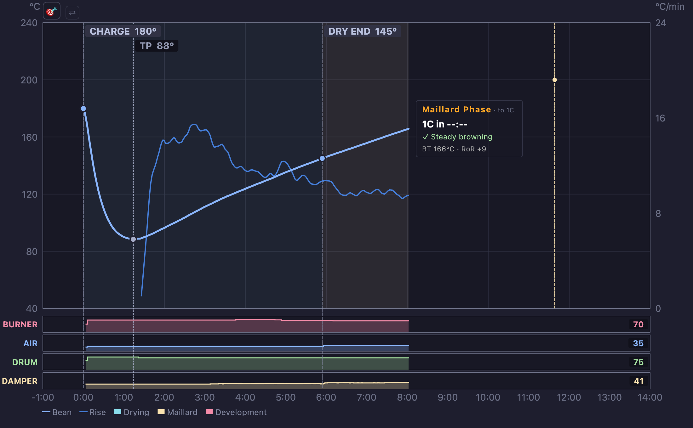

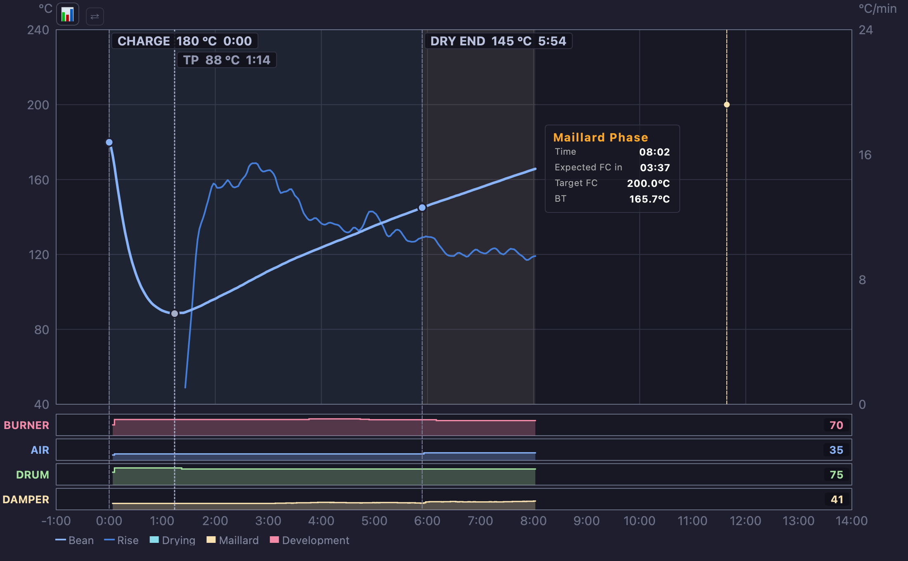

### Listening to the crack

If your probe counts cracks, TilauScope tells you what it is hearing — as a state, not as a tally.
A number of pops is trivia while a batch is running; what you need to know is whether
[first crack](glossary.md#fc--first-crack) has started, whether it is rolling, and whether it is
over.

**A bar appears above the plot, between the roast title and the view controls.** It is there only
while the probe is counting. Nothing is counting, nothing is shown — there is no greyed-out box to
wonder about in the middle of a roast.

The bar names one of four states:

| It says | It means |
|---|---|
| **QUIET** | The probe is listening and hearing nothing yet. |
| **FIRST POPS** | Isolated cracks. The crack is beginning. |
| **ROLLING** | Cracks are coming steadily. [Development](glossary.md#development) has started. |
| **SETTLING** | The pops have thinned out and stayed thin. The crack is done. |

**What to do about it is said where advice is always said** — on the assistant's instruction line,
not on the bar. The bar reports; the assistant tells you the gesture. Nothing on screen speaks
twice.

At the Guided level the bar shows the state alone. At Expert it adds a meter, the number of pops
heard over the last half-minute or so, and the running total the probe has counted since it
started listening.

**The state never overrules the milestone.** ROLLING appears once first crack is marked, however
it was marked — by you or by [automatic detection](configuration.md). The bar is a reading, and
it is never what decides that first crack happened.

**Along the foot of the plot, one tick per pop.** The ticks pile up where the cracks were dense and
thin out where they were not, so the shape of the crack stays on the curve after it is over. Beside
it, a faint dotted rule marks where the [roast plan](the-roast-plan.md) expected first crack — the
distance between that rule and the crack you actually heard is what tells you the batch ran early
or late, while there is still a drop to place.

<!-- CAPTURE 2.8g [scene:crackbar] — the curve during first crack, with the crack bar above the plot reading
ROLLING and the tick band along the foot of the plot, at the Expert level. -->

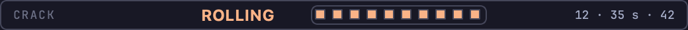

### Choosing what is traced

**Right-click anywhere on the curve** to open its options. Display choices are remembered for
future sessions, so the curve returns with the same traces and lever layout the next time you
open TilauScope. On a roast that is no longer running, the same menu starts with milestone
corrections — see [Correcting a milestone](#correcting-a-milestone).

| Option | What it adds |
|---|---|
| **Air temperature** | Traces [ET](glossary.md#et--environmental-temperature) alongside the bean. Not offered for a machine without an air probe, and unavailable on a roast recorded without one — there would be nothing to draw. |
| **Machine response** | Traces the [machine response](glossary.md#machine-response) — the earliest sign that a burner change has landed. Not offered for a machine without an air probe. |
| **One lane per channel** | Gives each machine lever its own strip beneath the curve. |
| **Burner traced, others as gestures** | Traces only the burner, and reduces the others to marks at the moments they moved. |
| **Rate of rise** | How much the rise is smoothed — three levels, from responsive to steady. |

The rate scale on the right appears with the roast: before the charge the drum is climbing, not
roasting, and a scale with nothing on it invites reading the drum against the wrong numbers.

The last one is not a display setting. The rate of rise is never stored in a roast file; it is
recalculated every time a roast is opened. Changing the level therefore changes what the rate
**is**, on this roast and on every one opened afterwards.

**The lever strips are drawn live**, throughout the preheat and the roast, and each one carries
its current level in figures at its right edge. Reading a gesture against the curve it caused is
the point of them, and that reading is worth most while the roast is still running. Before the
first move on a channel, the strip shows the level the lever is being held at.

**Replaying a simulated roast**, a small **x1 / x2 / x8** selector sits at the top right of the
curve for as long as the simulation runs. It sets the replay speed directly, in place of clicking
the clock with a modifier key held.

<!-- CAPTURE 2.8d — the right-click menu open over the curve. CAPTURE 2.8e [scene:levers] — a roast mid-Maillard
showing the lever strips beneath the curve, in one-lane-per-channel mode, with at least two
gestures already played on the burner. -->

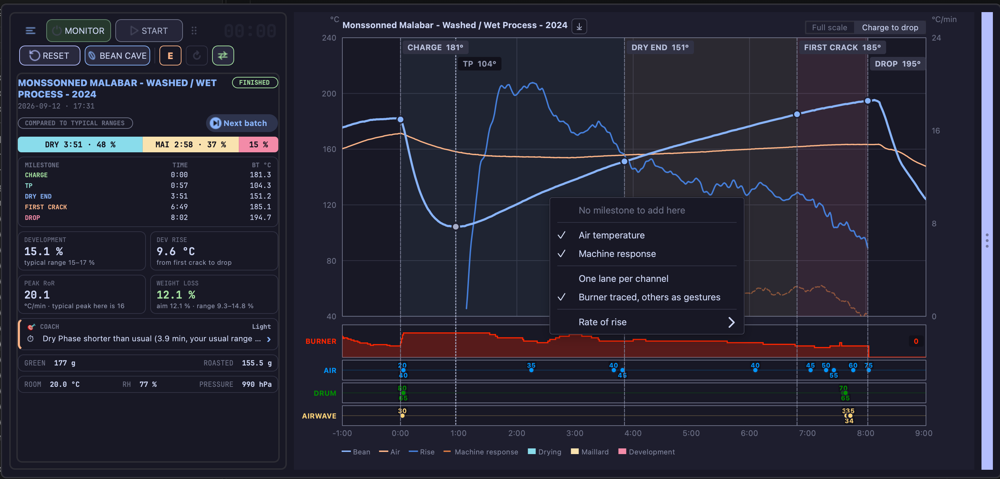

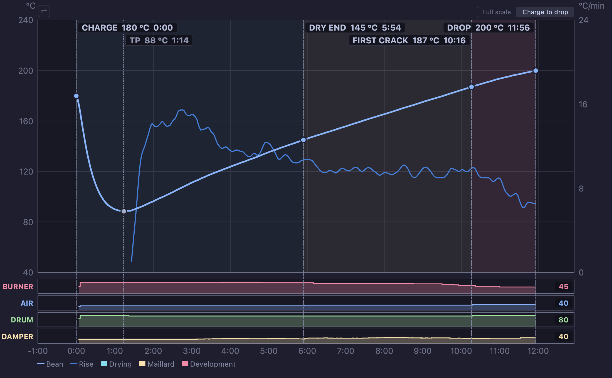

### Correcting a milestone

A milestone marked a little late in the moment, or forgotten altogether, can be put right on the
curve itself — once nothing is running any more: monitoring and recording both off, on a roast
you have just stopped or one opened from a file. It works the same at the Guided and the Expert
level, and only on the roast itself: the background curve and the lever strips are never
changed. The [turning point](glossary.md#tp--turning-point) is always calculated, so it cannot be
moved or added by hand, and a milestone cannot be removed from here.

**Moving one.** Hover over a milestone's label, or over its dot on the bean curve: it is
outlined, the pointer changes, and a hint says it can be dragged. Drag it sideways. A provisional
mark follows the nearest recorded instant, with the milestone's name, the proposed time and the
bean temperature at that moment — a dash when none was measured — while the original mark stays
faintly in place. It keeps its distance from the pointer: taking a label by its middle does not
make the milestone jump under the pointer. Moving up or
down changes nothing — a correction changes when something happened, never what was measured.
Release over the chart to apply it. Pressing Escape, releasing outside the chart or switching to
another window cancels it.

A milestone never passes its neighbours: dragged beyond one, the mark stops on the last reading
before it and says **Limit:** with that neighbour's name. The neighbours themselves are never
moved.

**Adding one.** Right-click the curve at the moment it happened — there is no need to aim at the
bean line. The menu opens with **Add a milestone at** and that time, followed by the milestones
that can go there, in roast order, and a dashed line marks the moment while the menu is open.
Choosing one adds it at once. Only milestones not yet on the roast are offered, and only those
whose place in the roast falls at that moment: with a charge and a first crack but no dry end,
right-clicking between the two offers **DRY END** and nothing else; between the first crack and
the drop, with no crack end marked, it offers **FC END**, **SECOND CRACK** and **SC END**. The
order is a placing rule, not a list of steps to fill in — a roast does not need a second crack.
Where nothing fits, the menu says **No milestone to add here**. The lever strips, the margins and
the legend offer no additions, and a click beyond either end of the recording is not moved onto
it.

**Typing a time.** Right-clicking a milestone's label or dot offers **Change the time of …**
instead. A small window shows the current time, the range allowed and a field in minutes and
seconds, counted from the charge — or from the start of the recording when there is no charge; a
minus sign places the charge earlier. The time actually kept, the nearest recorded instant, is shown
before anything is applied, and a time outside the range cannot be applied. Enter applies,
Escape cancels.

**What follows a correction.** Moving the charge moves the start of the roast clock: the charge
reads 0:00 again, and every other time, the turning point, the rate of rise, the phases and the
[roast review](after-the-roast.md#the-roast-review) are recalculated. The recorded readings never
change. The roast is marked as modified, like any other change: the correction is written to the
file when you save it, and reopening the roast shows it. Nothing is sent to the machine, no alarm
fires, the assistant does not start, the batch number does not change and nothing is uploaded — a
correction fixes a record, it does not replay a roast.

A roast opened without any charge mark is drawn from the start of its recording — even when no
bean temperature was recorded — so that its charge can be placed on it; the phases and the rate
of rise appear once it has one. When the milestones already
on a roast are out of order, the curve offers no correction and asks for them to be fixed in
Roast Properties first.

<!-- CAPTURE 2.8h — a stopped roast with DRY END being dragged: the provisional mark with its
name, time and temperature, and the original mark faded. -->

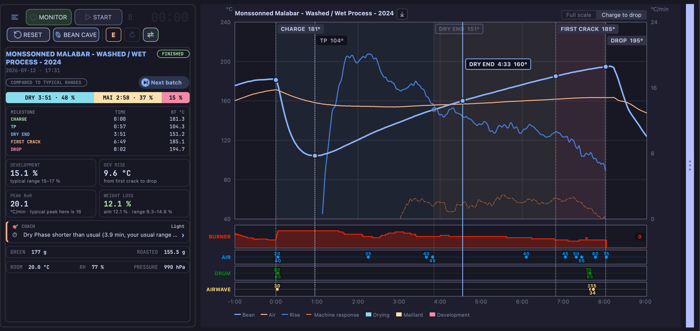

---

the machine rather than sitting at the desk.
## Machine controls

The four machine levers — on a typical setup burner, airflow, drum and extraction — use compact
segmented controls. The filled segments show the current setting in the lever's colour; the
remaining segments show the available range. The percentage remains visible beside the bar, so
colour is never the only indication.

The **−** and **+** buttons move by the machine's own step size. Each click is accepted even when
the previous click was not immediate. Holding either button repeats the action, which is useful
when making a larger adjustment with one hand.

Clicking the percentage opens the roller, where the value can still be selected directly. The
roller is the same precise control used by the previous slider presentation. Whichever way the
value is chosen, it is aligned to the machine's step size before being sent, so the setting shown
is always the one the machine received and the one recorded on the curve.

The extraction lever also works the other way round. It follows what the extractor reports back,
so a setting only takes effect on screen once the extractor confirms it, and a change made on the
extractor's own controls moves the lever here and is written into the roast — marked as coming
from the device rather than from your hand, and not sent back to it. A command the extractor does
not confirm is announced in the message area instead of being shown as applied.

Beneath both, and always visible, sits the **SV** row — the
[setpoint](glossary.md#sv--setpoint-value) the PID is aiming for. It spans the full width and is
never hidden by the toggle, because the setpoint is not a lever like the others: it is the target
everything else is working towards.

Until monitoring is switched on, the levers are greyed out and do not respond: with the link to
the machine closed, a setting sent from here would reach nothing. They come to life with the
**ON** button, at the same moment as the milestone buttons.

On a read-only machine, these controls are absent entirely — see
[Preparing a roast](preparing-a-roast.md#machines-tilauscope-cannot-drive).

When there is nothing left to steer — the recording has been stopped, or a past roast has been
opened from a file — the entire left column is given over to the
[roast review](after-the-roast.md#the-roast-review): the controls, the readouts above them and
the status line all describe a live session and say nothing about a finished one, so they make
way for it. Starting monitoring, starting a recording or pressing RESET brings them
back.

<!-- CAPTURE 2.8 [scene:window_controls] — the segmented control zone, four levers plus the SV row.
CAPTURE 2.9 — the percentage roller open on one control. -->

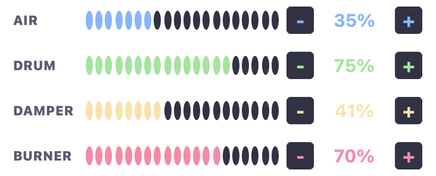

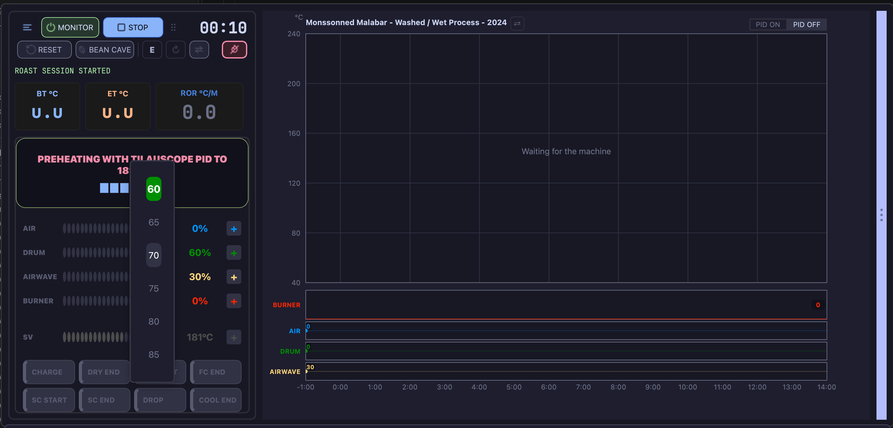

---

## The live column on the right

A column along the right edge reports what the application is doing, so nothing happens silently.
It is opened and closed by the **slim grip strip** at its edge — a chevron pointing **›** when
collapsed and **‹** when open — and it fades rather than jumping, so the eye is not pulled away
from the curve.

### LIVE EVENTS

The upper part is titled **LIVE EVENTS**, with a count of what it holds and a **✕** to clear it.
Each entry arrives as a card:

- **Triggered alarms** — the alarm that fired, with its condition and the milestone it was
  anchored to, colour-coded by what it acts on: PID, air, drum, burner, or an external command.
  Rather than discovering after the roast that an alarm fired, you see it land.
- **Fired events** — each press of an event button, tagged **EVT** with its command and the time.
  A press made before **START** reaches the roaster but is not written into the roast, and the
  card says so — during preheating your burner and air settings act on the machine without
  appearing in the profile.

In Expert mode, AirWave alarms can combine commands with commas or semicolons, for example
`MODE STD,FAN 30` or `FAN 30;POWER OFF`. Each sequence is sent whole, so nothing slips in
between a mode change and the speed behind it, and a stop is attempted even when the speed
before it went unconfirmed — see
[Machine controls](#machine-controls) for how the lever reports back.
A comment after `#` is displayed with the alarm and is not sent to the device.
Guided mode suppresses alarm actions.

Every card carries its time: **+3:14** counts from CHARGE once the batch is in, and a plain
**14:32:05** before that. Cards fade in as they arrive and stack newest-first, so the column
reads as a running account of the roast.

The column empties itself at every **START** and at **RESET**, so two roasts in a row never share
it. The **✕** clears it at any other moment.

### ARTISAN messages

Below the events sits a section headed **ARTISAN**: the messages Artisan itself emits — the ones
that, in Artisan, flash once in the status bar and are gone. Here they are **kept**, timestamped,
newest highlighted and older ones dimmed, up to the last forty, with a button to clear them.

**Routine noise is filtered out**, so the section holds what has operational meaning rather than
every internal notice. When something unexpected happens mid-roast, the explanation is usually
already sitting in this list — which is the whole point of keeping it. The section runs from the
start of the recording to its end, and empties with the cards above it at the next **START** or
**RESET**.

<!-- CAPTURE 2.11 — the sidebar expanded during a recording, showing a triggered-alarm card and a
fired-event card, both stamped +m:ss, plus one event card pressed before START carrying its "not
recorded before START" line. CAPTURE 2.12 [scene:messages] — the ARTISAN message section with several messages,
newest highlighted, ending on "Scope recording stopped". CAPTURE 2.13 — the grip strip in both
states, collapsed and expanded. -->

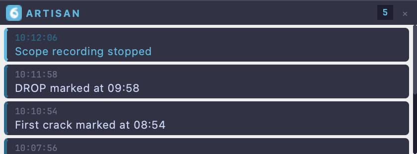

---

## The event buttons

Artisan's event buttons are also available as a **floating panel** that can be moved and resized
freely, and that remembers its position and size between sessions. Pressing a button fires its
command and posts a card in **LIVE EVENTS**, so a manual action leaves the same trace as an
automatic one. The card states whether the press was written into the roast: only a recording in
progress records it, and a button set to no event type never does.

Placing it where your hand naturally goes — beside the machine, not beside the curve — is the
point of it floating.

The panel keeps the grouping you set: buttons that belong together are welded into one block,
and a block is never cut in two by the panel wrapping onto another line — it moves down whole.
Narrowing the panel puts fewer blocks per line, never fewer buttons per block, so a pair you
reach for without looking stays where your hand expects it at any width.

<!-- CAPTURE 2.14 — the floating event panel, narrow enough to wrap, showing two welded blocks
on separate lines. -->

### Arranging your own buttons

**TilauScope → Custom button management…** shows those buttons laid out exactly as they will
appear during the roast: in rows, with the same welded groups. Drag any button to move it —
within its row, into another row, or into the tray at the bottom. A row holds as many buttons
as **Buttons per row** allows; past that, the next one moves down a row on its own.

**Add gap** drops an empty slot into a row. A gap is what separates one group of welded
buttons from the next, so it is how you keep *Burner up / Burner down* together and apart from
*Air on / Air off*. Nothing is pressed on a gap; it only leaves the space.

The tray at the bottom, **Not on the roast screen**, holds buttons that exist but are never
drawn: they are there to be fired by an alarm. Drag one into a row and it appears on the roast
screen; drag a button down into the tray and it disappears from it, keeping its command.

An alarm that presses a button follows that button: move it anywhere, and the alarm still
presses it at its new place. An alarm whose button you delete is switched off when you press
**Apply**, and a message lists it — it would otherwise press whichever button took that place.

Selecting a button opens the panel below the rows:

| Field | What it sets |
|---|---|
| **Button text** | What is written on the button. **Insert** offers the substitutions by name — a new line, the event name, the value, the temperature, and the ON/OFF, START/STOP, OPEN/CLOSE and AUTO/MANUAL pairs. |
| **Shows as** | The text as the operator will read it, in your language, with every substitution applied. Switch between **released** and **pressed** to see the pairs that change with the button's state. |
| **Hover hint** | The sentence shown when the pointer rests on the button during a roast. |
| **Colours** | The fill and the text. The seven swatches are the application's own palette; the two buttons on the left open a full colour picker. |
| **Records** | The event the press writes to the roast: an event name, then **set to**, **change by** or **change by % of**, then the value. **Nothing** records no event — useful for a button that only drives the machine. |
| **Show on roast screen** | Unticked, the button leaves the roast screen but keeps everything you set on it, and stays in place greyed out. It becomes a plain gap only once it carries nothing at all, and a tray button if it sits above every visible one. |
| **Machine command** | The command sent to the machine when the button is pressed. Folded away unless you roast at Expert level, where it is open by default. |

Nothing is written until you press **Apply**; **Cancel** leaves the buttons as they were.

!!! note "The colour reads differently on each bar"
    The editor previews the button as Artisan's own bar draws it, with the colour as the
    button's background. The floating panel keeps its dark buttons and shows the same colour
    as a stripe down the left edge, which stays legible against the roast curve behind it.
    The rows, the blocks and the text are identical on both.

<!-- CAPTURE 2.15 [scene:buttons] — the custom button editor with two rows, one gap splitting a row into two
groups, one button in the tray, and a button selected so the panel below is filled in. -->

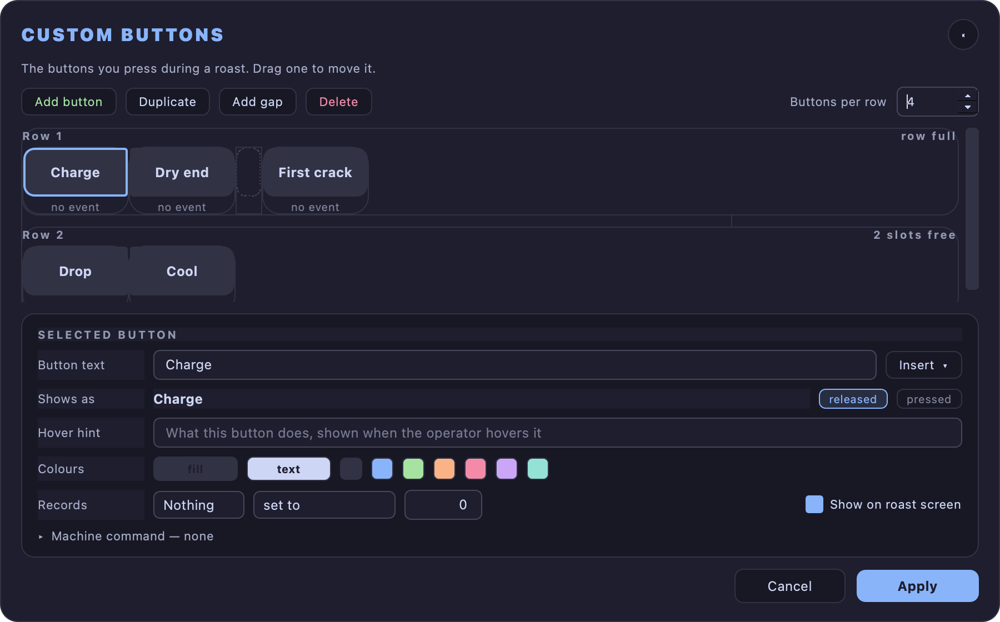

---

## Window behaviour

The window is frameless, with its own title bar, and can be resized from its corner grip. The
assistant can be docked in place of the control panel or floated as a separate window, and the
control zone keeps a fixed height so that switching control forms, or docking the assistant,
never resizes the window underneath your hands.

---

## When a simulation is running

Artisan can replay a past roast in place of the machine — to try the window out, to rehearse a
profile, or to show someone what happens without heating anything.

While a simulation is on, the window is **framed in mauve** and a band across the top of it reads
**SIMULATION** and names the roast being replayed. The temperatures on screen then come from that
recording rather than from the roaster, and a simulated roast never counts towards what
TilauScope learns about your machine or your coffee.

**Leave simulation**, at the right of the band, ends it and gives the readings back to the
machine. It is offered with monitoring off only: once monitoring is on, a replay is running and
is not something to end by mistake. **RESET** is unavailable for the whole simulation for the
same reason — the replayed roast is the only thing on the chart, and turning monitoring on
already clears the chart before each replay.

Starting a simulation opens the roast it will replay on the chart, so there is something to
follow from the start. Turning monitoring on clears it and the replay draws itself in its place;
its speed is then set by the **x1 / x2 / x8** selector above the curve, and clicking the timer
pauses and resumes it.

<!-- CAPTURE 2.16 — the window with a simulation on, before monitoring: mauve frame, SIMULATION
band naming the replayed roast with its Leave simulation control at the right, and the roast to
be replayed on the chart. Reproduce by starting the simulator on a past roast. -->

---

## While the app is working

Anything that takes more than a moment — reading a folder of roast files, exporting, searching
for a Bluetooth device, downloading an update — reports itself the same way everywhere, so there
is nothing new to recognise each time.

A **turning ring** means the app is busy and cannot say how long it will take. A ring that
**fills**, or a bar that fills, means the end is known, and the count beside it says how far
along it is — *47 of 312*, never a bare percentage. The ring turns **green with a tick** when the
work finishes, and stops on **red** when it does not, with the text saying what to do about it.
A red one stays until it is read; it never disappears on its own.

Where the indicator appears tells you whether you can carry on working. In the corner of a
window, it is a small badge and the window stays usable; you can keep browsing, and cancel from
the badge if the work allows it. In the middle of the screen, the work must finish before
anything else is touched.

Cancelling stops what has not started yet, never what is already out in the world. On a
printer, **✕** stops the run after the label currently coming out of the head, and the badge
then says how many were actually printed. Label printing is described in
[Labels and QR](labels-and-qr.md#while-a-label-is-printing).

Short actions do not announce themselves at all: below roughly half a second nothing is shown,
because an indicator that flashes reads as a glitch rather than as work.

!!! note "During a roast"
    The app never opens a window of its own accord while the drum is turning. Anything it starts
    on its own goes to the corner badge, where it can be ignored. A window opened deliberately
    from the coffee database is a different matter — that one was asked for.

If the computer is set to reduce motion in its accessibility settings, nothing turns: the same
indicators breathe gently instead. TilauScope follows the system setting; there is nothing to
configure.

---

## Next

- What the assistant reports inside this window: see [The guided roast](the-guided-roast.md).
- Setting up a batch before you get here: see [Preparing a roast](preparing-a-roast.md).
